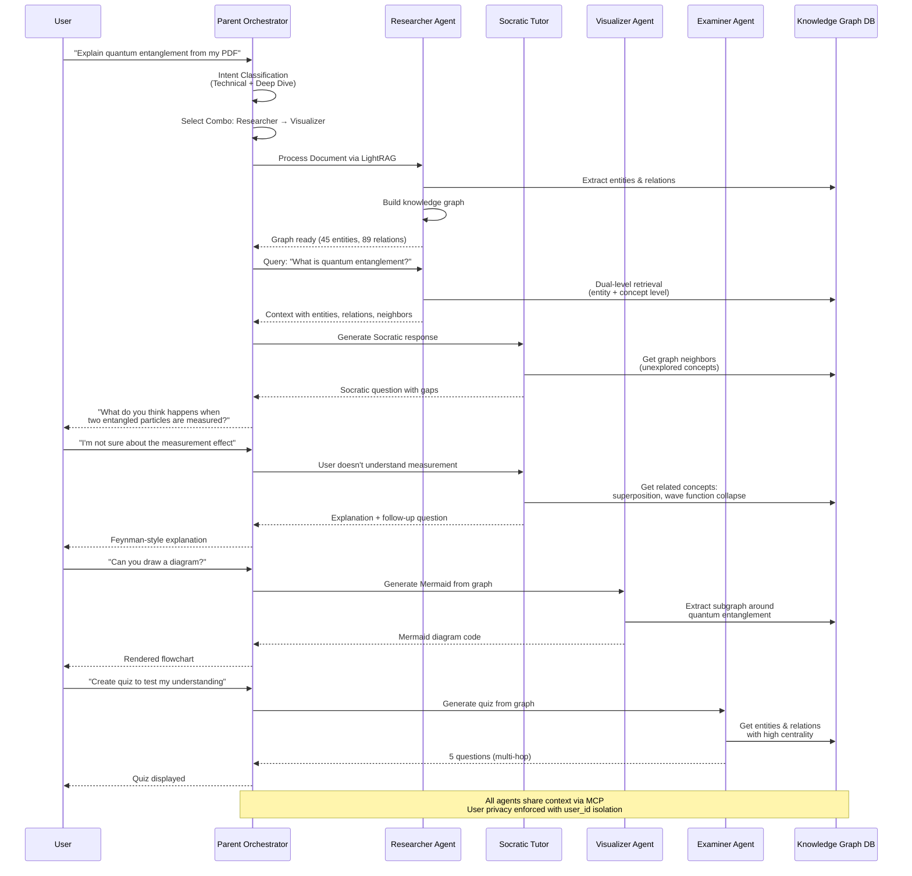
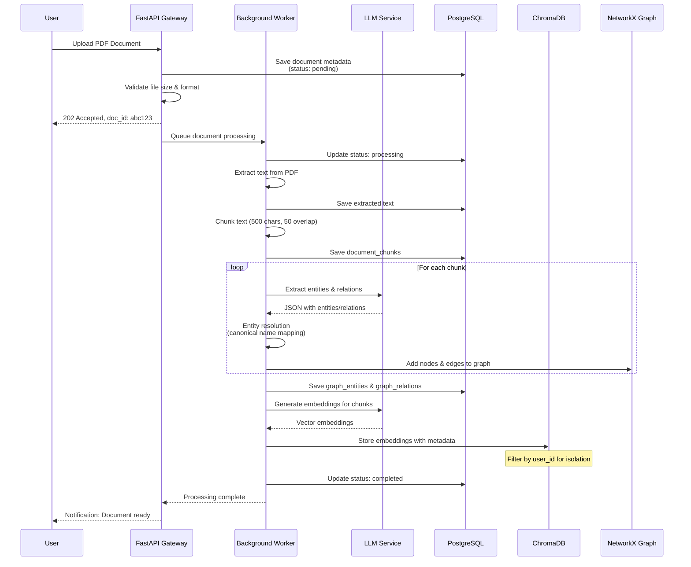
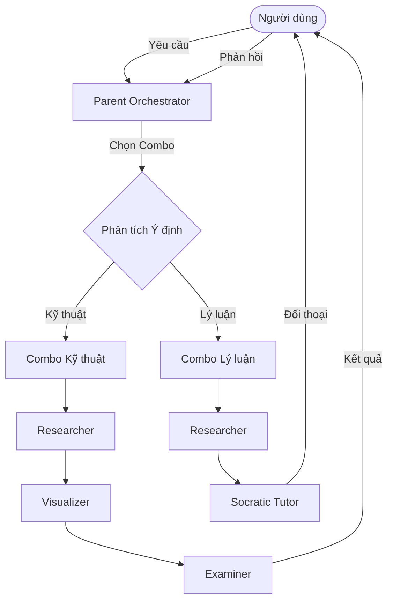
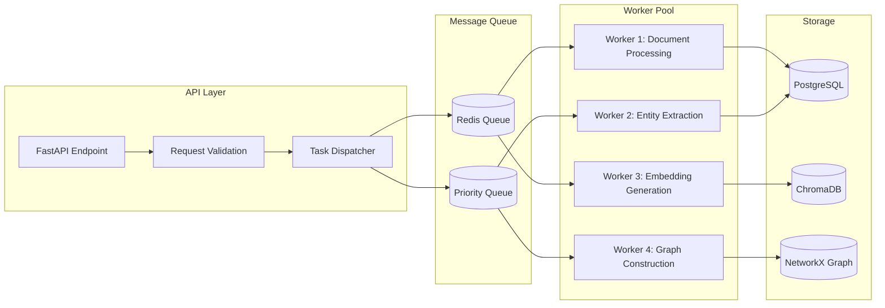
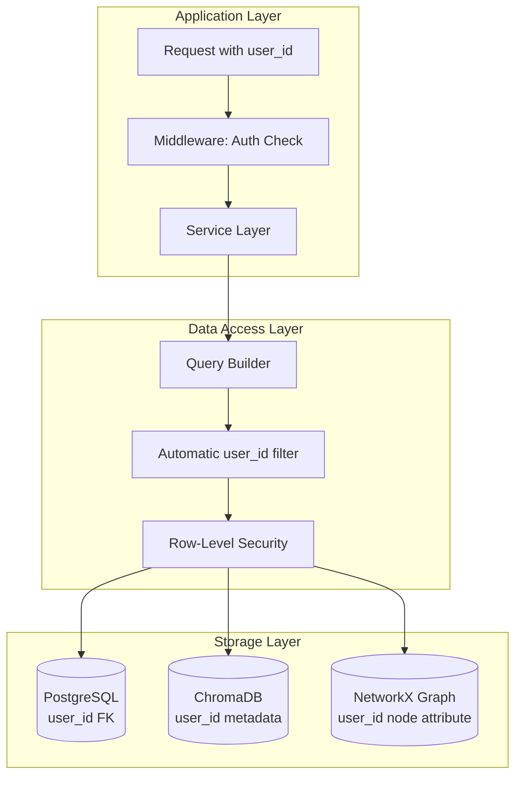

# Kiến Trúc Hệ Thống (Architecture)

> **Document Owner:** AetherTutor Team
> **Last Updated:** April 5, 2026
> **Status:** Active (MVP Phase)

---

Tài liệu này mô tả kiến trúc tổng thể, luồng dữ liệu và thiết lập đa Agent trong AetherTutor.

---

## 1. Mô hình Điều phối (Orchestration Model)

Trái tim của AetherTutor là **Parent Orchestrator**, đóng vai trò như một "bộ não" điều phối.

### Luồng xử lý Agentic (Agentic Workflow)

1. **Intent Classification:** Xác định mục tiêu của người học (đang muốn nghiên cứu sâu, ôn tập, hay trực quan hóa).
2. **Combo Selection:** Lựa chọn bộ công cụ (Combo) phù hợp dựa trên bản chất tri thức (Xã hội, Kỹ thuật, Sáng tạo).
3. **Task Decomposition:** Phân rã yêu cầu phức hợp thành các tác vụ nhỏ cho Agent chuyên biệt.
4. **Consolidation:** Tổng hợp kết quả từ các Agent thành một trải nghiệm học tập thống nhất.

## 2. Các Agent Chuyên biệt (Specialized Agents)

Hệ thống bao gồm các Agent với vai trò sư phạm riêng biệt:

- **The Researcher Agent (Chuyên gia Nghiên cứu):**
  - **Nhiệm vụ:** Tìm kiếm, tổng hợp dữ liệu từ **LightRAG Knowledge Graph**. Trích xuất entities và relations từ tài liệu, xây dựng graph knowledge base.
  - **LightRAG Integration:** Sử dụng dual-level retrieval (entity-level + concept-level) để truy xuất ngữ cảnh chính xác hơn vector similarity thuần túy.
- **The Socratic Tutor Agent (Gia sư Socratic):**
  - **Nhiệm vụ:** Tương tác qua hội thoại, sử dụng kỹ thuật gợi mở (Feynman Method) để người học tự giải thích vấn đề.
  - **LightRAG Integration:** Truy xuất graph neighbors để tạo câu hỏi Socratic dựa trên mối quan hệ giữa các concepts.
- **The Visualizer Agent (Chuyên gia Trực quan):**
  - **Nhiệm vụ:** Biến đổi văn bản thành sơ đồ Mermaid.js. Hỗ trợ "chỉnh sửa song hướng" giữa sơ đồ và văn bản.
  - **LightRAG Integration:** Tận dụng graph structure có sẵn để sinh visualization chính xác hơn.
- **The Examiner Agent (Chuyên gia Kiểm kê):**
  - **Nhiệm vụ:** Tự động tạo Quiz và quản lý lịch ôn tập theo thuật toán **Spaced Repetition (SM-2)**.
  - **LightRAG Integration:** Sinh câu hỏi multi-hop dựa trên graph traversal paths.

## 3. Triển khai các "Combo" Học tập

Kiến trúc hỗ trợ việc kết hợp các Agent theo kịch bản (Combos) định nghĩa trong tài liệu `Methodology.md`:

| Combo | Luồng xử lý chính | Agent phối hợp |
| :--- | :--- | :--- |
| **Hệ thống/Lý luận** | RAG -> Feynman Chat -> Backlinks | Researcher + Socratic |
| **Kỹ thuật/Logic** | Code Parse -> Flowchart -> Quiz | Researcher + Visualizer + Examiner |
| **Sáng tạo/Media** | Transcript -> Micro-summary -> Dual Coding | Researcher + Visualizer |

## 4. Giao thức MCP (Model Context Protocol)

MCP là "mạch máu" thông tin, cho phép:

- **Context Sharing:** Các Agent chia sẻ cùng một ngữ cảnh người dùng (lịch sử học tập, các điểm còn yếu).
- **Seamless Handoff:** Bàn giao tác vụ mượt mà giữa các Agent (vd: Researcher tìm xong dữ liệu sẽ gọi Visualizer vẽ sơ đồ).

### 4.1 Sequence Diagram: Agent Handoff qua MCP



### 4.2 Sequence Diagram: Document Processing Pipeline



## 5. Sơ đồ vận hành (Feedback Loop)



---

## 6. Background Worker Architecture

### 6.1 Task Queue Design

AetherTutor sử dụng **Background Worker Pattern** để xử lý các tác vụ nặng mà không block API response:



### 6.2 Worker Configuration

| Worker Type | Task | Priority | Timeout | Retry Policy |
|---|---|---|---|---|
| Document Processing | PDF text extraction | High | 2 min | 2 retries, 30s backoff |
| Entity Extraction | LLM entity & relation extraction | High | 5 min | 3 retries, exponential backoff |
| Embedding Generation | ChromaDB vector storage | Medium | 10 min | 2 retries, 60s backoff |
| Graph Construction | NetworkX graph building | Medium | 3 min | 1 retry |
| Notification | Email/push notifications | Low | 30s | 3 retries |

### 6.3 Task State Management

```python
# Task states in database
class TaskState(Enum):
    PENDING = "pending"
    QUEUED = "queued"
    PROCESSING = "processing"
    COMPLETED = "completed"
    FAILED = "failed"
    CANCELLED = "cancelled"
    RETRYING = "retrying"

# Task table structure
CREATE TABLE background_tasks (
    id UUID PRIMARY KEY DEFAULT gen_random_uuid(),
    user_id UUID NOT NULL REFERENCES users(id) ON DELETE CASCADE,
    task_type VARCHAR(50) NOT NULL,
    status VARCHAR(20) DEFAULT 'pending',
    progress INT DEFAULT 0,  -- 0-100 percentage
    payload JSONB,           -- Task input data
    result JSONB,            -- Task output data
    error_message TEXT,
    retry_count INT DEFAULT 0,
    max_retries INT DEFAULT 3,
    created_at TIMESTAMP DEFAULT CURRENT_TIMESTAMP,
    started_at TIMESTAMP,
    completed_at TIMESTAMP
);
```

### 6.4 Worker Isolation & Scaling

- **Per-user isolation:** Mỗi worker nhận `user_id` và chỉ xử lý dữ liệu của user đó
- **Rate limiting:** Giới hạn số task đồng hành per user (dựa trên subscription tier)
- **Resource quotas:** 
  - CPU: 0.5 cores per worker
  - Memory: 512MB per worker
  - Max concurrent tasks: 3 per user (free tier), 10 (pro tier)

---

## 7. Data Isolation & Multi-Tenancy

### 7.1 User Data Isolation Strategy

Đảm bảo dữ liệu của User A không bao giờ hiển thị cho User B:



**Implementation:**

1. **PostgreSQL:** Mọi query đều có `WHERE user_id = :current_user_id`
2. **ChromaDB:** Filter metadata `where={"user_id": user_id}` trong mọi retrieval
3. **NetworkX Graph:** Mỗi node/edge có attribute `user_id`, filter khi query
4. **Row-Level Security (RLS):** PostgreSQL RLS policies tự động apply

```sql
-- Enable Row-Level Security
ALTER TABLE documents ENABLE ROW LEVEL SECURITY;

-- Policy: Users can only see their own documents
CREATE POLICY user_documents_only ON documents
    USING (user_id = current_setting('app.current_user_id')::uuid);

-- Policy: Users can only insert their own documents
CREATE POLICY user_insert_only ON documents
    WITH CHECK (user_id = current_setting('app.current_user_id')::uuid);
```

---

> [!NOTE]
> Kiến trúc này đảm bảo tính mở rộng cao, cho phép thêm các Agent chuyên biệt mới (như Agent Code, Agent Ngoại ngữ) vào hệ sinh thái mà không làm thay đổi cấu trúc lõi.

---
© 2026 AetherTutor Team. Last updated: April 5, 2026
