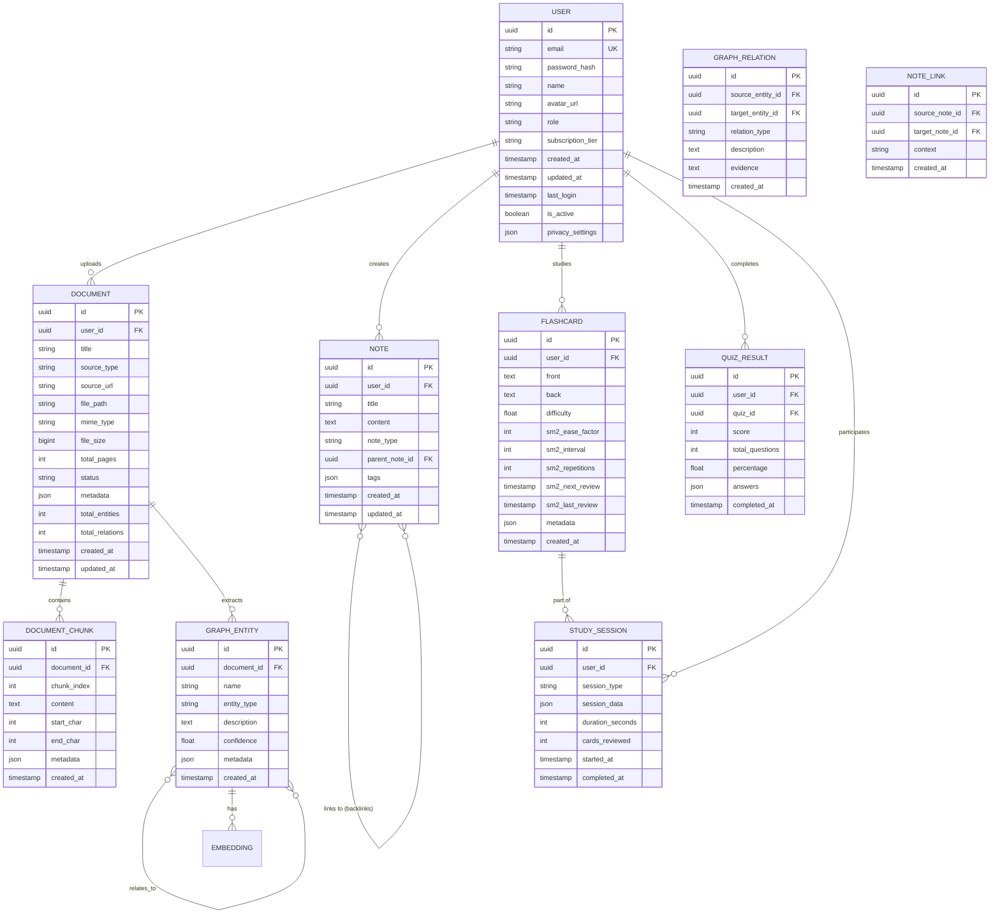
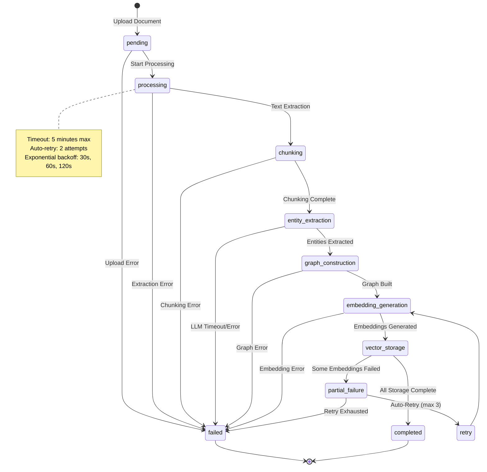

# Data Model & Schema Design

> **Document Owner:** AetherTutor Team
> **Last Updated:** April 5, 2026
> **Status:** Active (MVP Phase)

---

Tài liệu này mô tả chi tiết cấu trúc dữ liệu, schema cơ sở dữ liệu quan hệ và thiết kế Vector DB cho AetherTutor.

---

## 1. Entity Relationship Overview



---

## 2. Detailed Schema Definitions (MVP Core)

> [!IMPORTANT]
> Các bảng dưới đây là cốt lõi của MVP, tập trung vào quản lý người dùng và xử lý tài liệu với LightRAG.

### 2.1 Users Table

```sql
CREATE TABLE users (
    id UUID PRIMARY KEY DEFAULT gen_random_uuid(),
    email VARCHAR(255) UNIQUE NOT NULL,
    password_hash VARCHAR(255), -- NULL for OAuth users
    name VARCHAR(100) NOT NULL,
    avatar_url VARCHAR(500),
    role VARCHAR(20) DEFAULT 'user' CHECK (role IN ('user', 'admin', 'enterprise')),
    subscription_tier VARCHAR(20) DEFAULT 'free' CHECK (subscription_tier IN ('free', 'pro', 'team', 'enterprise')),
    created_at TIMESTAMP DEFAULT CURRENT_TIMESTAMP,
    updated_at TIMESTAMP DEFAULT CURRENT_TIMESTAMP,
    last_login TIMESTAMP,
    is_active BOOLEAN DEFAULT true,
    privacy_settings JSONB DEFAULT '{
        "data_collection": true,
        "ai_training": false,
        "telemetry": true,
        "history_retention_days": 365
    }'::jsonb
);

CREATE INDEX idx_users_email ON users(email);
CREATE INDEX idx_users_subscription ON users(subscription_tier);
```

### 2.2 Documents Table

```sql
CREATE TABLE documents (
    id UUID PRIMARY KEY DEFAULT gen_random_uuid(),
    user_id UUID NOT NULL REFERENCES users(id) ON DELETE CASCADE,
    title VARCHAR(500) NOT NULL,
    source_type VARCHAR(50) CHECK (source_type IN ('pdf', 'web', 'youtube', 'audio', 'text', 'code')),
    source_url TEXT,
    file_path VARCHAR(1000), -- S3/local storage path
    mime_type VARCHAR(100),
    file_size BIGINT, -- bytes
    total_pages INT,
    status VARCHAR(20) DEFAULT 'pending' CHECK (status IN ('pending', 'processing', 'completed', 'failed')),
    metadata JSONB DEFAULT '{}',
    processing_error TEXT,
    created_at TIMESTAMP DEFAULT CURRENT_TIMESTAMP,
    updated_at TIMESTAMP DEFAULT CURRENT_TIMESTAMP
);

CREATE INDEX idx_documents_user_id ON documents(user_id);
CREATE INDEX idx_documents_status ON documents(status);
CREATE INDEX idx_documents_created ON documents(created_at DESC);
```

### 2.3 Document Chunks Table

```sql
CREATE TABLE document_chunks (
    id UUID PRIMARY KEY DEFAULT gen_random_uuid(),
    document_id UUID NOT NULL REFERENCES documents(id) ON DELETE CASCADE,
    chunk_index INT NOT NULL,
    content TEXT NOT NULL,
    start_char INT,
    end_char INT,
    metadata JSONB DEFAULT '{}',
    created_at TIMESTAMP DEFAULT CURRENT_TIMESTAMP,
    
    UNIQUE(document_id, chunk_index)
);

CREATE INDEX idx_chunks_document_id ON document_chunks(document_id);
-- GIN index for full-text search fallback
CREATE INDEX idx_chunks_content_gin ON document_chunks USING GIN(to_tsvector('english', content));
```

---

> [!NOTE]
> **Post-MVP Integration:** Các tính năng dưới đây (Zettelkasten, Flashcards, Quiz) sẽ được triển khai sau khi Core RAG ổn định.

### 2.4 Notes Table (Zettelkasten)

```sql
CREATE TABLE notes (
    id UUID PRIMARY KEY DEFAULT gen_random_uuid(),
    user_id UUID NOT NULL REFERENCES users(id) ON DELETE CASCADE,
    title VARCHAR(500) NOT NULL,
    content TEXT NOT NULL,
    note_type VARCHAR(30) CHECK (note_type IN ('fleeting', 'literature', 'permanent', 'project')),
    parent_note_id UUID REFERENCES notes(id) ON DELETE SET NULL,
    tags TEXT[] DEFAULT '{}',
    created_at TIMESTAMP DEFAULT CURRENT_TIMESTAMP,
    updated_at TIMESTAMP DEFAULT CURRENT_TIMESTAMP
);

CREATE TABLE note_links (
    id UUID PRIMARY KEY DEFAULT gen_random_uuid(),
    source_note_id UUID NOT NULL REFERENCES notes(id) ON DELETE CASCADE,
    target_note_id UUID NOT NULL REFERENCES notes(id) ON DELETE CASCADE,
    context TEXT, -- Text surrounding the link
    created_at TIMESTAMP DEFAULT CURRENT_TIMESTAMP,
    
    UNIQUE(source_note_id, target_note_id)
);

CREATE INDEX idx_notes_user_id ON notes(user_id);
CREATE INDEX idx_notes_tags ON notes USING GIN(tags);
CREATE INDEX idx_notes_parent ON notes(parent_note_id);
CREATE INDEX idx_note_links_source ON note_links(source_note_id);
CREATE INDEX idx_note_links_target ON note_links(target_note_id);
```

### 2.5 Flashcards & SM-2 Table

```sql
CREATE TABLE flashcards (
    id UUID PRIMARY KEY DEFAULT gen_random_uuid(),
    user_id UUID NOT NULL REFERENCES users(id) ON DELETE CASCADE,
    front TEXT NOT NULL,
    back TEXT NOT NULL,
    difficulty FLOAT CHECK (difficulty >= 0 AND difficulty <= 1), -- AI-predicted difficulty
    -- SM-2 Algorithm Parameters
    sm2_ease_factor FLOAT DEFAULT 2.5, -- Initial ease factor (range: 1.3 - 5.0)
    sm2_interval INT DEFAULT 0, -- Days until next review
    sm2_repetitions INT DEFAULT 0, -- Successful recall count
    sm2_next_review TIMESTAMP,
    sm2_last_review TIMESTAMP,
    -- Metadata
    metadata JSONB DEFAULT '{}',
    created_at TIMESTAMP DEFAULT CURRENT_TIMESTAMP
);

CREATE INDEX idx_flashcards_user_id ON flashcards(user_id);
CREATE INDEX idx_flashcards_next_review ON flashcards(sm2_next_review);
CREATE INDEX idx_flashcards_due ON flashcards(sm2_next_review) WHERE sm2_next_review <= NOW();
```

**SM-2 Algorithm Implementation:**

```python
def update_sm2_params(card_id: UUID, quality: int):
    """
    quality: 0-5 (0=complete blackout, 5=perfect response)
    """
    card = get_flashcard(card_id)
    
    if quality >= 3:
        # Successful recall
        if card.sm2_repetitions == 0:
            card.sm2_interval = 1
        elif card.sm2_repetitions == 1:
            card.sm2_interval = 6
        else:
            card.sm2_interval = round(card.sm2_interval * card.sm2_ease_factor)
        
        card.sm2_repetitions += 1
    else:
        # Failed recall - reset
        card.sm2_repetitions = 0
        card.sm2_interval = 0
    
    # Update ease factor
    card.sm2_ease_factor = max(1.3, card.sm2_ease_factor + (0.1 - (5 - quality) * (0.08 + (5 - quality) * 0.02)))
    
    # Calculate next review
    if card.sm2_interval == 0:
        card.sm2_next_review = NOW()
    else:
        card.sm2_next_review = NOW() + INTERVAL '1 day' * card.sm2_interval
    
    card.sm2_last_review = NOW()
    save_flashcard(card)
```

### 2.6 Study Sessions Table

```sql
CREATE TABLE study_sessions (
    id UUID PRIMARY KEY DEFAULT gen_random_uuid(),
    user_id UUID NOT NULL REFERENCES users(id) ON DELETE CASCADE,
    session_type VARCHAR(50) CHECK (session_type IN ('flashcard_review', 'quiz', 'chat', 'diagram_study')),
    session_data JSONB DEFAULT '{}', -- Detailed session logs
    duration_seconds INT,
    cards_reviewed INT DEFAULT 0,
    started_at TIMESTAMP DEFAULT CURRENT_TIMESTAMP,
    completed_at TIMESTAMP
);

CREATE INDEX idx_sessions_user_id ON study_sessions(user_id);
CREATE INDEX idx_sessions_type ON study_sessions(session_type);
CREATE INDEX idx_sessions_started ON study_sessions(started_at DESC);
```

### 2.7 Quiz Results Table

```sql
CREATE TABLE quizzes (
    id UUID PRIMARY KEY DEFAULT gen_random_uuid(),
    user_id UUID REFERENCES users(id) ON DELETE CASCADE, -- NULL for system-generated quizzes
    title VARCHAR(500) NOT NULL,
    description TEXT,
    source_document_id UUID REFERENCES documents(id) ON DELETE SET NULL,
    questions JSONB NOT NULL, -- Array of questions
    created_at TIMESTAMP DEFAULT CURRENT_TIMESTAMP
);

CREATE TABLE quiz_results (
    id UUID PRIMARY KEY DEFAULT gen_random_uuid(),
    user_id UUID NOT NULL REFERENCES users(id) ON DELETE CASCADE,
    quiz_id UUID NOT NULL REFERENCES quizzes(id) ON DELETE CASCADE,
    score INT NOT NULL,
    total_questions INT NOT NULL,
    percentage FLOAT GENERATED ALWAYS AS (score * 100.0 / total_questions) STORED,
    answers JSONB NOT NULL, -- User's answers
    time_taken_seconds INT,
    completed_at TIMESTAMP DEFAULT CURRENT_TIMESTAMP
);

CREATE INDEX idx_quiz_results_user ON quiz_results(user_id);
CREATE INDEX idx_quiz_results_quiz ON quiz_results(quiz_id);
CREATE INDEX idx_quiz_results_completed ON quiz_results(completed_at DESC);
```

### 2.8 Chat History Table

```sql
CREATE TABLE chat_sessions (
    id UUID PRIMARY KEY DEFAULT gen_random_uuid(),
    user_id UUID NOT NULL REFERENCES users(id) ON DELETE CASCADE,
    agent_type VARCHAR(50) CHECK (agent_type IN ('socratic_tutor', 'researcher', 'visualizer', 'examiner')),
    context_document_id UUID REFERENCES documents(id) ON DELETE SET NULL,
    created_at TIMESTAMP DEFAULT CURRENT_TIMESTAMP
);

CREATE TABLE chat_messages (
    id UUID PRIMARY KEY DEFAULT gen_random_uuid(),
    session_id UUID NOT NULL REFERENCES chat_sessions(id) ON DELETE CASCADE,
    role VARCHAR(20) CHECK (role IN ('user', 'assistant', 'system')),
    content TEXT NOT NULL,
    metadata JSONB DEFAULT '{}',
    token_count INT,
    created_at TIMESTAMP DEFAULT CURRENT_TIMESTAMP
);

CREATE INDEX idx_chat_sessions_user ON chat_sessions(user_id);
CREATE INDEX idx_chat_messages_session ON chat_messages(session_id);
CREATE INDEX idx_chat_messages_created ON chat_messages(created_at);
```

### 2.9 Graph Entity & Relation Tables (Với FK Constraints)

```sql
CREATE TABLE graph_entities (
    id UUID PRIMARY KEY DEFAULT gen_random_uuid(),
    document_id UUID NOT NULL REFERENCES documents(id) ON DELETE CASCADE,
    user_id UUID NOT NULL REFERENCES users(id) ON DELETE CASCADE,
    canonical_name VARCHAR(500) NOT NULL, -- Standardized entity name
    display_name VARCHAR(500) NOT NULL,   -- Original name from document
    entity_type VARCHAR(50) CHECK (entity_type IN ('concept', 'term', 'person', 'process', 'theory', 'framework', 'tool')),
    description TEXT,
    confidence FLOAT CHECK (confidence >= 0 AND confidence <= 1),
    metadata JSONB DEFAULT '{
        "source_chunk_index": 0,
        "page_number": null,
        "timestamp": null,
        "extraction_prompt_version": "v1.0"
    }'::jsonb,
    created_at TIMESTAMP DEFAULT CURRENT_TIMESTAMP,

    -- Prevent duplicate entities per document
    UNIQUE(document_id, canonical_name)
);

CREATE TABLE graph_relations (
    id UUID PRIMARY KEY DEFAULT gen_random_uuid(),
    document_id UUID NOT NULL REFERENCES documents(id) ON DELETE CASCADE,
    source_entity_id UUID NOT NULL REFERENCES graph_entities(id) ON DELETE CASCADE,
    target_entity_id UUID NOT NULL REFERENCES graph_entities(id) ON DELETE CASCADE,
    relation_type VARCHAR(50) CHECK (relation_type IN ('is_a', 'part_of', 'related_to', 'causes', 'enables', 'prevents', 'depends_on')),
    description TEXT,
    evidence TEXT, -- Text snippet supporting this relation
    confidence FLOAT CHECK (confidence >= 0 AND confidence <= 1),
    metadata JSONB DEFAULT '{
        "source_chunk_index": 0,
        "extraction_prompt_version": "v1.0"
    }'::jsonb,
    created_at TIMESTAMP DEFAULT CURRENT_TIMESTAMP,

    -- Prevent duplicate relations
    UNIQUE(document_id, source_entity_id, target_entity_id, relation_type)
);

-- Indexes for graph queries
CREATE INDEX idx_graph_entities_document ON graph_entities(document_id);
CREATE INDEX idx_graph_entities_user ON graph_entities(user_id);
CREATE INDEX idx_graph_entities_canonical ON graph_entities(canonical_name);
CREATE INDEX idx_graph_entities_type ON graph_entities(entity_type);

CREATE INDEX idx_graph_relations_document ON graph_relations(document_id);
CREATE INDEX idx_graph_relations_source ON graph_relations(source_entity_id);
CREATE INDEX idx_graph_relations_target ON graph_relations(target_entity_id);
CREATE INDEX idx_graph_relations_type ON graph_relations(relation_type);

-- Cross-document entity resolution table
CREATE TABLE entity_aliases (
    id UUID PRIMARY KEY DEFAULT gen_random_uuid(),
    canonical_name VARCHAR(500) NOT NULL,
    alias_name VARCHAR(500) NOT NULL,
    user_id UUID REFERENCES users(id) ON DELETE CASCADE,
    similarity_score FLOAT,
    created_at TIMESTAMP DEFAULT CURRENT_TIMESTAMP,

    UNIQUE(canonical_name, alias_name, user_id)
);

CREATE INDEX idx_entity_aliases_canonical ON entity_aliases(canonical_name);
CREATE INDEX idx_entity_aliases_alias ON entity_aliases(alias_name);
```

### 2.10 Quiz Questions Schema (Chi tiết)

```sql
-- Quiz questions structure (stored in quizzes.questions JSONB)
-- Each question object follows this schema:
```

```typescript
interface QuizQuestion {
  id: string;           // UUID
  type: 'multiple_choice' | 'true_false' | 'fill_blank' | 'short_answer';
  text: string;         // Question text
  options?: {           // For multiple_choice
    id: string;
    text: string;
    is_correct: boolean;
  }[];
  correct_answer: string | string[];  // Correct answer(s)
  explanation: string;  // Why this is correct
  difficulty: number;   // 1-5 scale
  source_entity_ids: string[];  // Linked graph entities
  source_relation_ids: string[]; // Linked graph relations
  bloom_taxonomy: 'remember' | 'understand' | 'apply' | 'analyze' | 'evaluate' | 'create';
}
```

```sql
-- Additional table for tracking user answers per question
CREATE TABLE quiz_answers (
    id UUID PRIMARY KEY DEFAULT gen_random_uuid(),
    quiz_result_id UUID NOT NULL REFERENCES quiz_results(id) ON DELETE CASCADE,
    question_id UUID NOT NULL,  -- Index in questions JSONB array
    user_answer JSONB NOT NULL, -- User's selected options
    is_correct BOOLEAN,
    time_taken_seconds INT,
    metadata JSONB DEFAULT '{}'
);

CREATE INDEX idx_quiz_answers_result ON quiz_answers(quiz_result_id);
```

### 2.11 API Usage & Rate Limiting Table

```sql
CREATE TABLE api_usage_logs (
    id UUID PRIMARY KEY DEFAULT gen_random_uuid(),
    user_id UUID NOT NULL REFERENCES users(id) ON DELETE CASCADE,
    endpoint VARCHAR(200) NOT NULL,
    tokens_consumed INT,
    response_time_ms INT,
    status_code INT,
    created_at TIMESTAMP DEFAULT CURRENT_TIMESTAMP
);

CREATE TABLE user_quota_limits (
    id UUID PRIMARY KEY DEFAULT gen_random_uuid(),
    user_id UUID NOT NULL REFERENCES users(id) ON DELETE CASCADE,
    tier VARCHAR(20) NOT NULL,
    daily_document_limit INT DEFAULT 5,
    daily_api_calls INT DEFAULT 1000,
    daily_tokens INT DEFAULT 50000,
    max_file_size_mb INT DEFAULT 50,
    updated_at TIMESTAMP DEFAULT CURRENT_TIMESTAMP,

    UNIQUE(user_id, tier)
);

CREATE INDEX idx_api_usage_user_date ON api_usage_logs(user_id, created_at DESC);
CREATE INDEX idx_quota_limits_user ON user_quota_limits(user_id);
```

---

## 3. Metadata Schema Definitions

### 3.1 Document Metadata JSONB Schema

```typescript
interface DocumentMetadata {
  extraction_method: 'pdf_parser' | 'web_scraper' | 'youtube_transcript' | 'audio_transcription';
  language: string;               // ISO 639-1: 'en', 'vi', etc.
  page_count?: number;
  word_count?: number;
  chunk_count?: number;
  entity_count?: number;
  relation_count?: number;
  processing_time_seconds?: number;
  llm_model_used: string;         // 'gpt-4', 'ollama-llama3', etc.
  extraction_prompt_version: string;
  tags: string[];                 // Auto-generated or user-added tags
  custom_fields?: Record<string, any>; // User-defined metadata
}
```

### 3.2 Flashcard Metadata JSONB Schema

```typescript
interface FlashcardMetadata {
  source_document_id?: string;
  source_entity_ids?: string[];
  source_chunk_indices?: number[];
  auto_generated: boolean;        // true if AI-generated, false if user-created
  last_review_quality?: number;   // 0-5, quality of last review
  difficulty_history?: number[];  // Track difficulty changes over time
  tags: string[];
}
```

### 3.3 Study Session Data JSONB Schema

```typescript
interface StudySessionData {
  cards_reviewed: {
    card_id: string;
    quality: number;              // 0-5 SM-2 quality rating
    time_to_answer_ms: number;
    was_hint_used: boolean;
  }[];
  session_notes?: string;
  mood_rating?: number;           // 1-5, user's self-reported mood
  focus_level?: number;           // 1-5, user's self-reported focus
  interruptions_count?: number;
}
```

### 3.4 Chat Message Metadata JSONB Schema

```typescript
interface ChatMessageMetadata {
  retrieval_method: 'lightrag_dual' | 'vector_only' | 'keyword_only';
  entities_used: string[];        // Entity names from graph
  concepts_used: string[];        // Concept names from graph traversal
  relations_used: {source: string, target: string}[];
  source_chunk_ids: string[];
  prompt_template_version: string;
  token_breakdown: {
    prompt_tokens: number;
    completion_tokens: number;
    total_tokens: number;
  };
  temperature: number;
  model_used: string;
}
```

---

## 4. Document Processing State Machine



**State Transition Rules:**

| From State | To State | Trigger | Conditions |
|---|---|---|---|
| `pending` | `processing` | Background worker picks up | File size < max, valid format |
| `processing` | `chunking` | Text extraction success | Min 100 chars extracted |
| `chunking` | `entity_extraction` | Chunking complete | At least 1 chunk created |
| `entity_extraction` | `graph_construction` | LLM response valid | JSON parseable, min 1 entity |
| `graph_construction` | `embedding_generation` | Graph saved | NetworkX graph has nodes |
| `embedding_generation` | `vector_storage` | Embeddings generated | All chunks embedded |
| `vector_storage` | `completed` | All storage success | PostgreSQL + ChromaDB + Graph |
| Any state | `failed` | Error with no retry | Timeout, invalid data, API error |
| `partial_failure` | `retry` | Some embeddings failed | Retry count < 3 |

---

## 5. Vector Database Schema (ChromaDB/Qdrant)

### 3.1 Collection Structure

```python
# ChromaDB Collection Configuration
collection_config = {
    "name": "document_embeddings",
    "metadata": {
        "description": "User document chunks for RAG",
        "embedding_model": "text-embedding-3-small",
        "embedding_dim": 1536,
        "distance_metric": "cosine"
    }
}

# Metadata schema per embedding
embedding_metadata = {
    "user_id": "uuid",
    "document_id": "uuid",
    "chunk_id": "uuid",
    "chunk_index": "int",
    "source_type": "string",
    "document_title": "string",
    "page_number": "int",  # For PDFs
    "timestamp": "string",  # For video/audio
    "tags": ["string"]
}
```

### 3.2 RAG Query Flow

```python
def rag_query(user_query: str, user_id: UUID, top_k: int = 5):
    # 1. Get user's document collections
    user_collections = get_user_collections(user_id)
    
    # 2. Generate query embedding
    query_embedding = generate_embedding(user_query)
    
    # 3. Query vector DB with metadata filter
    results = chroma_collection.query(
        query_embeddings=[query_embedding],
        n_results=top_k,
        where={"user_id": user_id},  # Critical: isolate user data
        include=["documents", "metadatas", "distances"]
    )
    
    # 4. Return context for LLM
    return format_context_for_llm(results)
```

---

## 4. Data Indexing Strategy

### 4.1 Primary Indexes

| Table | Primary Index | Purpose |
|---|---|---|
| users | id (UUID) | Fast lookup by ID |
| documents | id (UUID) | Fast lookup by ID |
| document_chunks | id (UUID) + (document_id, chunk_index) | Unique chunks per doc |
| notes | id (UUID) | Fast lookup |
| flashcards | id (UUID) | Fast lookup |

### 4.2 Secondary Indexes

| Table | Index | Query Pattern |
|---|---|---|
| users | email | Login authentication |
| documents | user_id + created_at | User's document list |
| document_chunks | document_id | Retrieve all chunks |
| notes | user_id + tags | Filter by tags |
| notes | parent_note_id | Hierarchical queries |
| flashcards | user_id + sm2_next_review | Due flashcards query |
| chat_messages | session_id + created_at | Chat history retrieval |

### 4.3 Composite Indexes

```sql
-- Flashcard due query (most common)
CREATE INDEX idx_flashcards_due_query 
ON flashcards(user_id, sm2_next_review) 
WHERE sm2_next_review <= NOW();

-- Document chunks with metadata
CREATE INDEX idx_chunks_document_lookup 
ON document_chunks(document_id, chunk_index, created_at);

-- Notes with tags and date
CREATE INDEX idx_notes_user_tags_date 
ON notes(user_id, tags, created_at DESC);
```

---

## 6. Data Archival & Cleanup

### 6.1 Archival Policy

| Data Type | Active Period | Archive After | Delete After |
|---|---|---|---|
| Chat messages | 1 year | 2 years | 3 years |
| Study sessions | 2 years | 3 years | 5 years |
| Quiz results | 2 years | 3 years | 5 years |
| Deleted user data | 30 days (grace) | Immediate archive | Permanent delete |

### 6.2 Cleanup Jobs

```sql
-- Daily cron job: Delete expired grace period accounts
DELETE FROM users
WHERE is_active = false
  AND updated_at < NOW() - INTERVAL '30 days';

-- Weekly: Archive old chat messages
INSERT INTO chat_messages_archive
SELECT * FROM chat_messages
WHERE created_at < NOW() - INTERVAL '2 years';

DELETE FROM chat_messages
WHERE created_at < NOW() - INTERVAL '2 years';
```

---

## 7. Performance Considerations

### 7.1 Query Optimization

```sql
-- EXPLAIN ANALYZE for all complex queries
-- Use pagination (cursor-based for infinite scroll)
-- Materialized views for expensive aggregations

CREATE MATERIALIZED VIEW user_learning_stats AS
SELECT 
    user_id,
    COUNT(DISTINCT documents.id) as total_documents,
    COUNT(DISTINCT notes.id) as total_notes,
    COUNT(DISTINCT flashcards.id) as total_flashcards,
    SUM(study_sessions.duration_seconds) as total_study_time,
    AVG(quiz_results.percentage) as avg_quiz_score
FROM users
LEFT JOIN documents ON users.id = documents.user_id
LEFT JOIN notes ON users.id = notes.user_id
LEFT JOIN flashcards ON users.id = flashcards.user_id
LEFT JOIN study_sessions ON users.id = study_sessions.user_id
LEFT JOIN quiz_results ON users.id = quiz_results.user_id
GROUP BY user_id;

-- Refresh daily
REFRESH MATERIALIZED VIEW CONCURRENTLY user_learning_stats;
```

### 7.2 Caching Strategy (Redis)

| Cache Key | TTL | Purpose |
|---|---|---|
| `user:profile:{user_id}` | 1 hour | User profile data |
| `user:due_cards:{user_id}` | 15 min | Due flashcards count |
| `document:chunks:{doc_id}` | 24 hours | Document chunks |
| `rag:context:{query_hash}` | 7 days | RAG query results |
| `agent:response:{request_hash}` | 1 hour | Repeated AI queries |

---

> [!IMPORTANT]
> Schema này được version control và tự động migrate qua CI/CD pipeline.
> Mọi thay đổi cần qua review process và test trên staging trước khi deploy.

---
© 2026 AetherTutor Team. Last updated: April 5, 2026
