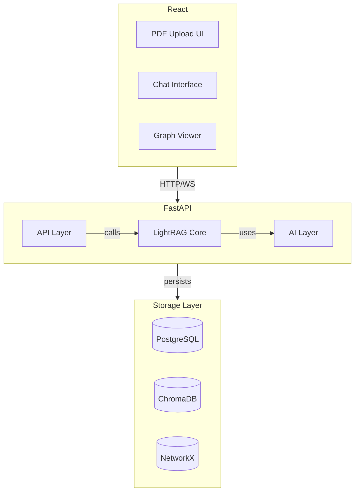

# MVP Implementation Plan với LightRAG

> **Document Owner:** AetherTutor Team
> **Last Updated:** April 6, 2026
> **Status:** Active (MVP Phase - Phase 1, 2 & 3 Complete)

---

Tài liệu này mô tả kế hoạch triển khai **MVP (Minimum Viable Product)** của AetherTutor với trọng tâm là **LightRAG** làm core technology.

---

## 1. Tóm tắt các Giai đoạn (Phases Summary)

1. **Phase 1: Core Infrastructure** (Week 1-2) - Setup FastAPI, MCP, DB, LLM.
2. **Phase 2: LightRAG Core** (Week 3-4) - Pipeline, Entity Extraction, Graph.
3. **Phase 3: Document Processing** (Week 5) - Upload, Ingestion, Persistence.
4. **Phase 4: Chat Interface** (Week 6-7) - Socratic Mode, Streaming, Context.
5. **Phase 5: Frontend Interface** (Week 8-9) - React UI, Graph View, Interaction.
6. **Phase 6: Testing & Polish** (Week 10) - Performance, Bug fixes, Launch.

---

## 2. Phạm vi MVP (MVP Scope)

### 2.1 Core User Journey

```text
User uploads PDF → LightRAG processes document → User chats with AI → AI answers with graph context
```

**Scope tối thiểu:**

- ✅ Upload PDF documents
- ✅ LightRAG entity extraction & graph construction
- ✅ Chat với AI (Socratic mode cơ bản)
- ✅ AI sử dụng LightRAG dual-level retrieval để trả lời
- ✅ Xem knowledge graph của document

**OUT of scope (để phase sau):**

- ❌ Flashcards & SM-2
- ❌ Quiz generation
- ❌ Visualizer Agent (Mermaid)
- ❌ Zettelkasten notes
- ❌ Multi-document reasoning
- ❌ User authentication (dùng local mode cho MVP)

### 2.2 MVP Success Criteria

Xem chi tiết bộ chỉ số đo lường tại [Roadmap.md#2-chi-số-thành-công-success-criteria](Roadmap.md#2-chi-số-thành-công-success-criteria).

---

## 3. Kiến trúc Hệ thống (Technical Architecture)

### 3.1 System Components



### 3.2 Technology Stack (MVP)

Xem chi tiết Tech Stack tại [Technical_Spec.md#1-công-nghệ-sử-dụng-tech-stack-mvp](Technical_Spec.md#1-công-nghệ-sử-dụng-tech-stack-mvp).

---

## 4. Implementation Phases

### Phase 1: Core Infrastructure (Week 1–2)

**Mục tiêu:** Setup được môi trường phát triển và các components cơ bản.

#### Tasks

- [x] Setup FastAPI project structure
- [ ] Setup MCP (Model Context Protocol) server/client layer
  - `app/`
    - `main.py` (FastAPI app)
    - `config.py` (settings)
    - `dependencies.py` (DI)
    - `api/`
      - `documents.py`
      - `chat.py`
      - `graph.py`
    - `core/`
      - `lightrag.py` (LightRAG core)
      - `entity_extractor.py`
      - `graph_builder.py`
      - `retriever.py`
    - `services/`
      - `document_service.py`
      - `llm_service.py`
      - `embedding_service.py`
    - `models/`
      - `document.py`
      - `entity.py`
      - `chat.py`
  - `tests/`
    - `test_entity_extractor.py`
    - `test_graph_builder.py`
    - `test_retriever.py`

- [x] Setup FastAPI project structure.
- [x] **Local Environment Setup**:
  - Tạo Python venv: `python -m venv venv`.
  - Cài đặt dependencies (Windows Powershell): `.\venv\Scripts\Activate.ps1` -> `pip install -r requirements.txt`. (Đã bổ sung tiktoken, asyncpg).
- [x] **Docker Infrastructure Readiness**:
  - Chạy các base services: `docker compose up -d db redis chromadb`.
  - Healthcheck các services từ bên ngoài container (Host).
- [x] **Database & Connectivity**:
  - Hoàn thiện `app/database.py` hỗ trợ async connection.
  - Setup Alembic: `alembic init alembic`.
  - Migration đầu tiên: `alembic revision --autogenerate -m "initial"`.
  - Fix Alembic `env.py` trỏ đúng `app.models`.
- [x] **MCP (Model Context Protocol)**:
  - Khởi tạo layer MCP cơ bản phục vụ cho việc truyền tải context. (Sẵn sàng mở rộng).

**Deliverables:**
- ✅ Môi trường venv hoạt động tốt.
- ✅ Kết nối tới Postgres, Redis, ChromaDB thành công từ môi trường local.
- ✅ Hệ thống migration (Alembic) sẵn sàng.
- ✅ Healthcheck API endpoint hoạt động (Real-time).
- ✅ Basic tests passing local.

---

**Phase 2: LightRAG Core (Week 3-4) - COMPLETED**

**Mục tiêu:** Implement được LightRAG pipeline: Entity extraction → Graph construction → Retrieval.

Chi tiết mã nguồn và logic thực thi: [LightRAG_Implementation.md#3-lightrag-pipeline-chi-tiết](LightRAG_Implementation.md#3-lightrag-pipeline-chi-tiết)

**Deliverables:**
- ✅ Entity extraction working (Qwen2.5-1.5B Optimized)
- ✅ Graph construction with persistence (SQL & ChromaDB)
- ✅ Dual-level retrieval functional
- ✅ Context assembly logic (Feynman Chat aware)
- ✅ Unit tests via script validation

---

### Phase 3: Document Processing Pipeline (Week 5) - COMPLETED

**Mục tiêu:** Upload PDF → Extract text → Process with LightRAG → Store results.

Chi tiết logic xử lý tài liệu: [LightRAG_Implementation.md#31-ingestion-pipeline-document--graph](LightRAG_Implementation.md#31-ingestion-pipeline-document--graph)

**Deliverables:**
- ✅ PDF upload working
- ✅ Text extraction working
- ✅ Full pipeline end-to-end
- ✅ Document status tracking

---

### Phase 4: Chat Interface (Week 6-7)

**Mục tiêu:** User có thể chat với AI, AI sử dụng LightRAG để trả lời với context và hỗ trợ Streaming.

Chi tiết logic hội thoại Socratic: [LightRAG_Implementation.md#32-retrieval-pipeline-query--context](LightRAG_Implementation.md#32-retrieval-pipeline-query--context)

**Deliverables:**
- ✅ Chat endpoint working
- ✅ LightRAG context integration
- ✅ Socratic mode functional
- ✅ Response Streaming (SSE) functional
- ✅ Response time < 3s (First chunk)

---

### Phase 5: Frontend (Week 8–9)

**Mục tiêu:** React UI cho upload, chat, và xem graph.

```text
frontend/
├─ src/
│   ├─ components/
│   │   ├─ DocumentUpload.tsx
│   │   ├─ ChatInterface.tsx
│   │   ├─ GraphViewer.tsx
│   │   └─ StatusIndicator.tsx
│   ├─ hooks/
│   │   ├─ useDocuments.ts
│   │   └─ useChat.ts
│   ├─ services/
│   │   ├─ api.ts (API client)
│   │   └─ websocket.ts
│   └─ App.tsx
├─ public/
└─ package.json
```

**Key Components:**

1. **DocumentUpload.tsx**
   ```tsx
   export function DocumentUpload() {
     const [uploading, setUploading] = useState(false);
     const [progress, setProgress] = useState(0);
     
     const handleUpload = async (file: File) => {
       setUploading(true);
       const formData = new FormData();
       formData.append('file', file);
       
       const response = await fetch('/api/v1/documents/process', {
         method: 'POST',
         body: formData
       });
       
       const result = await response.json();
       setUploading(false);
       
       // Show success notification
     };
     
     return (
       <div className="upload-area">
         <input 
           type="file" 
           accept=".pdf"
           onChange={(e) => handleUpload(e.target.files[0])}
         />
         {uploading && <ProgressBar value={progress} />}
       </div>
     );
   }
   ```

2. **ChatInterface.tsx**
   ```tsx
   export function ChatInterface({ documentId }: Props) {
     const [messages, setMessages] = useState<Message[]>([]);
     const [input, setInput] = useState('');
     
     const sendMessage = async () => {
       const userMessage = { role: 'user', content: input };
       setMessages([...messages, userMessage]);
       
       const response = await fetch('/api/v1/chat/socratic', {
         method: 'POST',
         headers: { 'Content-Type': 'application/json' },
         body: JSON.stringify({
           message: input,
           document_id: documentId,
           mode: 'socratic'
         })
       });
       
       const result = await response.json();
       setMessages(prev => [...prev, {
         role: 'assistant',
         content: result.data.response
       }]);
       
       setInput('');
     };
     
     return (
       <div className="chat-container">
         <MessageList messages={messages} />
         <input 
           value={input}
           onChange={(e) => setInput(e.target.value)}
           onKeyPress={(e) => e.key === 'Enter' && sendMessage()}
         />
       </div>
     );
   }
   ```

3. **GraphViewer.tsx**
   ```tsx
   import ReactFlow from 'reactflow';
   
   export function GraphViewer({ documentId }: Props) {
     const [nodes, setNodes] = useState([]);
     const [edges, setEdges] = useState([]);
     
     useEffect(() => {
       const fetchGraph = async () => {
         const response = await fetch('/api/v1/graph/subgraph', {
           method: 'POST',
           body: JSON.stringify({ document_id: documentId })
         });
         const result = await response.json();
         
         setNodes(result.data.nodes.map(node => ({
           id: node.id,
           data: { label: node.name },
           position: { x: node.x, y: node.y }
         })));
         
         setEdges(result.data.edges.map(edge => ({
           id: `${edge.source}-${edge.target}`,
           source: edge.source,
           target: edge.target,
           label: edge.relation_type
         })));
       };
       
       fetchGraph();
     }, [documentId]);
     
     return (
       <ReactFlow nodes={nodes} edges={edges}>
         <Controls />
         <MiniMap />
       </ReactFlow>
     );
   }
   ```

**Deliverables:**
- ✅ Upload UI working
- ✅ Chat interface working
- ✅ Graph viewer functional
- ✅ Responsive design

---

### Phase 6: Testing & Polish (Week 10)

**Mục tiêu:** Test end-to-end, fix bugs, optimize performance.

#### Testing Checklist

**Unit Tests:**

- [ ] Entity extraction tests
- [ ] Graph construction tests
- [ ] Retrieval accuracy tests
- [ ] Chat service tests
- [ ] API endpoint tests

**Integration Tests:**

- [ ] Full pipeline: PDF → Graph → Chat
- [ ] Multiple documents test
- [ ] Concurrent requests test

**Performance Tests:**

- [ ] Document processing < 30s
- [ ] Query response < 3s
- [ ] Memory usage < 2GB

**User Testing:**

- [ ] Upload flow test with real users
- [ ] Chat flow test end-to-end
- [ ] Graph visualization test
- [ ] Document feedback collection

---

## 5. Chiến lược Triển khai (Deployment Strategy)

### 5.1 Phát triển tại Local (Local Development)

#### Công cụ Yêu cầu (Prerequisites)
- Python 3.10+
- Node.js 18+ (cho frontend)
- Docker Desktop / Engine (cho infrastructure)

#### Luồng Thiết lập (Setup Workflow)
1.  **Hạ tầng (Infrastructure):**
    ```bash
    docker compose up -d db redis chromadb
    ```
2.  **Môi trường Backend:**
    ```bash
    python -m venv venv
    .\venv\Scripts\activate  # Windows
    pip install -r requirements.txt
    ```
3.  **Cấu hình Biến môi trường:**
    Copy `.env.example` -> `.env` và điều chỉnh các thông số `localhost`.
4.  **Database Migration:**
    ```bash
    alembic upgrade head
    ```
5.  **Chạy Ứng dụng:**
    ```bash
    uvicorn app.main:app --reload --port 8000
    ```

### 5.2 Triển khai với Docker (Docker Deployment)

```dockerfile
# Dockerfile
FROM python:3.10-slim

WORKDIR /app

# Install dependencies
COPY requirements.txt .
RUN pip install --no-cache-dir -r requirements.txt

# Copy application
COPY app/ app/

# Expose port
EXPOSE 8000

# Run application
CMD ["uvicorn", "app.main:app", "--host", "0.0.0.0", "--port", "8000"]
```

```yaml
# docker-compose.yml
version: '3.8'

services:
  api:
    build: .
    ports:
      - "8000:8000"
    volumes:
      - ./data:/app/data
    environment:
      - OPENAI_API_KEY=${OPENAI_API_KEY}
  
  frontend:
    build: ./frontend
    ports:
      - "3000:3000"
    depends_on:
      - api
```

---

## 6. Giảm thiểu Rủi ro (Risk Mitigation)

Xem chi tiết đánh giá rủi ro tại [future_ops/Risk_Assessment.md](future_ops/Risk_Assessment.md).

---

## 7. Tóm tắt Lộ trình (Timeline Summary)

Toàn bộ kế hoạch thời gian chi tiết được quản lý tập trung tại [Roadmap.md#lightrag-integration-timeline](Roadmap.md#lightrag-integration-timeline).

---

## 8. Lộ trình sau MVP (Post-MVP Roadmap)

Sau khi MVP hoàn thành, các tính năng tiếp theo:

1. **Flashcards & SM-2** (Week 11-12)
2. **Quiz Generation** (Week 13-14)
3. **Visualizer Agent** (Week 15-16)
4. **User Authentication** (Week 17)
5. **Multi-document Reasoning** (Week 18-19)
6. **Zettelkasten Notes** (Week 20-21)

---

> [!IMPORTANT]
> MVP scope được giữ tối giản để validate core value proposition: 
> **LightRAG-powered learning** tốt hơn traditional RAG.
> Mọi tính năng khác có thể thêm sau khi có user feedback.

---

© 2026 AetherTutor Team. Last updated: April 5, 2026
