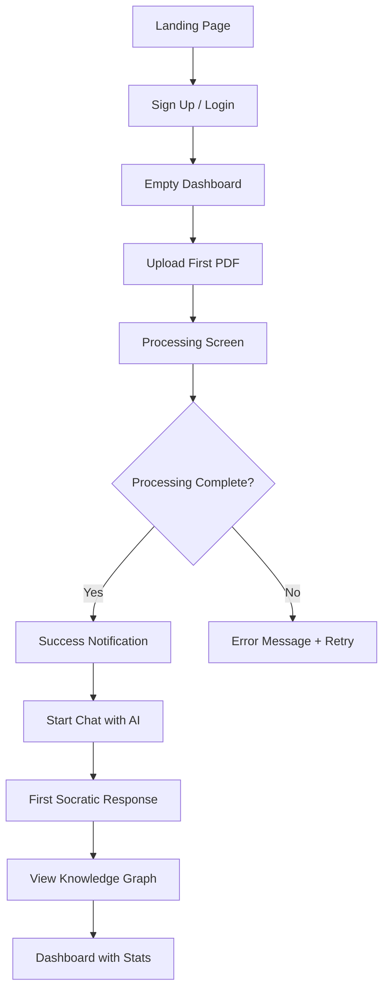
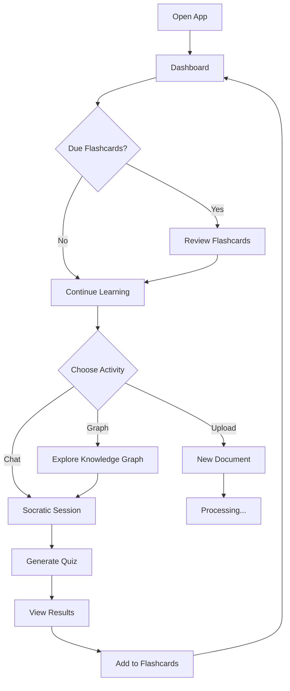

# AetherTutor: UI/UX Design Specification

> **Document Owner:** AetherTutor Team
> **Last Created:** April 5, 2026
> **Status:** Active (MVP Phase)
> **Version:** 1.0

---

## Mục lục

1. [Triết lý Thiết kế](#1-triết-lý-thiết-kế)
2. [Hệ thống Thiết kế (Design System)](#2-hệ-thống-thiết-kế-design-system)
3. [Cấu trúc Giao diện Tổng thể](#3-cấu-trúc-giao-diện-tổng-thể)
4. [Màn hình Chính (Core Screens)](#4-màn-hình-chính-core-screens)
   - [4.0 Empty States & Error States](#40-empty-states-error-states)
   - [4.1 Home Dashboard](#41-home-dashboard)
   - [4.2 Document Library](#42-document-library)
   - [4.3 Chat Interface](#43-chat-interface-socratic-tutor)
   - [4.4 Knowledge Graph Viewer](#44-knowledge-graph-viewer)
   - [4.5 Notes `[POST-MVP]`](#45-notes-zettelkasten-post-mvp)
   - [4.6 Quiz Interface `[POST-MVP]`](#46-quiz-interface-post-mvp)
5. [Thành phần UI Chi tiết (Component Details)](#5-thành-phần-ui-chi-tiết-component-details)
6. [Tương tác & Chuyển động (Interactions & Animations)](#6-tương-tác--chuyển-động-interactions--animations)
7. [Responsive & Accessibility](#7-responsive--accessibility)
8. [Thiết kế cho MVP](#8-thiết-cho-mvp)

---

## 1. Triết lý Thiết kế

### 1.1 Nguyên tắc Cốt lõi

AetherTutor được thiết kế dựa trên **3 trụ cột trải nghiệm**:

| Trụ cột | Mô tả | Mục tiêu |
|---------|-------|----------|
| **Clarity (Rõ ràng)** | Giao diện tối giản, tập trung vào nội dung học tập | Giảm cognitive load, tăng khả năng tập trung |
| **Flow (Dòng chảy)** | Chuyển đổi mượt mà giữa các tác vụ | Người dùng không bao giờ bị "mắc kẹt" |
| **Feedback (Phản hồi)** | Phản hồi tức thì cho mọi hành động | Tạo cảm giác kiểm soát và tiến bộ |

### 1.2 Phong cách Thị giác

- **Modern Minimalism:** Không gian trắng rộng rãi, typography rõ ràng, màu sắc có chủ đích
- **Knowledge-Centric:** UI biến mất, nội dung tri thức là trung tâm
- **Warm & Inviting:** Tông màu ấm áp, gradient nhẹ, góc bo tròn tạo cảm giác thân thiện
- **Progressive Disclosure:** Chỉ hiển thị khi cần thiết, tránh overload

### 1.3 Cảm hứng Thiết kế

- **Notion:** Không gian làm việc sạch sẽ, linh hoạt
- **Obsidian:** Graph visualization, linked thinking
- **Duolingo:** Gamification nhẹ nhàng, progress tracking
- **Linear:** Smooth interactions, keyboard-first approach

---

## 2. Hệ thống Thiết kế (Design System)

### 2.1 Bảng màu (Color Palette)

#### Primary Colors

```css
:root {
  /* Primary - Deep Indigo (Tri thức, sáng tạo) */
  --color-primary-50: #EEF2FF;
  --color-primary-100: #E0E7FF;
  --color-primary-200: #C7D2FE;
  --color-primary-300: #A5B4FC;
  --color-primary-400: #818CF8;
  --color-primary-500: #6366F1;  /* Main brand */
  --color-primary-600: #4F46E5;
  --color-primary-700: #4338CA;
  --color-primary-800: #3730A3;
  --color-primary-900: #312E81;

  /* Accent - Warm Amber (Năng lượng, đột phá) */
  --color-accent-50: #FFFBEB;
  --color-accent-100: #FEF3C7;
  --color-accent-200: #FDE68A;
  --color-accent-300: #FCD34D;
  --color-accent-400: #FBBF24;
  --color-accent-500: #F59E0B;  /* Main accent */
  --color-accent-600: #D97706;
  --color-accent-700: #B45309;
}
```

#### Neutral Colors

```css
:root {
  /* Light Mode */
  --bg-primary: #FFFFFF;
  --bg-secondary: #F8FAFC;
  --bg-tertiary: #F1F5F9;
  --border-light: #E2E8F0;
  --border-medium: #CBD5E1;
  --text-primary: #0F172A;
  --text-secondary: #475569;
  --text-tertiary: #94A3B8;

  /* Dark Mode */
  --bg-primary-dark: #0F172A;
  --bg-secondary-dark: #1E293B;
  --bg-tertiary-dark: #334155;
  --border-light-dark: #334155;
  --text-primary-dark: #F8FAFC;
  --text-secondary-dark: #CBD5E1;
  --text-tertiary-dark: #64748B;
}
```

#### Semantic Colors

```css
:root {
  --color-success: #10B981;  /* Green - Hoàn thành, đúng */
  --color-warning: #F59E0B;  /* Amber - Cảnh báo, ôn tập */
  --color-error: #EF4444;    /* Red - Lỗi, sai */
  --color-info: #3B82F6;     /* Blue - Thông tin */
}
```

### 2.2 Typography

```css
:root {
  /* Font Families */
  --font-sans: 'Inter', -apple-system, BlinkMacSystemFont, 'Segoe UI', sans-serif;
  --font-mono: 'JetBrains Mono', 'Fira Code', 'Consolas', monospace;
  --font-display: 'Plus Jakarta Sans', var(--font-sans);

  /* Font Sizes (Tailwind scale) */
  --text-xs: 0.75rem;      /* 12px - Labels, captions */
  --text-sm: 0.875rem;     /* 14px - Secondary text */
  --text-base: 1rem;       /* 16px - Body text */
  --text-lg: 1.125rem;     /* 18px - Emphasized text */
  --text-xl: 1.25rem;      /* 20px - H3 */
  --text-2xl: 1.5rem;      /* 24px - H2 */
  --text-3xl: 1.875rem;    /* 30px - H1 */
  --text-4xl: 2.25rem;     /* 36px - Hero */
}
```

**Usage Guidelines:**

| Element | Font | Size | Weight |
|---------|------|------|--------|
| Page Title | Plus Jakarta Sans | 30px | 700 |
| Section Header | Plus Jakarta Sans | 24px | 600 |
| Body Text | Inter | 16px | 400 |
| Chat Messages | Inter | 15px | 400 |
| Code Blocks | JetBrains Mono | 14px | 400 |
| Buttons | Inter | 14px | 500 |
| Labels | Inter | 12px | 500 |

### 2.3 Spacing & Layout

```css
:root {
  /* Spacing Scale (4px base) */
  --space-1: 0.25rem;   /* 4px */
  --space-2: 0.5rem;    /* 8px */
  --space-3: 0.75rem;   /* 12px */
  --space-4: 1rem;      /* 16px */
  --space-5: 1.25rem;   /* 20px */
  --space-6: 1.5rem;    /* 24px */
  --space-8: 2rem;      /* 32px */
  --space-10: 2.5rem;   /* 40px */
  --space-12: 3rem;     /* 48px */
  --space-16: 4rem;     /* 64px */
}
```

**Layout Principles:**

- **Container Max Width:** 1440px (desktop), fluid on smaller screens
- **Content Width:** Max 800px for readability (chat, notes, articles)
- **Grid Gutter:** 24px between columns
- **Card Padding:** 24px
- **Section Padding:** 48px vertical

### 2.4 Border Radius

```css
:root {
  --radius-sm: 6px;    /* Buttons, inputs */
  --radius-md: 8px;    /* Cards, panels */
  --radius-lg: 12px;   /* Large cards, modals */
  --radius-xl: 16px;   /* Hero sections */
  --radius-full: 9999px; /* Pills, avatars */
}
```

### 2.5 Shadows & Elevation

```css
:root {
  --shadow-sm: 0 1px 2px 0 rgba(0, 0, 0, 0.05);
  --shadow-md: 0 4px 6px -1px rgba(0, 0, 0, 0.1), 0 2px 4px -1px rgba(0, 0, 0, 0.06);
  --shadow-lg: 0 10px 15px -3px rgba(0, 0, 0, 0.1), 0 4px 6px -2px rgba(0, 0, 0, 0.05);
  --shadow-xl: 0 20px 25px -5px rgba(0, 0, 0, 0.1), 0 10px 10px -5px rgba(0, 0, 0, 0.04);
  --shadow-glow: 0 0 20px rgba(99, 102, 241, 0.3);  /* Primary glow */
}
```

### 2.6 Icons

- **Library:** Lucide Icons hoặc Heroicons (clean, modern)
- **Size:** 16px (inline), 20px (navigation), 24px (hero)
- **Style:** Outline cho inactive, filled cho active states

---

## 3. Cấu trúc Giao diện Tổng thể

### 3.1 Application Layout

```
┌─────────────────────────────────────────────────────────────┐
│  Top Navigation Bar (Sticky)                                │
│  [Logo] [Global Search]              [Notifications] [User] │
├──────────┬──────────────────────────────────────────────────┤
│          │                                                  │
│ Sidebar  │          Main Content Area                       │
│          │                                                  │
│ • Home   │    ┌──────────────────────────────────┐          │
│ • Docs   │    │                                  │          │
│ • Chat   │    │      Screen-specific Content     │          │
│ • Notes  │    │                                  │          │
│ • Graph  │    └──────────────────────────────────┘          │
│ • Quiz   │                                                  │
│ • Stats  │                                                  │
│          │                                                  │
├──────────┴──────────────────────────────────────────────────┤
│  Status Bar (optional)                                      │
│  [Processing: 2 docs] [Due: 5 cards] [Streak: 7 days]      │
└─────────────────────────────────────────────────────────────┘
```

### 3.2 Top Navigation Bar

**Height:** 64px
**Background:** White với subtle bottom border
**Position:** Sticky top

**Components:**

```
┌─────────────────────────────────────────────────────────────┐
│ ☰  [AetherTutor Logo]    🔍 Search...      🔔 3   👤 Avatar │
└─────────────────────────────────────────────────────────────┘
```

| Element | Description | Interaction |
|---------|-------------|-------------|
| **Hamburger Menu** | Toggle sidebar (mobile/tablet) | Click to expand/collapse |
| **Logo** | Brand + Home link | Click → Dashboard |
| **Global Search** | Command palette (Cmd+K) | Opens search modal |
| **LLM Mode Badge** | Hiển thị `🌐 Cloud` (GPT-4/Claude) hoặc `🔒 Local` (Ollama on-device). Đảm bảo người dùng luôn biết dữ liệu đang đi đến đâu — yếu tố tin tưởng quan trọng. | Click → Modal "Model Settings" |
| **Notifications** | Badge count | Click → Notification dropdown |
| **User Avatar** | Profile menu | Click → Settings, Logout |

**LLM Mode Badge — Chi tiết hiển thị:**

```
┌──────────────────────────────────────────────────────┐
│  🌐 Cloud Mode  →  GPT-4 / Claude 3.5 (API key)      │
│                    Dữ liệu được gửi lên Cloud        │
├──────────────────────────────────────────────────────┤
│  🔒 Local Mode  →  Ollama – Llama 3 (on-device)      │
│                    Mọi dữ liệu ở lại máy cá nhân    │
└──────────────────────────────────────────────────────┘
```

Click vào badge → Mở **Model Settings Modal** để:
- Chọn Cloud model (GPT-4o, Claude 3.5 Sonnet...)
- Chọn Local model (Llama 3, Mistral...) nếu Ollama đang chạy
- Kiểm tra trạng thái kết nối Ollama (Online / Offline)

**Search Modal (Cmd+K):**

```
┌──────────────────────────────────────────────────────┐
│  🔍  Type a command or search...                     │
├──────────────────────────────────────────────────────┤
│  SUGGESTIONS                                         │
│  📄  Continue reading "Neural Networks.pdf"          │
│  💬  Resume chat about Backpropagation               │
│  📊  View Knowledge Graph                            │
│  🎯  Review 5 due flashcards                         │
│                                                      │
│  ACTIONS                                             │
│  ⚡  Upload new document                             │
│  📝  Create new note                                 │
│  ❓  Start Socratic session                          │
└──────────────────────────────────────────────────────┘
```

### 3.3 Sidebar Navigation

**Width:** 260px (expanded), 72px (collapsed)
**Background:** Light gray (#F8FAFC)
**Position:** Fixed left, below top nav

**Navigation Items:**

```
┌─────────────────────┐
│  🏠  Home           │ ← Dashboard
│  📚  Documents      │ ← Document library
│  💬  Chat           │ ← AI conversations
│  📝  Notes          │ ← Zettelkasten
│  🕸️  Knowledge Graph│ ← Graph visualization
│  🎯  Quiz           │ ← Practice tests
│  📊  Progress       │ └← Learning analytics
│                     │
│  ─────────────────  │
│  ⚙️  Settings       │
│  ❓  Help           │
└─────────────────────┘
```

**Active State:**
- Background: Primary color (light tint)
- Icon: Primary color
- Text: Primary color, bold
- Left border: 3px primary color

**Hover State:**
- Background: Gray tint (#F1F5F9)
- Smooth transition: 150ms

### 3.4 Main Content Area

**Padding:** 32px
**Background:** White
**Max Width:** 1440px (centered)

---

## 4. Màn hình Chính (Core Screens)

### 4.0 Empty States & Error States

> [!IMPORTANT]
> Empty States và Error States là **MVP-required**. Người dùng mới hoặc gặp lỗi phải có hướng dẫn rõ ràng để tiếp tục — không được để màn hình trắng hoặc lỗi kỹ thuật thô.

#### 4.0.1 Empty State — Dashboard (Chưa có tài liệu nào)

```
┌────────────────────────────────────────────────────────────┐
│  Chào mừng đến với AetherTutor! 👋                        │
├────────────────────────────────────────────────────────────┤
│                                                             │
│                       📚                                   │
│                                                             │
│     Bắt đầu bằng cách tải lên tài liệu đầu tiên           │
│     để AetherTutor xây dựng Knowledge Graph cho bạn.       │
│                                                             │
│          [📤 Tải lên PDF]      [🔗 Nhập URL]               │
│                                                             │
│          Hỗ trợ: PDF • Trang web • YouTube                 │
│                                                             │
└────────────────────────────────────────────────────────────┘
```

**Behavior:** Hiển thị khi `documents.count === 0`. Thay toàn bộ nội dung Dashboard.

#### 4.0.2 Empty State — Document Library (Chưa có file)

```
┌────────────────────────────────────────────────────────────┐
│  📚 Documents                           [+ Upload PDF]     │
├────────────────────────────────────────────────────────────┤
│                                                             │
│                       📄                                   │
│           Chưa có tài liệu nào                             │
│           Tải lên tài liệu đầu tiên để bắt đầu học tập    │
│                                                             │
│           [📤 Upload PDF]     [🔗 Paste URL]               │
│                                                             │
└────────────────────────────────────────────────────────────┘
```

#### 4.0.3 Error State — Document Processing (Xử lý thất bại)

```
┌──────────────────────────────────────────────────────┐
│  ❌ Xử lý thất bại: Transformer Architecture.pdf     │
│                                                      │
│  Lỗi: LLM không phản hồi khi trích xuất thực thể   │
│       (Timeout sau 30 giây)                          │
│                                                      │
│  Gợi ý: Kiểm tra kết nối mạng hoặc API Key          │
│         hoặc chuyển sang 🔒 Local Mode               │
│                                                      │
│  [🔄 Thử lại]   [🔒 Dùng Local Mode]   [🗑️ Xóa]     │
└──────────────────────────────────────────────────────┘
```

**Error Types cần xử lý:**

| Lỗi | Thông báo hiển thị | Action khả dụng |
|-----|-------------------|-----------------|
| LLM Timeout | "LLM không phản hồi. Thử lại hoặc chuyển Local Mode." | Retry / Switch Local |
| File >50MB | "File vượt giới hạn 50MB. Vui lòng nén file." | Dismiss |
| PDF scan (không có text layer) | "Không đọc được text. Cần PDF có text layer." | Dismiss |
| API Key không hợp lệ | "API Key không hợp lệ. Kiểm tra trong Settings." | Go to Settings |
| Kết nối mạng thất bại | "Không kết nối được. Kiểm tra internet hoặc dùng Local Mode." | Retry / Switch Local |

#### 4.0.4 Error State — Chat (AI không phản hồi)

```
┌──────────────────────────────────────────────────┐
│  ⚠️  AI không phản hồi                          │
│                                                  │
│  Nguyên nhân có thể:                            │
│  • API key không hợp lệ hoặc hết quota           │
│  • Kết nối mạng gián đoạn                       │
│  • Model đang quá tải (thử lại sau vài giây)    │
│                                                  │
│  [🔄 Thử lại]    [⚙️ Kiểm tra Settings]         │
└──────────────────────────────────────────────────┘
```

---

### 4.1 Home Dashboard

**Mục đích:** Overview toàn bộ quá trình học tập, điểm bắt đầu cho mọi tác vụ

**Layout:**

```
┌────────────────────────────────────────────────────────────┐
│  Good morning, Alex! 👋                                   │
│  You've been learning for 7 days straight. Keep it up! 🔥  │
├────────────────────────────────────────────────────────────┤
│                                                             │
│  ┌──────────────────┐  ┌──────────────────────────────┐    │
│  │  Quick Stats     │  │  Continue Learning           │    │
│  │                  │  │                              │    │
│  │  📄 12 Docs      │  │  ▶ "Neural Networks.pdf"     │    │
│  │  💬 48 Messages  │  │    Last: Backpropagation     │    │
│  │  📝 23 Notes     │  │    Continue chat →           │    │
│  │  🎯 85% Quiz Avg │  │                              │    │
│  │                  │  │  ▶ "AI Ethics.pdf"           │    │
│  │  🔥 7 Day Streak │  │    Last: Data Bias impact    │    │
│  │                  │  │    Continue chat →           │    │
│  └──────────────────┘  └──────────────────────────────┘    │
│                                                             │
│  ┌──────────────────────────────────────────────────┐      │
│  │  📅 Today's Review (SM-2 Due)                    │      │
│  │                                                   │      │
│  │  ⚠️ 5 Flashcards due for review                  │      │
│  │  [Start Review →]                                │      │
│  │                                                   │      │
│  │  Progress: ████████░░ 8/10 concepts mastered     │      │
│  └──────────────────────────────────────────────────┘      │
│                                                             │
│  ┌──────────────────────────────┐  ┌─────────────────────┐ │
│  │  📊 Knowledge Graph Preview  │  │  ⚡ Quick Actions   │ │
│  │                              │  │                     │ │
│  │     (Mini graph viz)         │  │  📤 Upload PDF      │ │
│  │     45 nodes, 89 edges       │  │  💬 New Chat        │ │
│  │                              │  │  📝 New Note        │ │
│  │  [View Full Graph →]         │  │  🎯 Generate Quiz   │ │
│  └──────────────────────────────┘  └─────────────────────┘ │
│                                                             │
└────────────────────────────────────────────────────────────┘
```

**Key Features:**

| Component | Description | Visual Treatment |
|-----------|-------------|------------------|
| **Greeting Header** | Personalized message + streak | Large text, emoji, warm colors |
| **Quick Stats** | Key metrics at a glance | 2x3 grid, icon + number + label |
| **Continue Learning** | Recent documents/chats | Cards with thumbnail + last activity |
| **Today's Review** | SM-2 due flashcards | Progress bar + CTA button |
| **Graph Preview** | Mini knowledge graph | Embedded D3.js visualization |
| **Quick Actions** | Common tasks | Icon buttons grid |

### 4.2 Document Library

**Mục đích:** Quản lý tài liệu, theo dõi trạng thái xử lý

**Layout:**

```
┌────────────────────────────────────────────────────────────┐
│  📚 Documents                           [+ Upload PDF]     │
├────────────────────────────────────────────────────────────┤
│                                                             │
│  Filters: [All] [Processing] [Completed] [Failed]          │
│  Sort: [Recent ▼]                                          │
│                                                             │
│  ┌──────────────────────────────────────────────────┐      │
│  │  📄 Neural Networks and Deep Learning.pdf        │      │
│  │     ✅ Completed • 45 entities, 89 relations     │      │
│  │     Uploaded 2 hours ago • 2.4 MB, 32 pages      │      │
│  │     [💬 Chat] [🕸️ View Graph] [📊 Stats]         │      │
│  └──────────────────────────────────────────────────┘      │
│                                                             │
│  ┌──────────────────────────────────────────────────┐      │
│  │  📄 AI Ethics and Society.pdf                    │      │
│  │     ✅ Completed • 38 entities, 72 relations     │      │
│  │     Uploaded yesterday • 1.8 MB, 24 pages        │      │
│  │     [💬 Chat] [🕸️ View Graph] [📊 Stats]         │      │
│  └──────────────────────────────────────────────────┘      │
│                                                             │
│  ┌──────────────────────────────────────────────────┐      │
│  │  📄 Transformer Architecture.pdf                 │      │
│  │     ⏳ Processing... (Entity extraction: 65%)    │      │
│  │     Uploaded 5 min ago • 3.1 MB, 45 pages        │      │
│  │     [View Progress]                              │      │
│  └──────────────────────────────────────────────────┘      │
│                                                             │
└────────────────────────────────────────────────────────────┘
```

**Document Card Design:**

- **Background:** White với subtle border
- **Hover Effect:** Lift up 4px + shadow
- **Status Indicators:**
  - ✅ Green badge: Completed
  - ⏳ Amber animated badge: Processing
  - ❌ Red badge: Failed
- **Action Buttons:** Ghost style, appear on hover

**Upload Modal:**

```
┌──────────────────────────────────────────────┐
│  📤 Upload Documents                         │
│                                              │
│  Drag & drop PDF files here                  │
│  or click to browse                          │
│                                              │
│  ┌──────────────────────────────────────┐   │
│  │                                      │   │
│  │           📄                         │   │
│  │   Drop your PDF here                 │   │
│  │                                      │   │
│  │   Max 50MB per file                  │   │
│  │   Supports: PDF, Web URLs, YouTube   │   │
│  │                                      │   │
│  └──────────────────────────────────────┘   │
│                                              │
│  Selected files:                             │
│  📄 neural_networks.pdf (2.4 MB)      ✕     │
│  📄 ai_ethics.pdf (1.8 MB)            ✕     │
│                                              │
│  [Cancel]          [Upload 2 Files]         │
└──────────────────────────────────────────────┘
```

**Processing Progress:**

```
┌──────────────────────────────────────────────────┐
│  ⏳ Processing Document                          │
│                                                  │
│  Extracting text... ✅                           │
│  Chunking content... ✅                          │
│  Extracting entities... ████████░░ 65%           │
│  Building knowledge graph... ⏳                  │
│  Generating embeddings... ⏳                     │
│                                                  │
│  Estimated time: ~2 minutes                      │
│  [View in Background]                            │
└──────────────────────────────────────────────────┘
```

### 4.3 Chat Interface (Socratic Tutor)

**Mục đích:** Hội thoại AI với chế độ Socratic/Feynman

**Layout:**

```
┌────────────────────────────────────────────────────────────┐
│  💬 Chat with "Neural Networks.pdf"           [⚙️ Settings]│
├────────────────────────────────────────────────────────────┤
│                                                             │
│  ┌──────────────────────────────────────────────────┐      │
│  │  SYSTEM MODE                        [✏️ Đổi]   │      │
│  │  🎭 Socratic Tutor • Feynman Technique           │      │
│  │  📚 Combo: [D — Kỹ thuật & Logic ▼]             │      │
│  │  Graph-aware: 45 entities, 89 relations loaded   │      │
│  └──────────────────────────────────────────────────┘      │
│                                                             │
│  ┌──────────────────────────────────────────────────┐      │
│  │  AI Assistant                                    │      │
│  │                                                   │      │
│  │  I've analyzed the document on Neural Networks.  │      │
│  │  What would you like to explore first?           │      │
│  │                                                   │      │
│  │  Here are some suggestions:                      │      │
│  │  • How does backpropagation work?                │      │
│  │  • What are activation functions?                │      │
│  │  • Explain the role of gradient descent          │      │
│  │                                                   │      │
│  │  2:30 PM                                         │      │
│  └──────────────────────────────────────────────────┘      │
│                                                             │
│  ┌──────────────────────────────────────────────────┐      │
│  │  You                                             │      │
│  │                                                   │      │
│  │  Can you explain backpropagation?                │      │
│  │                                                   │      │
│  │  2:31 PM                                         │      │
│  └──────────────────────────────────────────────────┘      │
│                                                             │
│  ┌──────────────────────────────────────────────────┐      │
│  │  AI Assistant 🎭                                 │      │
│  │                                                   │      │
│  │  Before I explain it, let me ask you this:       │      │
│  │                                                   │      │
│  │  Imagine you're adjusting knobs on a machine     │      │
│  │  to get the desired output. How would you know   │      │
│  │  which knob needs more adjustment?               │      │
│  │                                                   │      │
│  │  💡 Think about it in terms of "error" and       │      │
│  │  "responsibility"...                             │      │
│  │                                                   │      │
│  │  🔗 Related: Gradient Descent, Loss Function     │      │
│  │  📊 Graph neighbors: 3 unexplored concepts       │      │
│  │                                                   │      │
│  │  2:31 PM                                         │      │
│  └──────────────────────────────────────────────────┘      │
│                                                             │
├────────────────────────────────────────────────────────────┤
│  💡 Try: "Explain like I'm 10" or "What if..."            │
│  ┌─────────────────────────────────────────────┐  [Send]   │
│  │ Type your message...                         │           │
│  └─────────────────────────────────────────────┘           │
│                                                             │
│  [🎓 Feynman Test] [📊 Sơ đồ °] [🎯 Quiz °]               │
└────────────────────────────────────────────────────────────┘

> **°** Các nút được đánh dấu `°` sẽ ở trạng thái **disabled** trong MVP với tooltip _"Coming soon"_. Chúng sẽ được kích hoạt sau khi Visualizer Agent (Post-MVP Week 15-16) và Quiz Interface (Post-MVP Week 13-14) hoàn thành.
```

**Key UI Features:**

| Feature | Description | Visual Treatment |
|---------|-------------|------------------|
| **Mode Indicator** | Hiển thị tutoring mode + nút `[✏️ Đổi]` để mở Learning Profile modal | Top banner với icon + dropdown |
| **Combo Selector** | Dropdown chọn Combo A/B/C/D theo lĩnh vực (xem `Methodology.md §3`). Agent tự điều chỉnh phong cách tương tác theo combo | Dropdown trong Mode Indicator banner |
| **Message Bubbles** | User (right, primary), AI (left, light) | Rounded corners, max-width 70% |
| **Streaming Response** | Real-time text generation | Typing animation + cursor |
| **Context Chips** | Related entities/concepts từ LightRAG graph | Small pill badges below message |
| **Quick Actions** | `[Feynman Test]` — MVP. `[Sơ đồ °]` `[Quiz °]` — disabled trong MVP | Clickable chips; disabled = grey + tooltip "Coming soon" |
| **Input Area** | Multi-line textarea với auto-resize | Min 48px height, expandable |

**Socratic Mode Indicators:**

```
┌──────────────────────────────────────────────────┐
│  Current Approach:                               │
│  🎯 Asking guiding questions                     │
│  🔍 Gap detected: Gradient Descent basics        │
│  💡 Suggestion: Review calculus fundamentals?    │
│  [Yes, explain] [Skip for now]                   │
└──────────────────────────────────────────────────┘
```

### 4.4 Knowledge Graph Viewer

**Mục đích:** Trực quan hóa mạng lưới tri thức

**Layout:**

```
┌────────────────────────────────────────────────────────────┐
│  🕸️ Knowledge Graph: "Neural Networks.pdf"    [⚙️] [📥]   │
├──────────┬─────────────────────────────────────────────────┤
│          │                                                 │
│ Sidebar  │         Graph Canvas (React Flow)              │
│          │                                                 │
│ Entities │         (Interactive node-edge diagram)        │
│ 🔵 Concept (25)                                           │
│ 🟡 Term (12)                                              │
│ 🟢 Process (8)                                            │
│          │              [Node]─────[Node]                  │
│ Relations│                │           │                    │
│ 🔗 is_a (15)           [Node]─────[Node]                  │
│ 🔗 part_of (20)                                           │
│ 🔗 causes (8)          Controls:                          │
│ 🔗 enables (12)        [Fit View] [Zoom +] [Zoom -]       │
│          │                [Layout] [Filter] [Search]       │
│ Selected │                                                 │
│ Node:    │                                                 │
│ ┌──────┐ │                                                 │
│ │Gradient│ │         Mini-map (bottom-right corner)        │
│ │Descent │ │         ┌─────────────────────┐              │
│ ├──────┤ │         │  (overview)           │              │
│ │Type:   │ │         └─────────────────────┘              │
│ │Process │ │                                              │
│ │Links: 8 │ │                                              │
│ │         │ │                                              │
│ │[Chat]   │ │                                              │
│ │[Quiz]   │ │                                              │
│ └──────┘ │                                                 │
│          │                                                 │
├──────────┴─────────────────────────────────────────────────┤
│  Legend:                                                    │
│  🔵 Concept  🟡 Term  🟢 Process  🟣 Theory  🟠 Framework  │
└────────────────────────────────────────────────────────────┘
```

**Node Design:**

- **Shape:** Circle cho concepts, rounded rectangle cho terms
- **Size:** Based on centrality (more connections = larger)
- **Color:** By entity type
- **Labels:** Show on hover, or always if zoomed in
- **Hover Effect:** Glow + tooltip với description

**Edge Design:**

- **Style:** Curved lines (bezier)
- **Color:** Gray default, primary when selected
- **Labels:** Relation type, shown on hover
- **Arrow:** Subtle, indicates direction

**Interactions:**

| Action | Result |
|--------|--------|
| Click node | Show details in sidebar |
| Double-click node | Focus subgraph |
| Drag node | Reposition manually |
| Scroll | Zoom in/out |
| Right-click | Context menu (Chat, Quiz, Add note) |
| Search | Highlight matching nodes |

### 4.5 Notes (Zettelkasten) `[POST-MVP — Week 20-21]`

> [!WARNING]
> **Tính năng này nằm ngoài phạm vi MVP.** Theo `MVP_Implementation_Plan.md §2.1`, Zettelkasten Notes được triển khai ở Week 20-21 sau khi hoàn thành core pipeline. Thiết kế dưới đây là tài liệu tham khảo — **không implement trong Sprint MVP hiện tại.**

**Mục đích:** Quản lý ghi chú nguyên tử với backlinks

**Layout:**

```
┌────────────────────────────────────────────────────────────┐
│  📝 Notes                                [+ New Note]      │
├──────────────────┬─────────────────────────────────────────┤
│                  │                                         │
│ Search Notes     │  Note Editor                            │
│ 🔍 [type...]     │                                         │
│                  │  ┌───────────────────────────────────┐  │
│ Tags             │  │ Title: The Danger of Objective Fn │  │
│ #ai-safety (5)   │  ├───────────────────────────────────┤  │
│ #neural-net (8)  │  │                                   │  │
│ #ethics (3)      │  │ Content:                           │  │
│                  │  │                                   │  │
│ Recent           │  │ An optimization algorithm can     │  │
│ Note A (2h ago)  │  │ inadvertently amplify social      │  │
│ Note B (1d ago)  │  │ patterns because it always seeks  │  │
│ Note C (3d ago)  │  │ the minimum of the loss function  │  │
│                  │  │ on historical data.               │  │
│ All Notes (23)   │  │                                   │  │
│                  │  │ 🔗 Backlinks (3):                 │  │
│                  │  │    • Data Bias in ML (linked 2d)  │  │
│                  │  │    • AI Alignment Problem (1w)    │  │
│                  │  │    • Utilitarianism (2w)          │  │
│                  │  │                                   │  │
│                  │  │ 🏷️ Tags: #ai-safety #ethics      │  │
│                  │  └───────────────────────────────────┘  │
│                  │                                         │
│                  │  [Save] [Preview] [Link to Note]        │
│                  │                                         │
└──────────────────┴─────────────────────────────────────────┘
```

**Note Card (List View):**

```
┌──────────────────────────────────────────┐
│  The Danger of Objective Functions       │
│  An optimization algorithm can           │
│  inadvertently amplify social patterns.. │
│                                          │
│  🔗 3 backlinks  🏷️ #ai-safety #ethics  │
│  Edited 2 hours ago                      │
└──────────────────────────────────────────┘
```

**Backlinks Feature:**

- Hiển thị dưới mỗi note
- Click để navigate đến linked note
- Tooltip preview trên hover

### 4.6 Quiz Interface `[POST-MVP — Week 13-14]`

> [!WARNING]
> **Tính năng này nằm ngoài phạm vi MVP.** Theo `MVP_Implementation_Plan.md §2.1`, Quiz Interface được triển khai ở Week 13-14 sau khi có Examiner Agent. Thiết kế dưới đây là tài liệu tham khảo — **không implement trong Sprint MVP hiện tại.**

**Mục đích:** Kiểm tra kiến thức adaptive

**Layout (Quiz Generation):**

```
┌────────────────────────────────────────────────────────────┐
│  🎯 Generate Quiz                                           │
├────────────────────────────────────────────────────────────┤
│                                                             │
│  Source: [Neural Networks.pdf ▼]                           │
│                                                             │
│  Number of Questions: [10]                                 │
│                                                             │
│  Question Types:                                           │
│  ☑️ Multiple Choice                                        │
│  ☑️ True/False                                             │
│  ☐ Fill in the Blank                                       │
│  ☐ Short Answer                                            │
│                                                             │
│  Difficulty:                                               │
│  ○ Easy    ● Medium    ○ Hard    ○ Adaptive                │
│                                                             │
│  Focus Areas:                                              │
│  ☑️ Backpropagation                                        │
│  ☑️ Activation Functions                                   │
│  ☐ Gradient Descent                                        │
│  ☐ All Topics                                              │
│                                                             │
│  [Generate Quiz]                                           │
│                                                             │
└────────────────────────────────────────────────────────────┘
```

**Layout (Quiz Taking):**

```
┌────────────────────────────────────────────────────────────┐
│  Quiz: Neural Networks fundamentals        Question 3/10   │
│  ████████████████████░░░░░░░░░░ 33%                       │
├────────────────────────────────────────────────────────────┤
│                                                             │
│  Question 3:                                               │
│  Which activation function is most commonly used in        │
│  hidden layers of modern neural networks?                  │
│                                                             │
│  ○ A) Sigmoid                                              │
│  ○ B) ReLU (Rectified Linear Unit)                         │
│  ○ C) Tanh                                                 │
│  ○ D) Softmax                                              │
│                                                             │
│  💡 Hint: Think about vanishing gradient problem           │
│                                                             │
│  [Previous]                    [Submit & Next]             │
│                                                             │
├────────────────────────────────────────────────────────────┤
│  Time: 2:45  |  Score: 2/2  |  Streak: 🔥 2                │
└────────────────────────────────────────────────────────────┘
```

**Layout (Quiz Results):**

```
┌────────────────────────────────────────────────────────────┐
│  Quiz Complete! 🎉                                         │
├────────────────────────────────────────────────────────────┤
│                                                             │
│  Score: 8/10 (80%)                                         │
│  ████████████████████░░░░                                  │
│                                                             │
│  ⏱️ Time: 8:32  |  Accuracy: 80%  |  Speed: Good           │
│                                                             │
│  ┌──────────────────────────────────────────────────┐      │
│  │  Questions to Review                             │      │
│  │                                                   │      │
│  │  ❌ Q5: What is the vanishing gradient problem?  │      │
│  │     Your answer: Sigmoid                         │      │
│  │     Correct: All of the above                    │      │
│  │     [Review Explanation] [Add to Flashcards]     │      │
│  │                                                   │      │
│  │  ❌ Q7: Define learning rate                     │      │
│  │     Your answer: (blank)                         │      │
│  │     Correct: Step size in gradient descent       │      │
│  │     [Review Explanation] [Add to Flashcards]     │      │
│  └──────────────────────────────────────────────────┘      │
│                                                             │
│  [Retake Quiz] [Review All] [Done]                         │
│                                                             │
└────────────────────────────────────────────────────────────┘
```

### 4.7 Progress & Analytics

**Mục đích:** Theo dõi quá trình học tập

**Layout:**

```
┌────────────────────────────────────────────────────────────┐
│  📊 Learning Progress                                     │
├────────────────────────────────────────────────────────────┤
│                                                             │
│  ┌──────────────┐ ┌──────────────┐ ┌──────────────┐       │
│  │  Study Time  │ │  Quiz Score  │ │  Mastery     │       │
│  │  24.5 hrs    │ │  85% avg     │ │  67%         │       │
│  │  ↑ 12%       │ │  ↑ 5%        │ │  ↑ 8%        │       │
│  │  This week   │ │  This week   │ │  Overall     │       │
│  └──────────────┘ └──────────────┘ └──────────────┘       │
│                                                             │
│  ┌──────────────────────────────────────────────┐          │
│  │  📈 Learning Activity (Last 30 days)         │          │
│  │                                               │          │
│  │  ██  ██    ██  ██████  ██    ██  ██████       │          │
│  │  ██  ██ ██ ██  ██  ██ ██ ██ ██  ██  ██       │          │
│  │  Mo  Tu  We  Th  Fr  Sa  Su  Mo  Tu  We       │          │
│  └──────────────────────────────────────────────┘          │
│                                                             │
│  ┌──────────────────────┐ ┌─────────────────────┐         │
│  │  🔥 Current Streak   │ │  📅 Study Schedule  │         │
│  │                       │ │                     │         │
│  │      7 Days!          │ │  M T W T F S S     │         │
│  │  ███████░░░░░         │ │  █ █ █ █ █ ░ ░     │         │
│  │  Best: 14 days        │ │                     │         │
│  │                       │ │  Next review:       │         │
│  └──────────────────────┘ │  Tomorrow, 9 AM     │         │
│                           └─────────────────────┘         │
│                                                             │
│  ┌──────────────────────────────────────────────┐          │
│  │  🧠 Knowledge Mastery by Topic              │          │
│  │                                               │          │
│  │  Neural Networks    ████████████████░░ 85%   │          │
│  │  Backpropagation    ██████████████░░░░ 75%   │          │
│  │  Activation Fn      ████████████████░░ 80%   │          │
│  │  Gradient Descent   ██████████░░░░░░░░ 55%   │          │
│  │  AI Ethics          ████████░░░░░░░░░░ 45%   │          │
│  └──────────────────────────────────────────────┘          │
│                                                             │
└────────────────────────────────────────────────────────────┘
```

---

## 5. Thành phần UI Chi tiết (Component Details)

### 5.1 Buttons

**Primary Button:**
```css
.btn-primary {
  background: linear-gradient(135deg, #6366F1 0%, #4F46E5 100%);
  color: white;
  padding: 10px 24px;
  border-radius: 8px;
  font-weight: 500;
  transition: all 150ms;
}
.btn-primary:hover {
  transform: translateY(-2px);
  box-shadow: 0 4px 12px rgba(99, 102, 241, 0.4);
}
```

**Secondary Button:**
```css
.btn-secondary {
  background: white;
  color: #4F46E5;
  border: 2px solid #E0E7FF;
  padding: 10px 24px;
  border-radius: 8px;
  font-weight: 500;
}
.btn-secondary:hover {
  border-color: #6366F1;
  background: #EEF2FF;
}
```

**Ghost Button:**
```css
.btn-ghost {
  background: transparent;
  color: #475569;
  padding: 8px 16px;
  border-radius: 8px;
}
.btn-ghost:hover {
  background: #F1F5F9;
  color: #0F172A;
}
```

### 5.2 Cards

**Document Card:**
```css
.doc-card {
  background: white;
  border: 1px solid #E2E8F0;
  border-radius: 12px;
  padding: 24px;
  transition: all 200ms;
}
.doc-card:hover {
  transform: translateY(-4px);
  box-shadow: 0 10px 25px rgba(0, 0, 0, 0.1);
}
```

### 5.3 Progress Indicators

**Linear Progress:**
```
Completed: ████████████████░░░░ 80%
```

**Circular Progress (for stats):**
```
    ╭─────╮
   ╱  85%  ╲
  │    ●    │
   ╲       ╱
    ╰─────╯
```

### 5.4 Badges & Tags

```css
.badge-success {
  background: #D1FAE5;
  color: #065F46;
  padding: 4px 12px;
  border-radius: 9999px;
  font-size: 12px;
  font-weight: 500;
}

.badge-warning {
  background: #FEF3C7;
  color: #92400E;
  padding: 4px 12px;
  border-radius: 9999px;
  font-size: 12px;
  font-weight: 500;
}
```

### 5.5 Input Fields

```css
.input {
  border: 2px solid #E2E8F0;
  border-radius: 8px;
  padding: 12px 16px;
  font-size: 14px;
  transition: all 150ms;
}
.input:focus {
  outline: none;
  border-color: #6366F1;
  box-shadow: 0 0 0 3px rgba(99, 102, 241, 0.1);
}
```

### 5.6 Tooltips

```css
.tooltip {
  background: #1E293B;
  color: white;
  padding: 8px 12px;
  border-radius: 6px;
  font-size: 12px;
  box-shadow: 0 4px 12px rgba(0, 0, 0, 0.3);
  z-index: 1000;
}
```

### 5.7 Modals

```
┌──────────────────────────────────────────────┐
│                                              │
│         Modal Content Area                   │
│         Max width: 600px                     │
│         Background: white                    │
│         Border-radius: 16px                  │
│         Box-shadow: 0 25px 50px rgba(0,0,0,0.25) │
│                                              │
└──────────────────────────────────────────────┘
```

Overlay: Black 50% opacity

---

## 6. Tương tác & Chuyển động (Interactions & Animations)

### 6.1 Animation Principles

- **Duration:** 150-300ms (fast enough to feel responsive, slow enough to notice)
- **Easing:** `cubic-bezier(0.4, 0, 0.2, 1)` (Material Design standard)
- **Transform > Position:** Use `transform` và `opacity` cho smooth 60fps animations

### 6.2 Common Animations

| Action | Animation | Duration |
|--------|-----------|----------|
| Hover button | TranslateY(-2px) + shadow | 150ms |
| Hover card | TranslateY(-4px) + shadow | 200ms |
| Modal open | Fade in + scale up (0.95 → 1) | 250ms |
| Page transition | Fade in | 200ms |
| Toast notification | Slide in from bottom | 300ms |
| Progress bar | Width animation | 500ms |
| Streaming text | Typing cursor + fade in chars | 30ms/char |
| Loading spinner | Rotate 360deg | 1000ms linear |

### 6.3 Loading States

**Skeleton Loading:**
```
┌────────────────────────────────────┐
│ ▓▓▓▓▓▓░░░░░░░░░░░░░░░░░░░░░░░░░░ │
│ ▓▓▓▓░░░░░░░░                       │
│                                     │
│ ▓▓▓▓▓▓▓▓▓▓▓▓░░░░░░░░░░░░░░░░░░░░ │
│ ▓▓▓▓▓▓▓▓▓▓░░░░░░░░                 │
└────────────────────────────────────┘
```

Animated shimmer effect: Left to right gradient

**Spinner:**
```css
.spinner {
  border: 3px solid #E0E7FF;
  border-top: 3px solid #6366F1;
  border-radius: 50%;
  width: 24px;
  height: 24px;
  animation: spin 1s linear infinite;
}
```

### 6.4 Micro-interactions

| Interaction | Feedback |
|-------------|----------|
| Upload complete | ✅ Green checkmark + toast notification |
| Message sent | Whoosh animation + slide in |
| Quiz correct | 🎉 Confetti (subtle) + green highlight |
| Quiz wrong | Gentle shake + red highlight |
| Streak milestone | 🔥 Fire animation + celebration modal |
| Note saved | Brief "Saved ✓" text |
| Graph node click | Glow pulse effect |

---

## 7. Responsive & Accessibility

### 7.1 Breakpoints

```css
/* Mobile */
@media (max-width: 640px) {
  /* Single column, hidden sidebar */
}

/* Tablet */
@media (min-width: 641px) and (max-width: 1024px) {
  /* Collapsible sidebar */
}

/* Desktop */
@media (min-width: 1025px) {
  /* Full layout */
}

/* Large Desktop */
@media (min-width: 1440px) {
  /* Max width container */
}
```

### 7.2 Mobile Adaptations

**Mobile Layout:**
```
┌─────────────────────┐
│  ☰  [Logo]     🔔 👤│  ← Top nav
├─────────────────────┤
│                     │
│   Main Content      │
│   (Full width)      │
│                     │
├─────────────────────┤
│  [🏠] [📚] [💬] [📝]│  ← Bottom tab bar
└─────────────────────┘
```

- **Sidebar:** Hidden, accessible via hamburger menu
- **Bottom Navigation:** 4-5 tabs (Home, Docs, Chat, Notes, More)
- **Cards:** Full width, stacked vertically
- **Buttons:** Larger touch targets (min 44x44px)

### 7.3 Accessibility (WCAG 2.1 AA)

| Requirement | Implementation |
|-------------|----------------|
| **Color Contrast** | Min 4.5:1 cho text, 3:1 cho UI elements |
| **Keyboard Navigation** | Tab order, focus indicators, shortcuts |
| **Screen Readers** | ARIA labels, semantic HTML, alt text |
| **Focus Management** | Visible focus rings (3px primary outline) |
| **Motion Reduction** | Respect `prefers-reduced-motion` |
| **Font Scaling** | Support up to 200% zoom |

**Focus Ring:**
```css
*:focus {
  outline: 3px solid #6366F1;
  outline-offset: 2px;
}
```

### 7.4 Dark Mode

**Toggle Location:** Settings + User menu

**Dark Mode Palette:**
```css
.dark {
  --bg-primary: #0F172A;
  --bg-secondary: #1E293B;
  --bg-tertiary: #334155;
  --text-primary: #F8FAFC;
  --text-secondary: #CBD5E1;
  --border-color: #334155;
}
```

**Considerations:**

- Reduce brightness of primary colors
- Increase contrast for readability
- Test graph visualization visibility
- Adjust shadows for dark backgrounds

---

## 8. Thiết kế cho MVP

### 8.1 MVP Scope (Sprint 5: Week 8-9)

**Required Screens:**

1. ✅ **Home Dashboard** (simplified — xem §8.2)
2. ✅ **Document Upload & List**
3. ✅ **Chat Interface** (Socratic mode, chỉ kích hoạt Feynman Test — Diagram/Quiz disabled)
4. ✅ **Graph Viewer** (basic, bao gồm Search entity)
5. ✅ **Empty States** (Dashboard trống, Library trống — xem §4.0.1, §4.0.2)
6. ✅ **Error States** (Processing failed, Chat failed — xem §4.0.3, §4.0.4)
7. ✅ **LLM Mode Indicator** (Cloud/Local toggle trong Top Nav — xem §3.2)

**Nice to Have:**

- ⚠️ Progress tracking (basic stats only)
- ⚠️ Dark mode (post-MVP)
- ⚠️ Mobile responsive (basic only)

**Post-MVP:**

- ❌ Notes (Zettelkasten)
- ❌ Quiz Interface
- ❌ Flashcards (SM-2)
- ❌ Advanced analytics

### 8.2 MVP Dashboard (Simplified)

```
┌────────────────────────────────────────────────────────────┐
│  Welcome to AetherTutor 👋                                │
├────────────────────────────────────────────────────────────┤
│                                                             │
│  ┌──────────────────────┐  ┌──────────────────────────┐   │
│  │  Quick Actions       │  │  Recent Documents        │   │
│  │                       │  │                           │   │
│  │  📤 Upload PDF       │  │  📄 Neural Networks.pdf  │   │
│  │  💬 Start Chat       │  │     ✅ Ready to chat     │   │
│  │  🕸️ View Graph       │  │                           │   │
│  │                       │  │  📄 AI Ethics.pdf        │   │
│  │                       │  │     ⏳ Processing...     │   │
│  └──────────────────────┘  └──────────────────────────┘   │
│                                                             │
└────────────────────────────────────────────────────────────┘
```

### 8.3 Implementation Priority

| Priority | Component | Reason |
|----------|-----------|--------|
| P0 | Chat Interface | Core value proposition |
| P0 | Document Upload | Required for LightRAG |
| P1 | Graph Viewer | Key differentiator |
| P1 | Dashboard | User orientation |
| P2 | Progress Stats | Engagement metric |
| P2 | Settings | Configuration |

### 8.4 Tech Stack for Frontend

```typescript
// Recommended stack
{
  "framework": "React 18+ with TypeScript",
  "styling": "Tailwind CSS",
  "state": "Zustand or Redux Toolkit",
  "routing": "React Router v6",
  "graph_viz": "React Flow",
  "charts": "Recharts or Chart.js",
  "animations": "Framer Motion",
  "http_client": "Axios",
  "websocket": "Socket.io-client",
  "ui_components": "Headless UI + custom styling"
}
```

---

## 9. User Flow Diagrams

### 9.1 First-Time User Onboarding



### 9.2 Daily Learning Flow



---

## 10. Design Tokens (Export for Development)

```json
{
  "color": {
    "primary": {
      "50": "#EEF2FF",
      "100": "#E0E7FF",
      "500": "#6366F1",
      "600": "#4F46E5",
      "700": "#4338CA"
    },
    "accent": {
      "500": "#F59E0B",
      "600": "#D97706"
    },
    "semantic": {
      "success": "#10B981",
      "warning": "#F59E0B",
      "error": "#EF4444",
      "info": "#3B82F6"
    }
  },
  "spacing": {
    "unit": 4,
    "sm": 8,
    "md": 16,
    "lg": 24,
    "xl": 32
  },
  "typography": {
    "fontFamily": {
      "sans": "Inter, system-ui, sans-serif",
      "display": "Plus Jakarta Sans, sans-serif",
      "mono": "JetBrains Mono, monospace"
    }
  },
  "borderRadius": {
    "sm": "6px",
    "md": "8px",
    "lg": "12px",
    "xl": "16px"
  },
  "shadows": {
    "md": "0 4px 6px -1px rgba(0,0,0,0.1)",
    "lg": "0 10px 15px -3px rgba(0,0,0,0.1)"
  }
}
```

---

## 11. Next Steps & Deliverables

### Sprint 1: Design (Week 1-2)

- [ ] Create Figma wireframes for all core screens
- [ ] Design component library in Storybook
- [ ] Prototype key interactions (chat, graph viewer)
- [ ] User testing with 3-5 participants

### Sprint 2: Development (Week 3-6)

- [ ] Setup React project với TypeScript
- [ ] Implement design system (Tailwind config)
- [ ] Build core components (buttons, cards, inputs)
- [ ] Develop screens (Dashboard, Upload, Chat, Graph)
- [ ] Integrate với backend API

### Sprint 3: Polish (Week 7-8)

- [ ] Add animations và micro-interactions
- [ ] Test responsive breakpoints
- [ ] Accessibility audit (Lighthouse)
- [ ] Performance optimization
- [ ] Cross-browser testing

---

## 12. Design Principles Checklist

Mỗi màn hình cần đạt các tiêu chí:

- [ ] **Clarity:** Mục đích của màn hình là gì? (rõ ràng trong 3 giây)
- [ ] **Efficiency:** Người dùng hoàn thành task trong bao nhiêu click?
- [ ] **Feedback:** Mọi action có phản hồi không? (loading, success, error)
- [ ] **Consistency:** Có tuân theo design system không?
- [ ] **Accessibility:** Có đạt WCAG 2.1 AA không?
- [ ] **Delightful:** Có yếu tố gây bất ngờ tích cực không?

---

## 13. Tài liệu Tham khảo

- **Material Design 3:** https://m3.material.io/
- **Apple Human Interface Guidelines:** https://developer.apple.com/design/
- **Tailwind UI:** https://tailwindui.com/
- **Nielsen Norman Group (UX):** https://nngroup.com/
- **Laws of UX:** https://lawsofux.com/

---

> [!NOTE]
> Tài liệu này sẽ được cập nhật liên tục trong quá trình phát triển.
> Mọi thay đổi cần được thông qua bởi Design Lead và Product Owner.

---

© 2026 AetherTutor Team. Last updated: April 5, 2026
