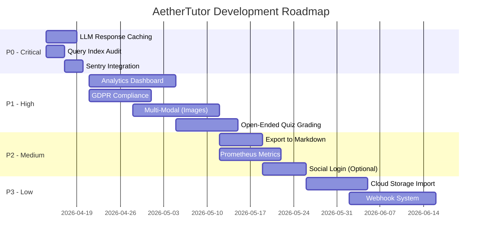

# AetherTutor - Phân Tích Tham Khảo & Đề Xuất Phát Triển

> **Ngày tạo:** April 11, 2026  
> **Author:** AI Assistant  
> **Mục đích:** Tổng hợp phân tích hệ thống hiện tại, phản biện các cơ hội tích hợp, và đề xuất roadmap phát triển tối ưu.

---

## 📊 MỤC LỤC

1. [Tổng Quan Hệ Thống Hiện Tại](#1-tổng-quan-hệ-thống-hiện-tại)
2. [Phân Tích SWOT](#2-phân-tích-swot)
3. [Đề Xuất Tích Hợp & Phản Biện](#3-đề-xuất-tích-hợp--phản-biện)
4. [Roadmap Tối Ưu](#4-roadmap-tối-ưu)
5. [Kết Luận & Khuyến Nghị](#5-kết-luận--khuyến-nghị)

---

## 1. TỔNG QUAN HỆ THỐNG HIỆN TẠI

### 1.1 Kiến Trúc Tổng Thể

AetherTutor là **AI-Powered Learning OS** với kiến trúc agentic, sử dụng LightRAG để xây dựng Knowledge Graph từ tài liệu người dùng, hỗ trợ học tập sâu thông qua phương pháp Socratic phản biện.

**Tech Stack:**
| Layer | Technology |
|-------|-----------|
| **Backend** | Python 3.11, FastAPI, Uvicorn |
| **Database** | PostgreSQL 16 (asyncpg), SQLAlchemy 2.0 |
| **Vector DB** | ChromaDB 0.5.0 |
| **Cache/Queue** | Redis 7, ARQ |
| **LLM** | OpenAI API / Ollama (local) |
| **Graph** | NetworkX |
| **Frontend** | React/Vite + TypeScript |
| **Testing** | pytest, pytest-asyncio, httpx |

### 1.2 Tính Năng Đã Implement ✅

**Trụ cột 1 - Interactive Learning:**
- ✅ Socratic/Feynman Chat với graph-aware context
- ✅ SSE streaming responses
- ✅ Multi-document reasoning
- ✅ Adaptive Quiz generation (Bloom's Taxonomy)
- ✅ Auto-grading cho multiple choice

**Trụ cột 2 - Knowledge Architecture:**
- ✅ LightRAG Knowledge Graph (hybrid: spaCy + LLM)
- ✅ Bi-directional Zettelkasten notes với AI backlinks
- ✅ Graph viewer (React Flow)
- ✅ Entity resolution & alias normalization
- ✅ Cross-verification (multi-document contradiction detection)
- ✅ Obsidian vault import

**Trụ cột 3 - Efficiency & Memory:**
- ✅ Smart Spaced Repetition (SM-2 algorithm)
- ✅ Flashcard generation từ graph entities
- ✅ Daily digest notifications
- ✅ Quiz weak area detection
- ✅ Flashcard conversion từ wrong answers

**Hạ tầng:**
- ✅ JWT authentication với multi-device sessions
- ✅ Background processing (ARQ worker)
- ✅ Rate limiting (SlowAPI)
- ✅ Structured logging (Loguru)
- ✅ Error handling hierarchy
- ✅ Repository pattern + BaseRepository
- ✅ Docker multi-stage builds
- ✅ CI/CD (GitHub Actions)

### 1.3 Database Models (15+ tables)

| Model | Purpose | Key Features |
|-------|---------|--------------|
| User | Authentication | Preferences, JWT sessions |
| Document | Uploaded PDFs | Hash dedup, status tracking |
| Topic | User organization | M:N với documents, notes |
| Conversation/Message | Chat sessions | Sequence ordering, SSE status |
| Flashcard | Spaced repetition | SM-2 params (ease, interval, reps) |
| StudySession | Review records | Idempotency keys, response_time |
| Quiz | Generated quizzes | Difficulty, question_types array |
| QuizResult | Quiz completion | Weak areas JSON, feedback |
| Note | Zettelkasten | Type (fleeting/literature/permanent), tags GIN |
| NoteLink | Bi-directional links | Link type (manual/ai/confirmed) |
| GraphEntity | Knowledge nodes | Entity type, confidence, tags GIN |
| GraphRelation | Knowledge edges | Relation type, backlink flag |
| EntityAlias | Name resolution | Alias -> canonical mapping |
| DocumentChunk | PDF chunks | Chunk index, tokens |
| UserSession | Auth sessions | Device info, IP, expiry |

### 1.4 Service Layer (24 services)

**Core:** LLMService, EmbeddingService, ChromaClient, DocumentService, ChatService, SM2Service

**Graph & Knowledge:** EntityExtractor, EntityResolutionService, EntityAliasService, BacklinkService, TagService, CrossVerificationService, FlashcardGenerationService

**Content:** NoteService, BacklinkAIService, TopicService, QuizAnalysisService

**Infrastructure:** AuthService, Security, NotificationService, PDFExtractor, ObsidianVaultImporter

### 1.5 Worker Background Tasks (ARQ)

| Task | Trigger | Purpose |
|------|---------|---------|
| process_document_task | Document upload | Full PDF processing pipeline |
| cleanup_expired_sessions_task | Cron 2 AM daily | Delete old sessions |
| sm2_dispatcher_task | Cron 8 AM daily | Daily flashcard digest |
| quiz_feedback_analysis_task | Low rating (<=2) | LLM feedback classification |
| import_obsidian_vault_task | Manual | Import Obsidian markdown |

### 1.6 API Endpoints

| Router | Endpoints | Features |
|--------|-----------|----------|
| `/documents` | Upload, list, get, delete | Async processing, status polling |
| `/chat` | Stream (SSE), conversations, history | Socratic/Feynman modes, multi-doc |
| `/graph` | Query, view, stats, centrality, export | Single/multi/global, community detection |
| `/flashcards` | Due, review, stats, generate | SM-2 algorithm, auto-generation |
| `/quiz` | Generate, submit, results, stats | Bloom's Taxonomy, weak areas |
| `/notes` | CRUD, graph, search, links | Zettelkasten, AI backlinks |
| `/auth` | Register, login, refresh, logout | JWT, multi-device sessions |
| `/topics` | CRUD, assign docs/notes | User organization |

---

## 2. PHÂN TÍCH SWOT

### 2.1 Strengths (Điểm Mạnh)

| # | Strength | Chi Tiết |
|---|----------|----------|
| **S1** | **LightRAG Core** | Knowledge graph extraction hybrid (spaCy + LLM), dual-level retrieval, cross-verification |
| **S2** | **Pedagogical Foundation** | Socratic method, Feynman technique, SM-2 spaced repetition - research-backed |
| **S3** | **Architecture Quality** | Repository pattern, service layer, dependency injection, async-first |
| **S4** | **Multi-Provider LLM** | OpenAI + Ollama, auto-fallback, configurable per environment |
| **S5** | **Background Processing** | ARQ worker với retry, idempotency, cron jobs |
| **S6** | **Testing Coverage** | 18+ unit tests, 20+ integration tests, passing CI/CD |
| **S7** | **Zettelkasten Implementation** | Bi-directional links, AI suggestions, graph view |
| **S8** | **Production-Ready** | Rate limiting, CORS hardening, structured logging, error hierarchy |

### 2.2 Weaknesses (Điểm Yếu)

| # | Weakness | Impact | Severity |
|---|----------|--------|----------|
| **W1** | **No Observability** | Không biết system health, error rates, performance bottlenecks | 🔴 High |
| **W2** | **No User Analytics** | Users không thấy progress, learning velocity, retention rate | 🟡 Medium |
| **W3** | **Text-Only Processing** | Bỏ qua diagrams, equations, charts trong PDFs | 🟡 Medium |
| **W4** | **No Data Export/Delete** | Không GDPR compliant, legal risk cho EU users | 🟡 Medium |
| **W5** | **Query Performance Unknown** | Chưa có profiling, có thể bottleneck khi scale | 🟢 Low |
| **W6** | **No LLM Response Caching** | LLM calls expensive, không tận dụng deterministic outputs | 🟡 Medium |
| **W7** | **Single-Instance Only** | Chưa support horizontal scaling | 🟢 Low (hiện tại ok) |

### 2.3 Opportunities (Cơ Hội)

| # | Opportunity | Potential Value | Effort |
|---|-------------|-----------------|--------|
| **O1** | **Learning Analytics Dashboard** | High user retention, engagement | Medium |
| **O2** | **Multi-Modal (Images)** | Tăng value proposition đáng kể | Medium-High |
| **O3** | **Open-Ended Quiz Grading** | Complete assessment pipeline | Medium |
| **O4** | **Export to Markdown** | Obsidian/Logseq compatibility | Low |
| **O5** | **Social Login (Google/GitHub)** | User acquisition | Medium |
| **O6** | **Cloud Storage Import** | Convenience for users | Medium |
| **O7** | **Webhook System** | Enable Zapier/Make integrations | High |

### 2.4 Threats (Nguy Cơ)

| # | Threat | Risk Level | Mitigation |
|---|--------|------------|------------|
| **T1** | **LLM Cost Escalation** | 🔴 High | Implement caching, model routing, prompt optimization |
| **T2** | **Data Privacy Regulations** | 🟡 Medium | GDPR compliance (export/delete), privacy policy |
| **T3** | **Competitor Features** | 🟡 Medium | Focus on differentiation (LightRAG, Socratic) |
| **T4** | **Technical Debt** | 🟡 Medium | Continuous refactoring, testing coverage |
| **T5** | **User Churn (No Progress Visibility)** | 🟡 Medium | Analytics dashboard, gamification |

---

## 3. ĐỀ XUẤT TÍCH HỢP & PHẢN BIỆN

### 3.1 Advanced Learning Features

#### 3.1.1 Spaced Repetition Enhancement (ML-based)

**Ý tưởng:** Cải thiện SM-2 với machine learning prediction cho optimal review timing.

**Phản biện:**

| Aspect | Vấn Đề | Giải Pháp |
|--------|--------|-----------|
| **Data Volume** | MVP mới launch, chưa đủ training data | Cần 3-6 tháng user behavior data tối thiểu |
| **Complexity** | ML model có thể over-engineering cho v0.2 | Start với heuristic improvements trước |
| **Performance** | Real-time prediction làm chậm review flow | Batch prediction offline, cache trong Redis |
| **ROI** | Effort cao, impact thấp khi user base nhỏ | **Priority: LOW** -待 >1000 active users |

**Verdict:** ⚠️ **DEFERRED**

**Lý do:** 
- SM-2 hiện tại đã production-ready với idempotency, daily digest
- Chưa có đủ data để train ML model có ý nghĩa
- Có thể cải thiện SM-2 parameters hiện tại trước (ease_factor boundaries, forgetting curve modeling)

**Alternative:** Điều chỉnh SM-2 algorithm với time-based difficulty adjustment (giảm interval nếu user không review trong >7 days)

---

#### 3.1.2 Learning Analytics Dashboard

**Ý tưởng:** Dashboard hiển thị progress, streak, quiz scores trend, knowledge retention.

**Phân tích:**
- Database đã có quiz_results, study_sessions, flashcards với đầy đủ metadata
- Có thể aggregate data mà không cần schema changes lớn

**Phản biện:**

| Aspect | Vấn Đề | Giải Pháp |
|--------|--------|-----------|
| **Query Performance** | Aggregation queries chậm trên large dataset | Materialized views hoặc pre-computed daily stats |
| **Frontend Complexity** | Cần charts, graphs, filters | Recharts/Chart.js - đã có React ecosystem |
| **Data Retention** | Lưu toàn bộ history tốn storage | Raw data 90 days, aggregated 1 year |
| **User Value** | **High** - users muốn thấy progress | **Priority: HIGH** - MVP làm simple stats trước |

**Verdict:** ✅ **RECOMMENDED**

**Implementation Plan:**
```
Phase 1 (Week 1-2):
- GET /api/v1/analytics/stats (basic: streak, cards reviewed, avg quiz score)
- GET /api/v1/analytics/flashcard-activity (7/30 day chart data)
- GET /api/v1/analytics/quiz-performance (weak areas trend)

Phase 2 (Week 3-4):
- Frontend dashboard với charts
- Knowledge mastery visualization
- Study time tracking

Phase 3 (Week 5-6):
- Learning velocity metrics
- Retention rate calculation
- Goal setting & progress tracking
```

**Endpoints đề xuất:**
```python
GET /api/v1/analytics/stats
GET /api/v1/analytics/flashcard-activity?days=30
GET /api/v1/analytics/quiz-performance?days=90
GET /api/v1/analytics/knowledge-mastery
GET /api/v1/analytics/study-time?period=week
```

**Schema additions (optional):**
```sql
-- Pre-computed daily stats (materialized view hoặc scheduled job)
CREATE TABLE daily_user_stats (
    user_id UUID NOT NULL,
    date DATE NOT NULL,
    cards_reviewed INT DEFAULT 0,
    cards_due INT DEFAULT 0,
    quizzes_taken INT DEFAULT 0,
    avg_score DECIMAL(5,2),
    study_minutes INT DEFAULT 0,
    streak_days INT DEFAULT 0,
    PRIMARY KEY (user_id, date)
);
```

---

#### 3.1.3 Adaptive Learning Path (AI-driven)

**Ý tưởng:** AI tự động generate learning path dựa trên performance và knowledge gaps.

**Phản biện:**

| Aspect | Vấn Đề | Đánh Giá |
|--------|--------|----------|
| **Complexity** | Cần domain ontology + knowledge graph + user modeling | Research-level problem |
| **Cold Start** | Không có curriculum metadata, không thể recommend | Need manual mapping trước |
| **LLM Cost** | Continuous assessment = nhiều LLM calls = đắt | Rule-based trước, LLM sau |
| **UX** | Auto-generated paths có thể sai direction | User should drive, AI assists |
| **Timeline** | 2-3 years vision, không phải MVP feature | ❌ Not now |

**Verdict:** ❌ **NOT RECOMMENDED (hiện tại)**

**Lý do:**
- Đây là product vision dài hạn, không phải feature đơn lẻ
- Cần research và validation đáng kể trước khi implement
- Tập trung vào core experience trước

---

#### 3.1.4 Peer Collaboration

**Ý tưởng:** Study groups, shared flashcards, knowledge sharing.

**Phản biện:**

| Aspect | Vấn Đề | Giải Pháp |
|--------|--------|-----------|
| **Multi-tenancy** | Hiện tại user_id isolation rất strict | Cần sharing model mới |
| **Privacy** | User data là private by default | Explicit consent cho sharing |
| **Complexity** | Real-time collaboration cần WebSockets | Start với export/share trước |
| **Moderation** | User-generated content cần review | Flagging system + admin review |

**Verdict:** ⚠️ **PARTIAL**

**Recommendation:**
- **Phase 1:** Export/Share feature (share flashcard deck as JSON, export notes as markdown)
- **Phase 2:** Public/private flashcard decks (browse, duplicate from community)
- **Phase 3:** Real-time collaboration (post-MVP, khi có user base ổn định)

---

### 3.2 AI/ML Enhancements

#### 3.2.1 Multi-Modal Learning (Images, Audio, Video)

**Ý tưởng:** Xử lý diagrams, equations, charts trong PDFs; hỗ trợ audio/video uploads.

**Phân tích:**
- Hiện tại chỉ xử lý PDF text (pypdf extraction)
- LLM providers đã hỗ trợ vision (GPT-4V, Qwen-VL)
- ChromaDB supports multi-modal embeddings

**Phản biện:**

| Aspect | Vấn Đề | Giải Pháp |
|--------|--------|-----------|
| **Storage** | Media files tốn storage gấp 100x text | External storage (S3, R2), chỉ lưu URLs |
| **Processing** | Cần OCR, speech-to-text | OpenAI Whisper API, GPT-4V cho vision |
| **Embeddings** | ChromaDB cần multi-modal model | CLIP embeddings cho images |
| **User Value** | **High** - textbooks có diagrams, equations | **Priority: HIGH** - start với images |

**Verdict:** ✅ **RECOMMENDED**

**Implementation Plan:**
```
Phase 1 - Images trong PDFs (Week 2-3):
- Detect images trong PDF (figures, diagrams, charts)
- OCR extraction (Tesseract hoặc OpenAI vision)
- Vision LLM mô tả image content -> thêm vào graph entities
- Store image URLs trong GraphEntity metadata

Phase 2 - Image Uploads (Week 4-5):
- Upload riêng images (không cần PDF)
- CLIP embeddings cho vector search
- Image retrieval trong chat context

Phase 3 - Audio/Video (Week 6-8):
- Whisper API transcription
- Video segmentation (chapter detection)
- Micro-learning generation
```

**Schema additions:**
```sql
ALTER TABLE documents ADD COLUMN media_files JSONB DEFAULT '[]';
ALTER TABLE graph_entities ADD COLUMN media_references JSONB DEFAULT '{}';

CREATE TABLE document_media (
    id UUID PRIMARY KEY,
    document_id UUID REFERENCES documents(id),
    media_type VARCHAR(20), -- 'image', 'audio', 'video'
    file_path TEXT,
    mime_type VARCHAR(50),
    description TEXT, -- LLM-generated description
    embedding_id TEXT, -- ChromaDB reference
    metadata JSONB
);
```

---

#### 3.2.2 Auto-Grading (Open-Ended Questions)

**Ý tưởng:** LLM grading cho self-essay/short answer questions với rubric-based evaluation.

**Phân tích:**
- Quiz system đã có auto-grading cho multiple choice
- Chưa support open-ended questions

**Phản biện:**

| Aspect | Vấn Đề | Giải Pháp |
|--------|--------|-----------|
| **Reliability** | LLM grading có thể inconsistent | Rubric-based + confidence scores + human override |
| **Cost** | Grading mỗi answer = 1 LLM call | Batch grading, cache similar answers |
| **Fairness** | Different models = different grading | Fixed version + temperature 0 + deterministic prompts |

**Verdict:** ✅ **RECOMMENDED**

**Implementation:**
```python
# Quiz question types extension
class QuestionType(Enum):
    MULTIPLE_CHOICE = "multiple_choice"
    TRUE_FALSE = "true_false"
    SHORT_ANSWER = "short_answer"  # NEW
    ESSAY = "essay"  # NEW

# Grading service
class AutoGradingService:
    async def grade_open_ended(
        self,
        question: str,
        user_answer: str,
        rubric: dict,
        reference_answer: str
    ) -> GradingResult:
        # LLM evaluation với rubric
        # Return: score (0-100), confidence (0-1), feedback
        pass
```

**Features:**
- Rubric-based grading (correctness, completeness, clarity)
- Confidence score (<0.7 -> flag for manual review)
- Explanation tại sao得分/lost points
- Suggest improvements

---

#### 3.2.3 Knowledge Gap Detection

**Ý tưởng:** Detect topics/concepts user chưa hiểu rõ dựa trên quiz performance và review patterns.

**Phản biện:**

| Aspect | Vấn Đề | Giải Pháp |
|--------|--------|-----------|
| **Dependency** | Cần quiz coverage metadata (question -> topic mapping) | Extend quiz schema với topic tags |
| **Algorithm** | Defining "gap" là subjective | Rule-based: <60% accuracy sau 2 attempts |
| **False Positives** | Detect sai gây confusion | Confidence threshold + user feedback |

**Verdict:** ⚠️ **DEFERRED**

**Lý do:**
- Cần `QuizAnalysisService` mở rộng trước (hiện tại đã có nhưng chưa rõ scope)
- Cần data history đủ để pattern recognition
- Có thể làm simple version: weak areas từ quiz results (đã có) -> recommend flashcards

---

### 3.3 Integration Opportunities

#### 3.3.1 Cloud Storage Import (Google Drive, OneDrive, Dropbox)

**Ý tưởng:** Import documents từ cloud storage thay vì upload thủ công.

**Phản biện:**

| Aspect | Vấn Đề | Giải Pháp |
|--------|--------|-----------|
| **Auth Complexity** | Mỗi provider cần OAuth2 flow riêng | Unified interface (cloudstorage library) |
| **Sync** | File changes cần real-time sync | One-time import trước, sync sau |
| **Scope** | Không cần full sync | "Import from Drive" button - copy một lần |
| **Value** | Medium - users có thể download rồi upload | **Priority: MEDIUM** |

**Verdict:** ⚠️ **NICE-TO-HAVE**

**Recommendation:** Tập trung vào PDF processing quality trước, integration sau khi core ổn định.

---

#### 3.3.2 Note-taking Apps (Notion, Obsidian, Roam)

**Phân tích:**
- **Đã có Obsidian import!** (`ObsidianVaultImporter`)
- Đã có Zettelkasten note system với bi-directional linking

**Phản biện:**

| Aspect | Vấn Đề | Giải Pháp |
|--------|--------|-----------|
| **Notion API** | Complex, rate limits | Export markdown compatible với Notion import |
| **Obsidian** | Đã có import, cần export | Add Obsidian export (markdown + wiki-links) |
| **Roam** | Niche user base | Skip for now |

**Verdict:** ✅ **RECOMMENDED**

**Implementation:**
```
Export to Markdown:
- Notes -> .md files với frontmatter (tags, type, created_at)
- Links -> Wiki-links [[note title]]
- Structure: Vault/
  - Notes/
  - Flashcards/
  - Graph/
    - entities.json
    - relations.json
```

**Features:**
- Full vault export (ZIP)
- Selective export (by topic, date, tag)
- Import-compatible với Obsidian, Logseq

---

#### 3.3.3 Reference Managers (Zotero, Mendeley)

**Ý tưởng:** Auto-import academic papers từ reference managers.

**Phản biện:**

| Aspect | Vấn Đề | Đánh Giá |
|--------|--------|----------|
| **Target Users** | Researchers/students viết papers | Market segment nhỏ |
| **API** | Zotero có API tốt | Integration feasible |
| **Value** | Auto-import papers + metadata | **Priority: LOW** |

**Verdict:** ⚠️ **LOW PRIORITY**

---

#### 3.3.4 LMS Integration (Canvas, Moodle, Blackboard)

**Phản biện:**

| Aspect | Vấn Đề | Đánh Giá |
|--------|--------|----------|
| **Target Users** | Schools/enterprises, hiện tại B2C | ❌ Wrong market |
| **Complexity** | LTI integration rất phức tạp | Each LMS different |
| **Business** | Cần sales team, contracts | Not technical problem |

**Verdict:** ❌ **NOT RECOMMENDED**

---

### 3.4 Developer Experience

#### 3.4.1 SDK/API Client

**Phản biện:**

| Aspect | Vấn Đề | Đánh Giá |
|--------|--------|----------|
| **Demand** | Chưa có user request API access | ❌ Not needed |
| **OpenAPI** | FastAPI auto-generate spec | Swagger docs là đủ |
| **Maintenance** | Multiple languages = burden | Skip for now |

**Verdict:** ❌ **NOT NEEDED**

---

#### 3.4.2 Webhook System

**Ý tưởng:** Emit events khi document processed, flashcard due, quiz completed.

**Phản biện:**

| Aspect | Vấn Đề | Giải Pháp |
|--------|--------|-----------|
| **Use Cases** | Chưa rõ ai cần webhooks | Internal event system trước |
| **Reliability** | Need retry, error handling | ARQ đã có retry logic |
| **Value** | Medium - enables Zapier/Make | **Priority: MEDIUM** |

**Verdict:** ⚠️ **DEFERRED**

**Recommendation:** Internal event bus trước (pub/sub trong app), webhooks sau khi có integration requests.

---

#### 3.4.3 Plugin System

**Phản biện:**

| Aspect | Vấn Đề | Đánh Giá |
|--------|--------|----------|
| **Complexity** | Need stable API + sandboxing | ❌ Too early |
| **Demand** | Chưa có community requests | Skip |
| **Security** | User plugins = risk | Need review pipeline |

**Verdict:** ❌ **NOT RECOMMENDED (hiện tại)**

---

### 3.5 Infrastructure & Performance

#### 3.5.1 LLM Response Caching

**Ý tưởng:** Cache LLM responses cho similar questions để giảm cost.

**Phân tích:**
- LLM calls là expensive nhất trong system
- Similar questions sẽ get similar answers
- Embeddings là deterministic (cùng input -> cùng output)

**Phản biện:**

| Aspect | Vấn Đề | Giải Pháp |
|--------|--------|-----------|
| **Cache Key** | Prompt + model + params = complex | Hash(prompt + model + temperature) |
| **Hit Rate** | Chat questions ít khi giống hệt | Focus on embedding cache, entity extraction |
| **Staleness** | Cached responses outdated khi model update | TTL-based expiry, version by model |
| **Value** | **High** cho embeddings, Medium cho chat | **Priority: HIGH** |

**Verdict:** ✅ **RECOMMENDED**

**Implementation:**
```python
# Redis cache cho embeddings
class EmbeddingCache:
    def __init__(self, redis: Redis):
        self.redis = redis
        self.ttl = 86400 * 30  # 30 days
    
    def get_key(self, text: str, model: str) -> str:
        return f"emb:{hashlib.md5(text.encode()).hexdigest()}:{model}"
    
    async def get(self, text: str, model: str) -> Optional[list[float]]:
        key = self.get_key(text, model)
        cached = await self.redis.get(key)
        return json.loads(cached) if cached else None
    
    async def set(self, text: str, model: str, embedding: list[float]):
        key = self.get_key(text, model)
        await self.redis.setex(key, self.ttl, json.dumps(embedding))

# Entity extraction cache
class EntityExtractionCache:
    TTL = 86400 * 7  # 7 days (chunks ít khi thay đổi)
```

**Expected Savings:**
- Embedding API calls: **-60-80%** (duplicate chunks across documents)
- Entity extraction: **-30-40%** (similar content patterns)
- Chat responses: **-10-20%** (FAQs, common questions)

---

#### 3.5.2 Query Optimization & Indexing

**Ý tưởng:** Optimize database queries, thêm missing indexes.

**Phản biện:**

| Aspect | Vấn Đề | Giải Pháp |
|--------|--------|-----------|
| **Unknown Bottlenecks** | Chưa có profiling data | Slow query logging trước |
| **Premature Optimization** | Optimizing khi chưa cần = waste | Wait until >10k documents |
| **Low-Hanging Fruit** | Missing FK indexes | Add indexes nếu chưa có |

**Verdict:** ✅ **RECOMMENDED (Audit)**

**Actions:**
```sql
-- Audit current indexes
SELECT 
    schemaname,
    tablename,
    indexname,
    indexdef
FROM pg_indexes
WHERE schemaname = 'public'
ORDER BY tablename, indexname;

-- Add missing FK indexes (nếu chưa có)
CREATE INDEX IF NOT EXISTS idx_documents_user_id ON documents(user_id);
CREATE INDEX IF NOT EXISTS idx_flashcards_user_id ON flashcards(user_id);
CREATE INDEX IF NOT EXISTS idx_notes_user_id ON notes(user_id);
CREATE INDEX IF NOT EXISTS idx_quiz_results_user_id ON quiz_results(user_id);

-- Composite indexes for common queries
CREATE INDEX IF NOT EXISTS idx_flashcards_due_review 
ON flashcards(user_id, next_review) 
WHERE next_review IS NOT NULL;

CREATE INDEX IF NOT EXISTS idx_notes_search 
ON notes USING GIN(user_id, tags);
```

**Setup slow query logging:**
```sql
-- postgresql.conf
log_min_duration_statement = 1000  # Log queries > 1s
log_checkpoints = on
log_lock_waits = on
```

---

#### 3.5.3 Horizontal Scaling Support

**Phản biện:**

| Aspect | Vấn Đề | Đánh Giá |
|--------|--------|----------|
| **Current State** | Docker Compose single-instance | Need K8s cho multi-instance |
| **Sessions** | PostgreSQL sessions - shared OK | ✅ Scales horizontally |
| **Files** | Local filesystem = problem | Need S3/compatible |
| **Demand** | Single instance chịu được bao nhiêu users? | Load test trước |

**Verdict:** ⚠️ **DEFERRED**

**Recommendation:** Load test hiện tại trước (estimate >100 concurrent users), scale khi cần.

---

#### 3.5.4 Monitoring & Observability

**Ý tưởng:** Implement monitoring cho production system.

**Phân tích:**
- Production system cần observability
- Hiện tại chỉ có structured logging (Loguru)
- Đã có tài liệu `future_ops/Monitoring_Observability.md`

**Phản biện:**

| Aspect | Vấn Đề | Giải Pháp |
|--------|--------|-----------|
| **Metrics** | Need: LLM latency, error rates, queue depth | FastAPI middleware export Prometheus |
| **Alerting** | Need alerts cho service down, high errors | Prometheus Alertmanager hoặc UptimeRobot |
| **Complexity** | Prometheus + Grafana = 2 services mới | Start đơn giản: Sentry + health checks |
| **Value** | **High** cho production | **Priority: HIGH** |

**Verdict:** ✅ **RECOMMENDED**

**Implementation Plan:**
```
Phase 1 (Week 1): Error Tracking
- Setup Sentry (self-hosted hoặc cloud)
- Integrate với FastAPI exception handler
- Capture: 5xx errors, LLM failures, queue failures
- Alerting: Email/Slack khi critical errors

Phase 2 (Week 2-3): Basic Metrics
- Prometheus middleware cho FastAPI
- Metrics: request_count, request_duration, active_users
- Grafana dashboard cơ bản
- Health check endpoint improvements

Phase 3 (Week 4-6): Advanced Monitoring
- LLM-specific metrics: token_usage, model_latency, error_rates
- Worker metrics: queue_depth, processing_time, failure_rate
- Business metrics: documents_processed, flashcards_reviewed
- Custom alerts: queue backup, high error rate, LLM provider down
```

**Metrics đề xuất:**
```python
# Prometheus metrics
from prometheus_client import Counter, Histogram, Gauge

# Request metrics
REQUEST_COUNT = Counter('http_requests_total', 'Total HTTP requests', ['method', 'endpoint', 'status'])
REQUEST_DURATION = Histogram('http_request_duration_seconds', 'HTTP request duration')

# LLM metrics
LLM_TOKEN_USAGE = Counter('llm_tokens_used_total', 'Total LLM tokens', ['model', 'type'])
LLM_LATENCY = Histogram('llm_request_latency_seconds', 'LLM request latency', ['model'])
LLM_ERRORS = Counter('llm_errors_total', 'LLM errors', ['model', 'error_type'])

# Worker metrics
QUEUE_DEPTH = Gauge('arq_queue_depth', 'ARQ queue depth', ['queue_name'])
WORKER_PROCESSING = Gauge('arq_processing', 'ARQ jobs processing', ['worker_name'])

# Business metrics
ACTIVE_USERS = Gauge('active_users', 'Active users (daily)')
DOCUMENTS_PROCESSED = Counter('documents_processed_total', 'Documents processed')
FLASHCARDS_REVIEWED = Counter('flashcards_reviewed_total', 'Flashcards reviewed')
```

---

### 3.6 Security & Compliance

#### 3.6.1 OAuth2/SAML SSO

**Phản biện:**

| Aspect | Vấn Đề | Đánh Giá |
|--------|--------|----------|
| **Target Users** | Enterprise feature, hiện tại B2C | ❌ Not now |
| **Complexity** | SAML rất phức tạp | OAuth2 với Google/GitHub feasible |
| **Demand** | Chưa có user request | Skip for now |

**Verdict:** ❌ **NOT RECOMMENDED (hiện tại)**

**Alternative:** Social Login (Google, GitHub) cho user acquisition - medium priority.

---

#### 3.6.2 Data Encryption (E2E)

**Phản biện:**

| Aspect | Vấn Đề | Giải Pháp |
|--------|--------|-----------|
| **Current State** | Passwords đã bcrypt, JWT đã signed | Data at rest chưa encrypt |
| **E2E Encryption** | Client-side = không thể search/index | Không compatible với server-side AI |
| **Practical** | TLS in transit, disk encryption at rest là đủ | Focus on access control |

**Verdict:** ⚠️ **PARTIAL**

**Recommendation:**
- ✅ Đảm bảo TLS everywhere (đã có)
- ✅ Database disk encryption (LUKS, cloud provider encryption)
- ❌ Không cần E2E encryption (không compatible với LLM processing)
- 🟡 Encrypt sensitive fields (API keys, email) trong database

---

#### 3.6.3 GDPR Compliance

**Ý tưởng:** Implement data export và account deletion endpoints.

**Phân tích:**
- Đã có user data: documents, notes, quiz results, flashcards
- Chưa có data export hoặc account deletion flow
- Đã đề cập trong `future_ops/Security_Privacy.md`

**Phản biện:**

| Aspect | Vấn Đề | Giải Pháp |
|--------|--------|-----------|
| **Export** | Users có quyền download toàn bộ data | Export endpoint (ZIP với JSON/CSV) |
| **Deletion** | FK CASCADE đã lo delete, cần confirm flow | Soft delete trước, hard delete sau 30 days |
| **Consent** | Need privacy policy, cookie consent | Legal documents + UI consent banners |
| **Value** | **Legal requirement** cho EU users | **Priority: HIGH** |

**Verdict:** ✅ **RECOMMENDED**

**Implementation:**
```python
# Endpoints
POST /api/v1/users/export-data
GET /api/v1/users/export-status/{job_id}
POST /api/v1/users/request-deletion
DELETE /api/v1/users/confirm-deletion/{token}

# Export structure
export.zip
├── profile.json
├── documents/
│   ├── metadata.json
│   └── files/
├── flashcards.json
├── study_sessions.json
├── quizzes.json
├── quiz_results.json
├── notes.json
├── knowledge_graph.json
└── topics.json

# Deletion flow
1. User requests deletion -> soft delete (is_deleted=true)
2. Send confirmation email với token (valid 30 days)
3. After 30 days -> hard delete (CASCADE sẽ lo phần còn lại)
4. User có thể cancel trong 30 days
```

**Schema additions:**
```sql
ALTER TABLE users ADD COLUMN is_deleted BOOLEAN DEFAULT FALSE;
ALTER TABLE users ADD COLUMN deletion_requested_at TIMESTAMP;
ALTER TABLE users ADD COLUMN deletion_scheduled_at TIMESTAMP;
```

**Legal requirements:**
- Privacy policy (GDPR compliant)
- Cookie consent (nếu dùng analytics cookies)
- Data processing agreement (nếu dùng third-party LLM)
- Right to access, rectify, delete data

---

## 4. ROADMAP TỐI ƯU

### 4.1 Priority Matrix

Dựa trên phân tích Impact vs Effort:

```
                IMPACT
                Cao
                  |
    O1 Analytics  |  O2 Multi-Modal
    Dashboard     |  (Images)
                  |
  ----------------+------------------ EFFORT
                  |  O7 Monitoring
    Low Effort    |  & Observability
                  |
                  |
                Thấp
```

### 4.2 Recommended Roadmap

#### **P0 - Critical (Tuần 1-2)**

| Priority | Feature | Impact | Effort | Status |
|----------|---------|--------|--------|--------|
| **P0.1** | **LLM Response Caching** | 🔴 High | 🟢 Low | ✅ Recommended |
| **P0.2** | **Query Index Audit** | 🟡 Medium | 🟢 Low | ✅ Recommended |
| **P0.3** | **Error Tracking (Sentry)** | 🔴 High | 🟢 Low | ✅ Recommended |

**Lý do:**
- Caching giảm LLM cost ngay lập tức (30-60% savings)
- Index audit ngăn ngừa performance issues
- Sentry cho visibility vào production errors

---

#### **P1 - High (Tuần 3-6)**

| Priority | Feature | Impact | Effort | Status |
|----------|---------|--------|--------|--------|
| **P1.1** | **Learning Analytics Dashboard** | 🔴 High | 🟡 Medium | ✅ Recommended |
| **P1.2** | **GDPR Compliance** | 🔴 High | 🟡 Medium | ✅ Recommended |
| **P1.3** | **Multi-Modal (Images)** | 🔴 High | 🟡 Medium | ✅ Recommended |
| **P1.4** | **Open-Ended Quiz Grading** | 🟡 Medium | 🟡 Medium | ✅ Recommended |

**Lý do:**
- Analytics tăng user retention
- GDPR là legal requirement
- Multi-modal tăng value proposition đáng kể
- Auto-grading complete assessment pipeline

---

#### **P2 - Medium (Tuần 7-10)**

| Priority | Feature | Impact | Effort | Status |
|----------|---------|--------|--------|--------|
| **P2.1** | **Export to Markdown** | 🟡 Medium | 🟢 Low | ✅ Recommended |
| **P2.2** | **Prometheus Metrics** | 🟡 Medium | 🟡 Medium | ✅ Recommended |
| **P2.3** | **Social Login** | 🟡 Medium | 🟡 Medium | ⚠️ Optional |
| **P2.4** | **Knowledge Gap Detection** | 🟡 Medium | 🟡 Medium | ⚠️ Deferred |

**Lý do:**
- Export tăng compatibility với external tools
- Metrics cho production monitoring
- Social login cho user acquisition (optional)
- Gap detection cần thêm data history

---

#### **P3 - Low (Tuần 11+)**

| Priority | Feature | Impact | Effort | Status |
|----------|---------|--------|--------|--------|
| **P3.1** | **Cloud Storage Import** | 🟡 Medium | 🟡 Medium | ⚠️ Nice-to-have |
| **P3.2** | **Webhook System** | 🟡 Medium | 🔴 High | ⚠️ Deferred |
| **P3.3** | **Reference Manager Integration** | 🟢 Low | 🟡 Medium | ❌ Low priority |
| **P3.4** | **Horizontal Scaling** | 🟢 Low | 🔴 High | ⚠️ Deferred |

**Lý do:**
- Cloud storage import là convenience, không blocking
- Webhooks cần internal event bus trước
- Reference managers là niche market
- Scaling chưa cần thiết

---

#### **NOT NOW - Postpone Indefinitely**

| Feature | Lý Do | Khi Nào Review |
|---------|-------|----------------|
| Adaptive Learning Path | Research-level, 2-3 years vision | Khi có >10k users |
| LMS Integration | Enterprise sales, không phù hợp MVP | Khi pivot B2B |
| Plugin System | Chưa có ecosystem | Khi có community |
| E2E Encryption | Không compatible với server AI | Không cần thiết |
| SDK/API Client | OpenAPI spec là đủ | Khi có developer requests |

---

### 4.3 Timeline Visualization



---

### 4.4 Resource Estimation

| Phase | Duration | Effort (Dev Weeks) | Priority |
|-------|----------|-------------------|----------|
| **P0 - Critical** | 2 weeks | 3 dev-weeks | 🔴 Must-have |
| **P1 - High** | 4 weeks | 12 dev-weeks | 🔴 Must-have |
| **P2 - Medium** | 3 weeks | 6 dev-weeks | 🟡 Should-have |
| **P3 - Low** | 4 weeks | 8 dev-weeks | 🟢 Nice-to-have |
| **Total** | **13 weeks** | **29 dev-weeks** | |

---

## 5. KẾT LUẬN & KHUYẾN NGHỊ

### 5.1 Đánh Giá Tổng Thể

**Hệ thống hiện tại đã rất mạnh** với:
- ✅ Full Socratic tutoring pipeline
- ✅ Spaced repetition (SM-2) production-ready
- ✅ Knowledge graph extraction hybrid
- ✅ Zettelkasten notes với AI backlinks
- ✅ Quiz generation với weak area detection
- ✅ Multi-provider LLM (OpenAI/Ollama)
- ✅ Background processing với ARQ
- ✅ Authentication với multi-device sessions

**Điểm khác biệt cốt lõi (Core Differentiators):**
1. **LightRAG Knowledge Graph** - Không phải RAG system nào cũng có graph-based retrieval
2. **Socratic Method** - Pedagogy-first approach, không chỉ Q&A
3. **SM-2 Integration** - Evidence-based spaced repetition
4. **Zettelkasten + AI** - Bi-directional linking với AI suggestions

### 5.2 Gaps Lớn Nhất

Không phải là features mới, mà là:

| Gap | Impact | Recommendation |
|-----|--------|----------------|
| **1. Observability** | Không biết system có khỏe mạnh không | ✅ Sentry + Prometheus |
| **2. User Feedback Loop** | Users không thấy progress của họ | ✅ Analytics dashboard |
| **3. Data Portability** | Không export/delete data được | ✅ GDPR compliance |
| **4. Multi-Modal** | Chỉ xử lý text, bỏ qua diagrams | ✅ Image processing |
| **5. Cost Optimization** | LLM calls expensive | ✅ Response caching |

### 5.3 Khuyến Nghị Chiến Lược

#### ✅ **NÊN LÀM (Quality over Quantity)**

1. **Optimize Current Features**
   - Improve entity extraction accuracy (hiện tại có thể <80%)
   - Reduce LLM latency (caching, prompt optimization)
   - Enhance graph visualization (better layouts, filtering)

2. **Add Observability**
   - Sentry cho error tracking
   - Prometheus cho metrics
   - Slow query logging cho database

3. **Ensure Compliance**
   - GDPR data export/delete
   - Privacy policy
   - Terms of service

4. **Enhance User Experience**
   - Analytics dashboard
   - Multi-modal support (images)
   - Export to Markdown

#### ⚠️ **TRÁNH (Premature Optimization)**

1. **Đừng build features users chưa request**
   - Adaptive learning path
   - Plugin system
   - LMS integration

2. **Đừng scale trước khi cần**
   - Horizontal scaling
   - Kubernetes migration
   - Microservices

3. **Đừng over-engineer**
   - ML-based spaced repetition (khi chưa đủ data)
   - E2E encryption (không compatible với server AI)
   - Custom LLM training

#### 🎯 **Focus Areas cho Next 3 Months**

**Month 1: Foundation Hardening**
- [ ] LLM response caching (embeddings + entity extraction)
- [ ] Sentry integration
- [ ] Query index audit
- [ ] Analytics API (basic stats)

**Month 2: User Experience**
- [ ] Analytics dashboard frontend
- [ ] GDPR export/delete endpoints
- [ ] Multi-modal (images trong PDFs)
- [ ] Open-ended quiz grading

**Month 3: Polish & Expand**
- [ ] Prometheus metrics
- [ ] Export to Markdown
- [ ] Social login (optional)
- [ ] Knowledge gap detection (simple version)

### 5.4 Success Metrics

| Metric | Current | Target (3 months) | Measurement |
|--------|---------|-------------------|-------------|
| LLM Cost per User | $X/month | $0.4X/month (-60%) | API usage logs |
| Error Rate | Unknown | <1% | Sentry |
| Query Latency (p95) | Unknown | <500ms | Prometheus |
| User Retention (7-day) | Unknown | >40% | Analytics |
| Document Processing Time | <30s | <20s | Time from upload to ready |
| Entity Extraction Accuracy | >80% | >90% | Manual review sample |

### 5.5 Final Verdict

**AetherTutor đã có foundation vững chắc** với kiến trúc sạch sẽ, testing coverage tốt, và feature set impressively comprehensive cho MVP.

**Ưu tiên số 1 không phải là thêm features mới, mà là:**
1. **Make system observable** - Bạn không thể improve what you cannot measure
2. **Make users see progress** - Analytics dashboard cho retention
3. **Make system compliant** - GDPR để avoid legal risks
4. **Make costs sustainable** - Caching để giảm LLM spending

**Sau khi hoàn thành 4 việc trên, mở rộng sang:**
- Multi-modal (images, audio, video)
- Community features (sharing, collaboration)
- Advanced AI (adaptive learning, auto-grading)

**Timeline đề xuất:** 13 weeks cho full roadmap, với P0+P1 (6 weeks) là critical minimum.

---

## PHỤ LỤC

### A. Tài Liệu Tham Khảo Nội Bộ

| Tài liệu | Đường dẫn | Mục đích |
|----------|-----------|----------|
| Architecture | `docs/core/Architecture.md` | System design, agent orchestration |
| Technical Spec | `docs/core/Technical_Spec.md` | Tech stack, pipeline, rate limiting |
| Features | `docs/core/Features.md` | Feature list, pillars |
| API Spec | `docs/core/API_Specifications.md` | REST endpoints |
| Data Model | `docs/core/Data_Model.md` | Database schema |
| Monitoring | `docs/future_ops/Monitoring_Observability.md` | Monitoring strategy |
| Security | `docs/future_ops/Security_Privacy.md` | Security & privacy |
| Roadmap | `docs/reports/2026-04-07_product_roadmap.md` | Milestones, timeline |

### B. Technologies Evaluated But Not Selected

| Technology | Lý Do Loại | Alternative Selected |
|------------|------------|---------------------|
| Celery | Heavy, sync-first | ARQ (async Redis queue) |
| LangGraph | Complex cho MVP | Custom state machine |
| Neo4j | Overkill cho R&D | NetworkX (upgrade post-MVP) |
| D3.js | Complex rendering | React Flow (higher-level) |
| Tailwind CSS | Learning curve | Vanilla CSS (MVP) |

### C. Risk Register

| ID | Risk | Probability | Impact | Mitigation |
|----|------|-------------|--------|------------|
| R1 | LLM API downtime | Medium | High | Multi-provider fallback (OpenAI -> Ollama) |
| R2 | Data breach | Low | Critical | JWT + bcrypt + RLS + TLS |
| R3 | User churn | Medium | High | Analytics, gamification, notifications |
| R4 | Cost overrun | High | Medium | Caching, rate limiting, model routing |
| R5 | Feature creep | High | Medium | Strict prioritization, roadmap discipline |

---

> [!IMPORTANT]  
> Tài liệu này là living document, cần được update sau mỗi sprint review.  
> **Contact:** AetherTutor Team  
> **Last Updated:** April 11, 2026

---
© 2026 AetherTutor Team. All rights reserved.
