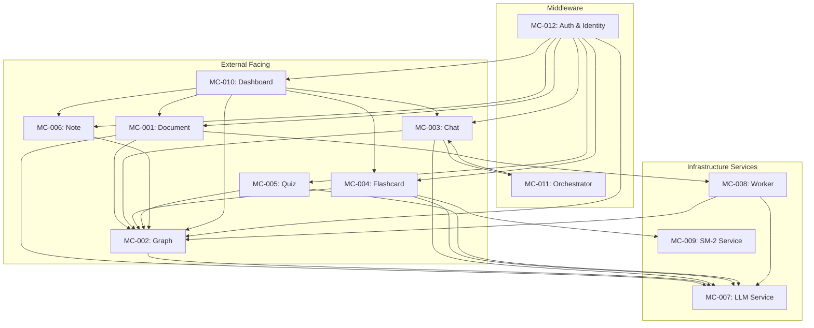

# Module Contracts — Interface Definitions

> **Document Owner:** AetherTutor Team
> **Created:** April 10, 2026
> **Version:** 1.0
> **Status:** Active (MVP Phase)
> **Parent:** [SRS_Overview.md](SRS_Overview.md)

---

## Hướng Dẫn Sử Dụng

Mỗi Module Contract được đánh ID: **`MC-XXX`** (Module Contract #XXX).

**Cấu trúc mỗi contract:**
1. **Module Name** — Tên module
2. **Responsibility** — Module này làm gì (và KHÔNG làm gì)
3. **Dependencies** — Module nào nó phụ thuộc
4. **Public Interface** — API endpoints + internal service methods
5. **Input Contract** — Dữ liệu đầu vào (format, validation)
6. **Output Contract** — Dữ liệu đầu ra (format, success/error cases)
7. **Error Contract** — Cách module xử lý và trả về lỗi

---

## MC-001: Document Module

### Responsibility
- Tiếp nhận và validate file upload (PDF, URL, YouTube)
- Trigger background processing pipeline
- Theo dõi trạng thái xử lý tài liệu

**KHÔNG làm:**
- ❌ Không trực tiếp xử lý text extraction (việc của Worker)
- ❌ Không xây dựng graph (việc của Graph Module)

### Dependencies

| Dependency | Type | Bắt buộc? | Mục đích |
|---|---|---|---|
| Background Worker | Internal | ✅ | Queue processing task |
| LLM Service | Internal | ✅ | Entity extraction (qua Worker) |
| PostgreSQL | Infrastructure | ✅ | Lưu document metadata, chunks |
| ChromaDB | Infrastructure | ✅ | Lưu embeddings (qua Worker) |
| NetworkX | Internal | ✅ | Lưu graph (qua Worker) |

### Public Interface

#### API Endpoints

**1. Upload Document**
```
POST /api/v1/documents/process
Content-Type: multipart/form-data
```

**Input Contract:**
```typescript
interface UploadDocumentRequest {
  file: File;                    // PDF file, max 50MB
  // Hoặc
  url?: string;                  // Web URL hoặc YouTube link
  tags?: string[];               // Optional user-defined tags
  metadata?: Record<string, any>; // Optional custom metadata
}

// Validation rules:
// - file.type === 'application/pdf'
// - file.size <= 50 * 1024 * 1024  // 50MB
// - Nếu url: phải valid URL, accessible (HTTP 200)
```

**Output Contract:**
```typescript
// Success (202 Accepted)
interface UploadDocumentResponse {
  success: true;
  data: {
    document_id: string;         // UUID
    status: 'pending';           // Luôn là pending khi mới upload
    message: 'Document queued for processing';
    estimated_time_seconds?: number; // Ước lượng dựa trên file size
  };
}

// Error (400 Bad Request)
interface UploadDocumentError {
  success: false;
  error: {
    code: 'VALIDATION_ERROR' | 'QUOTA_EXCEEDED' | 'FILE_TOO_LARGE' | 'INVALID_FORMAT';
    message: string;
    details?: Record<string, any>;
  };
}
```

---

**2. Get Document Status**
```
GET /api/v1/documents/{document_id}/status
```

**Input Contract:**
```typescript
interface GetDocumentStatusRequest {
  document_id: string;  // UUID từ upload response
}
```

**Output Contract:**
```typescript
interface GetDocumentStatusResponse {
  success: true;
  data: {
    document_id: string;
    status: 'pending' | 'processing' | 'chunking' | 'entity_extraction' |
            'graph_construction' | 'embedding_generation' | 'vector_storage' | 'completed' | 'failed';
    progress?: number;           // 0-100, chỉ có khi status != pending/completed/failed
    current_step?: string;       // Mô tả bước hiện tại (1-8)
    error_message?: string;      // Chỉ có khi status = 'failed'
    stats?: {                    // Chỉ có khi status = 'completed'
      total_chunks: number;
      total_entities: number;
      total_relations: number;
      processing_time_seconds: number;
    };
  };
}
```

---

**3. Get Document Details**
```
GET /api/v1/documents/{document_id}
```

**Input Contract:**
```typescript
interface GetDocumentRequest {
  document_id: string;
}
```

**Output Contract:**
```typescript
interface GetDocumentResponse {
  success: true;
  data: {
    id: string;
    title: string;
    source_type: 'pdf' | 'web' | 'youtube';
    file_size?: number;          // bytes
    total_pages?: number;
    status: string;
    metadata: DocumentMetadata;
    created_at: string;          // ISO 8601
    updated_at: string;
  };
}

interface DocumentMetadata {
  extraction_method: string;
  language: string;
  page_count?: number;
  word_count?: number;
  chunk_count?: number;
  entity_count?: number;
  relation_count?: number;
  processing_time_seconds?: number;
  llm_model_used: string;
  tags: string[];
}
```

---

**4. List Documents**
```
GET /api/v1/documents?status={status}&page={page}&limit={limit}
```

**Input Contract:**
```typescript
interface ListDocumentsRequest {
  status?: 'pending' | 'processing' | 'completed' | 'failed'; // Optional filter
  page?: number;               // Default: 1
  limit?: number;              // Default: 20, max: 100
  sort?: 'created_at' | 'updated_at' | 'title'; // Default: 'created_at'
  order?: 'asc' | 'desc';      // Default: 'desc'
}
```

**Output Contract:**
```typescript
interface ListDocumentsResponse {
  success: true;
  data: {
    documents: Array<{
      id: string;
      title: string;
      source_type: string;
      status: string;
      total_entities?: number;
      total_relations?: number;
      created_at: string;
    }>;
    pagination: {
      page: number;
      limit: number;
      total: number;
      total_pages: number;
    };
  };
}
```

---

**5. Delete Document**
```
DELETE /api/v1/documents/{document_id}
```

**Input Contract:**
```typescript
interface DeleteDocumentRequest {
  document_id: string;
}
```

**Output Contract:**
```typescript
interface DeleteDocumentResponse {
  success: true;
  data: {
    message: 'Document and associated data deleted';
    deleted_entities: number;
    deleted_relations: number;
    deleted_embeddings: number;
  };
}
```

### Error Contract

| HTTP Code | Error Code | Condition | Message |
|---|---|---|---|
| 400 | `VALIDATION_ERROR` | File type/size invalid | "Invalid file. Must be PDF <= 50MB" |
| 400 | `URL_INACCESSIBLE` | URL không accessible | "Cannot access URL" |
| 404 | `DOCUMENT_NOT_FOUND` | Document ID không tồn tại | "Document not found" |
| 409 | `DUPLICATE_DOCUMENT` | File đã được upload trước đó | "Document already exists" |
| **409** | **`CONCURRENT_PROCESSING`** | **User đã có document đang xử lý** | **"Document khác đang được xử lý. Vui lòng đợi hoàn tất trước khi upload thêm."** |
| 429 | `QUOTA_EXCEEDED` | Vượt giới hạn upload/ngày | "Daily upload quota exceeded" |
| 500 | `INTERNAL_ERROR` | Server error | "Internal server error" |

---

## MC-002: Graph Module

### Responsibility
- Quản lý Knowledge Graph (NetworkX in-memory)
- Entity & Relation CRUD
- Dual-level retrieval (entity + concept)
- Subgraph extraction cho visualization
- **Entity-Document many-to-many relationship management**

**KHÔNG làm:**
- ❌ Không trực tiếp gọi LLM để extract entities (việc của Worker)
- ❌ Không lưu embeddings (việc của ChromaDB service)
- ❌ **KHÔNG xóa entities trực tiếp khi xóa document (qua entity_documents junction)**

### Dependencies

| Dependency | Type | Bắt buộc? | Mục đích |
|---|---|---|---|
| Document Module | Internal | ✅ | Lấy document_id làm scope |
| LLM Service | Internal | ✅ | Entity extraction (qua Worker) |
| PostgreSQL | Infrastructure | ✅ | Lưu entity/relation metadata |
| NetworkX | Internal | ✅ | Graph storage & queries |

### Public Interface

#### API Endpoints

**1. Query Knowledge Graph (Dual-Level Retrieval)**
```
POST /api/v1/graph/query
```

**Input Contract:**
```typescript
interface GraphQueryRequest {
  query: string;                  // User's natural language query
  top_k_entities?: number;        // Default: 5, max: 20
  top_k_concepts?: number;        // Default: 3, max: 10
  document_ids?: string[];        // Filter by specific documents
  include_relations?: boolean;    // Default: true
  max_depth?: number;             // Graph traversal depth, default: 2
}

// Validation:
// - query.length >= 3 && query.length <= 500
// - top_k_entities <= 20
// - document_ids: mỗi ID phải tồn tại và status = 'completed'
```

**Output Contract:**
```typescript
interface GraphQueryResponse {
  success: true;
  data: {
    entities: Array<{
      name: string;
      entity_type: 'concept' | 'term' | 'person' | 'process' | 'theory' | 'framework' | 'tool';
      description: string;
      similarity: number;          // 0-1, similarity score
      source_documents: string[];  // Document IDs
    }>;
    concepts: Array<{
      name: string;
      entity_type: string;
      description: string;
      connection_count: number;    // Number of relations
    }>;
    relations: Array<{
      source: string;              // Entity name
      target: string;              // Entity name
      relation_type: 'is_a' | 'part_of' | 'related_to' | 'causes' | 'enables' | 'prevents' | 'depends_on';
      description: string;
    }> | null;                     // Null nếu include_relations = false
    assembled_context: string;     // Formatted context cho LLM
  };
}
```

---

**2. Get Entity Details**
```
GET /api/v1/graph/entities/{entity_id}
```

**Input Contract:**
```typescript
interface GetEntityRequest {
  entity_id: string;  // UUID hoặc canonical name
}
```

**Output Contract:**
```typescript
interface GetEntityResponse {
  success: true;
  data: {
    entity: {
      id: string;
      name: string;
      entity_type: string;
      description: string;
      confidence: number;         // 0-1
      source_documents: string[];
    };
    neighbors: Array<{
      entity_name: string;
      relation_type: string;
      relation_description: string;
    }>;
    metadata: {
      degree: number;              // Number of connections
      centrality_score: number;    // 0-1
    };
  };
}
```

---

**3. Extract Subgraph (for Visualization)**
```
POST /api/v1/graph/subgraph
```

**Input Contract:**
```typescript
interface SubgraphRequest {
  topic: string;                  // Center topic for subgraph
  max_nodes?: number;             // Default: 50, max: 200
  max_depth?: number;             // Default: 2, max: 4
  document_ids?: string[];        // Filter by documents
}
```

**Output Contract:**
```typescript
interface SubgraphResponse {
  success: true;
  data: {
    nodes: Array<{
      id: string;
      name: string;
      entity_type: string;
      x?: number;                  // Layout position (nếu có)
      y?: number;
    }>;
    edges: Array<{
      source: string;              // Node ID
      target: string;              // Node ID
      relation_type: string;
    }>;
    mermaid_code?: string;         // Optional Mermaid diagram code
    metadata: {
      total_nodes: number;
      total_edges: number;
      truncated: boolean;          // True nếu vượt quá max_nodes
    };
  };
}
```

---

**4. Graph Statistics**
```
GET /api/v1/graph/stats
```

**Output Contract:**
```typescript
interface GraphStatsResponse {
  success: true;
  data: {
    total_entities: number;
    total_relations: number;
    total_documents: number;
    graph_density: number;         // 0-1
    avg_entities_per_doc: number;
    most_connected_entities: Array<{
      name: string;
      degree: number;
    }>;
    last_updated: string;          // ISO 8601
  };
}
```

### Error Contract

| HTTP Code | Error Code | Condition | Message |
|---|---|---|---|
| 400 | `INVALID_QUERY` | Query quá ngắn | "Query must be at least 3 characters" |
| 404 | `ENTITY_NOT_FOUND` | Entity ID không tồn tại | "Entity not found" |
| 404 | `GRAPH_NOT_FOUND` | Document chưa có graph | "Graph not available. Document still processing" |
| 400 | `MERGE_ERROR` | Lỗi khi gộp thực thể | "Entities cannot be merged" |
| 500 | `GRAPH_ERROR` | NetworkX error | "Error building graph" |

---

**5. Import Obsidian Vault**
```
POST /api/v1/graph/import/obsidian
```

**Input Contract:**
```typescript
interface ObsidianImportRequest {
  vault_path: string;            // Absolute path to Obsidian vault
}
```

**Output Contract:**
```typescript
interface ObsidianImportResponse {
  success: true;
  data: {
    job_id: string;              // UUID for background worker
    status: 'queued';
  };
}
```

---

**6. Merge Entities (Manual)**
```
POST /api/v1/graph/entities/merge
```

**Input Contract:**
```typescript
interface MergeEntitiesRequest {
  primary_entity_id: string;     // UUID of the entity to keep
  secondary_entity_id: string;   // UUID of the entity to merge into primary and delete
}
```

**Output Contract:**
```typescript
interface MergeEntitiesResponse {
  success: true;
  data: {
    status: 'success';
    primary_id: string;
    transferred_relations: number;
    transferred_documents: number;    // Số document associations đã chuyển
    transferred_note_links: number;  // Số note links đã chuyển
    message: string;
  };
}
```

**⚠️ CRITICAL — Merge Cascade Logic (BẮT BUỘC):**
```
Khi merge secondary → primary:
  1. Chuyển relations của secondary sang primary
  2. Chuyển document associations (entity_documents table):
     - INSERT INTO entity_documents (entity_id=primary, document_id)
       SELECT secondary, document_id FROM entity_documents 
       WHERE entity_id = secondary
       ON CONFLICT DO NOTHING
     - Xóa associations cũ của secondary
  3. Chuyển note_entity_links:
     - UPDATE note_entity_links 
       SET entity_id = primary 
       WHERE entity_id = secondary
  4. Chuyển flashcard_entities (nếu có):
     - UPDATE flashcard_entities 
       SET entity_id = primary 
       WHERE entity_id = secondary
  5. Xóa secondary entity
  6. Rebuild NetworkX graph từ SQL

⚠️ Nếu KHÔNG thực hiện steps 2-4, dữ liệu sẽ bị orphan 
   (notes, flashcards, documents trỏ tới entity đã xóa).
```

---

## MC-003: Chat Module

### Responsibility
- Xử lý hội thoại Socratic với AI
- Quản lý chat sessions và history
- Graph-aware context retrieval

**KHÔNG làm:**
- ❌ Không trực tiếp query graph (gọi Graph Module)
- ❌ Không gọi LLM trực tiếp (gọi LLM Service)

### Dependencies

| Dependency | Type | Bắt buộc? | Mục đích |
|---|---|---|---|
| Graph Module | Internal | ✅ | Context retrieval |
| LLM Service | Internal | ✅ | Generate response |
| Parent Orchestrator | Internal | ✅ | Agent routing |
| PostgreSQL | Infrastructure | ✅ | Lưu chat history |

### Public Interface

#### API Endpoints

**1. Socratic Chat**
```
POST /api/v1/chat/socratic
```

**Input Contract:**
```typescript
interface SocraticChatRequest {
  message: string;                // User's message
  session_id?: string;            // Optional: tiếp tục session cũ
  document_id?: string;           // Optional: context document
  agent_mode?: 'socratic' | 'general'; // Default: 'socratic'
}

// Validation:
// - message.length >= 1 && message.length <= 2000
// - session_id: phải tồn tại nếu cung cấp
// - document_id: phải tồn tại và status = 'completed'
```

**Output Contract:**
```typescript
interface SocraticChatResponse {
  success: true;
  data: {
    session_id: string;
    message_id: string;
    response: string;             // AI response text
    agent_mode: string;           // 'socratic' | 'general'
    attempt_count: number;        // Số lần user đã thử cho concept hiện tại
    current_concept?: string;     // Khái niệm đang được thảo luận
    context_entities?: string[];  // Entities dùng trong context
    token_count?: number;         // Token usage
  };
}

// Streaming response (SSE):
// Event: message
// Data: {type: "chunk", content: "..."}
// Event: message
// Data: {type: "done", session_id: "...", message_id: "..."}
```

---

**2. Get Chat History**
```
GET /api/v1/chat/sessions/{session_id}/messages?page={page}&limit={limit}
```

**Input Contract:**
```typescript
interface GetChatHistoryRequest {
  session_id: string;
  page?: number;         // Default: 1
  limit?: number;        // Default: 50, max: 200
}
```

**Output Contract:**
```typescript
interface GetChatHistoryResponse {
  success: true;
  data: {
    messages: Array<{
      id: string;
      role: 'user' | 'assistant' | 'system';
      content: string;
      metadata?: Record<string, any>;
      created_at: string;
    }>;
    session: {
      id: string;
      agent_type: string;
      context_document_id?: string;
      created_at: string;
    };
    pagination: {
      page: number;
      limit: number;
      total: number;
    };
  };
}
```

---

**3. Create Chat Session**
```
POST /api/v1/chat/sessions
```

**Input Contract:**
```typescript
interface CreateChatSessionRequest {
  agent_type: 'socratic_tutor' | 'researcher' | 'visualizer' | 'examiner';
  context_document_id?: string;
}
```

**Output Contract:**
```typescript
interface CreateChatSessionResponse {
  success: true;
  data: {
    session_id: string;
    agent_type: string;
    context_document_id?: string;
    attempt_count: number;        // Khởi tạo = 0
    created_at: string;
  };
}
```

### Error Contract

| HTTP Code | Error Code | Condition | Message |
|---|---|---|---|
| 400 | `EMPTY_MESSAGE` | Message trống | "Message cannot be empty" |
| 400 | `MESSAGE_TOO_LONG` | Message > 2000 chars | "Message exceeds 2000 character limit" |
| 404 | `SESSION_NOT_FOUND` | Session ID không tồn tại | "Chat session not found" |
| 500 | `LLM_ERROR` | LLM service fail | "AI service unavailable. Please try again" |
| 503 | `LLM_UNAVAILABLE` | LLM down | "LLM service unavailable. Check Settings" |

---

## MC-004: Flashcard Module

### Responsibility
- Tạo flashcard tự động từ graph entities
- Quản lý SM-2 scheduling
- Xử lý flashcard review

**KHÔNG làm:**
- ❌ Không trực tiếp gọi LLM (gọi LLM Service)
- ❌ Không query graph trực tiếp (gọi Graph Module)

### Dependencies

| Dependency | Type | Bắt buộc? | Mục đích |
|---|---|---|---|
| Graph Module | Internal | ✅ | Lấy entities để sinh flashcard |
| LLM Service | Internal | ✅ | Generate flashcard content |
| SM-2 Service | Internal | ✅ | Calculate review schedule |
| PostgreSQL | Infrastructure | ✅ | Lưu flashcards + sessions |

### Public Interface

#### API Endpoints

**1. Generate Flashcards**
```
POST /api/v1/flashcards/generate
```

**Input Contract:**
```typescript
interface GenerateFlashcardsRequest {
  document_id: string;           // Source document
  count?: number;                // Default: 20, max: 50
  min_confidence?: number;       // Default: 0.7
  min_degree?: number;           // Default: 1
}

// Validation:
// - document_id phải tồn tại và status = 'completed'
// - count <= 50
// - min_confidence >= 0.5 && min_confidence <= 1.0
```

**Output Contract:**
```typescript
interface GenerateFlashcardsResponse {
  success: true;
  data: {
    flashcards_created: number;
    flashcards: Array<{
      id: string;
      front: string;
      back: string;
      difficulty: number;        // 0-1
      source_entity_ids: string[];
    }>;
    skipped_entities: number;    // Số entities bị skip (không đủ điều kiện)
  };
}
```

---

**2. Get Due Flashcards**
```
GET /api/v1/flashcards/due
```

**Output Contract:**
```typescript
interface GetDueFlashcardsResponse {
  success: true;
  data: {
    due_count: number;
    flashcards: Array<{
      id: string;
      front: string;
      back: string;              // KHÔNG gửi trong due list (ẩn cho đến khi reveal)
      difficulty: number;
      sm2_interval: number;
      sm2_repetitions: number;
      sm2_next_review: string;
    }>;
  };
}
```

---

**3. Review Flashcard (Update SM-2)**
```
POST /api/v1/flashcards/{flashcard_id}/review
```

**Input Contract:**
```typescript
interface ReviewFlashcardRequest {
  quality: number;               // 0-5 (SM-2 quality rating)
}

// Validation:
// - quality >= 0 && quality <= 5
```

**Output Contract:**
```typescript
interface ReviewFlashcardResponse {
  success: true;
  data: {
    flashcard_id: string;
    sm2_ease_factor: number;     // Updated
    sm2_interval: number;        // Updated
    sm2_repetitions: number;     // Updated
    sm2_next_review: string;     // Updated (ISO 8601)
    was_successful: boolean;     // quality >= 3
  };
}
```

### Error Contract

| HTTP Code | Error Code | Condition | Message |
|---|---|---|---|
| 400 | `INVALID_QUALITY` | Quality không trong 0-5 | "Quality must be between 0 and 5" |
| 404 | `FLASHCARD_NOT_FOUND` | Flashcard ID không tồn tại | "Flashcard not found" |
| 404 | `NO_QUALIFIED_ENTITIES` | Không có entities đủ điều kiện | "No entities qualify for flashcard generation" |
| 409 | `DOCUMENT_NOT_COMPLETED` | Document chưa completed | "Document processing not complete" |

---

## MC-005: Quiz Module

### Responsibility
- Sinh câu hỏi quiz từ graph entities
- Chấm điểm và lưu kết quả
- Đảm bảo coverage >= 80% entities quan trọng

**KHÔNG làm:**
- ❌ Không trực tiếp gọi LLM (gọi LLM Service)
- ❌ Không quản lý lịch sử quiz dài hạn (việc của PostgreSQL)

### Dependencies

| Dependency | Type | Bắt buộc? | Mục đích |
|---|---|---|---|
| Graph Module | Internal | ✅ | Lấy entities quan trọng |
| LLM Service | Internal | ✅ | Generate questions |
| PostgreSQL | Infrastructure | ✅ | Lưu quiz + results |

### Public Interface

#### API Endpoints

**1. Generate Quiz**
```
POST /api/v1/quiz/generate
```

**Input Contract:**
```typescript
interface GenerateQuizRequest {
  document_id?: string;          // Source document (optional: auto from context)
  count?: number;                // Default: 10, max: 20
  difficulty?: number;           // 1-5, default: 3
  question_types?: string[];     // ['multiple_choice', 'true_false', 'fill_blank']
  bloom_levels?: string[];       // ['remember', 'understand', 'apply', 'analyze']
}

// Validation:
// - count <= 20
// - difficulty >= 1 && difficulty <= 5
// - document_id: phải tồn tại và status = 'completed'
```

**Output Contract:**
```typescript
interface GenerateQuizResponse {
  success: true;
  data: {
    quiz_id: string;
    questions: Array<{
      id: string;
      type: 'multiple_choice' | 'true_false' | 'fill_blank' | 'short_answer';
      text: string;
      options?: Array<{          // Cho multiple_choice
        id: string;
        text: string;
      }>;
      difficulty: number;        // 1-5
      bloom_taxonomy: string;
    }>;
    coverage: {
      total_important_entities: number;
      covered_entities: number;
      percentage: number;        // Must be >= 80%
    };
  };
}
```

---

**2. Submit Quiz Answers**
```
POST /api/v1/quiz/{quiz_id}/submit
```

**Input Contract:**
```typescript
interface SubmitQuizRequest {
  answers: Array<{
    question_id: string;
    answer: string | string[];   // User's answer
  }>;
  time_taken_seconds?: number;
}
```

**Output Contract:**
```typescript
interface SubmitQuizResponse {
  success: true;
  data: {
    quiz_id: string;
    score: number;               // Percentage 0-100 (e.g., 85.5)
    correct_answers: number;     // Exact count of correct answers
    total_questions: number;
    weak_areas: string[];        // Entity names user struggled with
    results: Array<{
      question_id: string;
      user_answer: string | string[];
      correct_answer: string | string[];
      is_correct: boolean;
      explanation: string;
    }>;
  };
}
```

**⚠️ CRITICAL — Score Field Semantics (KHỚP VỚI CODE):**
```
- `score`: FLOAT, percentage 0-100 (ví dụ: 85.5 = 85.5%)
- `correct_answers`: INT, số câu trả lời đúng (ví dụ: 17/20 = 17)
- `total_questions`: INT, tổng số câu hỏi

KHÔNG được nhầm lẫn: score ≠ correct_answers
Frontend PHẢI hiển thị cả hai: "17/20 đúng (85%)"
```

### Error Contract

| HTTP Code | Error Code | Condition | Message |
|---|---|---|---|
| 400 | `INVALID_QUIZ_CONFIG` | Config không hợp lệ | "Invalid quiz configuration" |
| 404 | `QUIZ_NOT_FOUND` | Quiz ID không tồn tại | "Quiz not found" |
| 400 | `INSUFFICIENT_ENTITIES` | Không đủ entities | "Need more important entities to generate quiz" |
| 400 | `LOW_COVERAGE` | Coverage < 80% | "Quiz coverage is below 80% threshold" |

---

## MC-006: Note Module

### Responsibility
- CRUD atomic notes (Zettelkasten)
- Auto backlink suggestion
- Tag management

**KHÔNG làm:**
- ❌ Không trực tiếp query graph (gọi Graph Module)

### Dependencies

| Dependency | Type | Bắt buộc? | Mục đích |
|---|---|---|---|
| Graph Module | Internal | ✅ | Entity matching cho backlinks |
| PostgreSQL | Infrastructure | ✅ | Lưu notes + links |

### Public Interface

#### API Endpoints

**1. Create Note**
```
POST /api/v1/notes
```

**Input Contract:**
```typescript
interface CreateNoteRequest {
  title: string;                 // Max 500 chars
  content: string;               // Required
  note_type?: 'fleeting' | 'literature' | 'permanent' | 'project';
  tags?: string[];
  parent_note_id?: string;       // For hierarchical notes
}

// Validation:
// - title.length >= 1 && title.length <= 500
// - content.length >= 1
// - parent_note_id: phải tồn tại nếu cung cấp
```

**Output Contract:**
```typescript
interface CreateNoteResponse {
  success: true;
  data: {
    note_id: string;
    title: string;
    content: string;
    note_type: string;
    tags: string[];
    created_at: string;
    backlink_suggestions: Array<{
      note_id: string;
      title: string;
      context: string;           // Text showing why suggested
      matched_entities: string[];
    }>;
    embedding_status: 'pending' | 'completed' | 'failed';
    // 'pending': Background task queued
    // 'completed': Embedding generated
    // 'failed': Will retry in background
  };
}
```

**⚠️ CRITICAL — Note Embedding (BR-009 enhancement):**
```
SAU KHI lưu note:
    1. Queue ARQ task 'embed_note' với note content
    2. Trả về response ngay với embedding_status = 'pending'
    3. Worker sinh embedding → lưu ChromaDB với metadata:
       - "content_type": "note"
       - "note_id": UUID
       - "user_id": UUID
    4. Update note record: embedding_status = 'completed'

⚠️ Notes PHẢI được embed để AI retrieval hoạt động.
   Nếu không, chat AI sẽ không thể tìm notes liên quan.
```

---

**2. Get Note with Backlinks**
```
GET /api/v1/notes/{note_id}
```

**Output Contract:**
```typescript
interface GetNoteResponse {
  success: true;
  data: {
    note: {
      id: string;
      title: string;
      content: string;
      note_type: string;
      tags: string[];
      parent_note_id?: string;
      created_at: string;
      updated_at: string;
    };
    backlinks: Array<{
      source_note_id: string;
      source_note_title: string;
      context: string;
      created_at: string;
    }>;
    linked_entities: Array<{
      entity_name: string;
      entity_type: string;
      source_document_ids: string[];
    }>;
  };
}
```

### Error Contract

| HTTP Code | Error Code | Condition | Message |
|---|---|---|---|
| 400 | `EMPTY_TITLE` | Title trống | "Note title cannot be empty" |
| 400 | `EMPTY_CONTENT` | Content trống | "Note content cannot be empty" |
| 404 | `NOTE_NOT_FOUND` | Note ID không tồn tại | "Note not found" |
| 404 | `PARENT_NOTE_NOT_FOUND` | Parent note không tồn tại | "Parent note not found" |

---

## MC-007: LLM Service

### Responsibility
- Abstraction layer cho LLM providers (OpenAI, Ollama)
- Health checking
- Token usage tracking
- Retry logic

**KHÔNG làm:**
- ❌ Không biết về business logic (chỉ là provider)
- ❌ Không lưu trữ data dài hạn

### Dependencies

| Dependency | Type | Bắt buộc? | Mục đích |
|---|---|---|---|
| OpenAI API | External | ✅ (Cloud Mode) | GPT-4, etc. |
| Ollama | External | ✅ (Local Mode) | Llama 3, etc. |
| Redis | Infrastructure | ✅ | Caching |
| PostgreSQL | Infrastructure | ✅ | Token usage logging |

### Public Interface (Internal Service Methods)

```python
class LLMService:
    async def generate_completion(
        self,
        prompt: str,
        system_prompt: str,
        temperature: float = 0.7,
        max_tokens: int = 1000,
        stream: bool = False,
    ) -> LLMResponse | AsyncGenerator[str, None]:
        """Generate text completion."""
        pass

    async def generate_embeddings(
        self,
        texts: list[str],
    ) -> list[list[float]]:
        """Generate vector embeddings."""
        pass

    async def health_check(self) -> bool:
        """Check if LLM provider is available."""
        pass

    async def get_token_usage(self) -> TokenUsage:
        """Get current token usage stats."""
        pass
```

**LLMResponse:**
```typescript
interface LLMResponse {
  content: string;
  token_count: number;
  model_used: string;
  finish_reason: 'stop' | 'length' | 'error';
}
```

### Error Contract

| Error Type | Condition | Handling |
|---|---|---|
| `LLMUnavailableError` | Provider down | Retry 3x, then fail |
| `LLMTimeoutError` | Response timeout (> 30s) | Retry with exponential backoff |
| `RateLimitError` | API quota exceeded | Notify user, queue request |
| `InvalidAPIKeyError` | Key expired/invalid | Alert user to check Settings |

---

## MC-008: Background Worker

### Responsibility
- Xử lý async tasks nặng (document processing)
- Retry logic với exponential backoff
- Task state management

**KHÔNG làm:**
- ❌ Không trả về response trực tiếp cho client (qua API)
- ❌ Không tương tác với frontend

### Dependencies

| Dependency | Type | Bắt buộc? | Mục đích |
|---|---|---|---|
| Redis | Infrastructure | ✅ | Task queue |
| LLM Service | Internal | ✅ | Entity extraction |
| Graph Module | Internal | ✅ | Graph construction |
| PostgreSQL | Infrastructure | ✅ | Task state + document data |

### Public Interface (Task Definitions)

```python
@worker.task(name='process_document', timeout=300, retries=3)
async def process_document_task(document_id: UUID, user_id: UUID):
    """
    Full document processing pipeline:
    1. Extract text
    2. Chunk
    3. Extract entities/relations
    4. Build graph
    5. Generate embeddings (chunks + entities)
    6. Store to ChromaDB (with content_type metadata)
    """
    pass

@worker.task(name='extract_entities', timeout=300, retries=3)
async def extract_entities_task(document_id: UUID, user_id: UUID, chunk_ids: list[UUID]):
    """
    LLM entity & relation extraction.
    High priority, exponential backoff retry.
    """
    pass

@worker.task(name='generate_embeddings', timeout=600, retries=2)
async def generate_embeddings_task(
    document_id: UUID, 
    user_id: UUID, 
    chunk_ids: list[UUID],
    entity_ids: list[UUID],  # ← NEW: Entity IDs để embed
):
    """
    ChromaDB vector storage cho CẢ chunks VÀ entities.
    
    Metadata cho mỗi embedding:
    - "user_id": UUID
    - "document_id": UUID
    - "content_type": "chunk" | "entity"
    - "chunk_id": UUID (nếu content_type="chunk")
    - "entity_id": UUID (nếu content_type="entity")
    - "embedding_model": string
    - "embedding_dim": int
    
    ⚠️ KHÔNG được chỉ embed chunks. Entities PHẢI được embed
    để LightRAG dual-level retrieval hoạt động.
    
    Medium priority, 60s backoff retry.
    """
    pass

@worker.task(name='construct_graph', timeout=180, retries=1)
async def construct_graph_task(document_id: UUID, user_id: UUID, entities: list[dict], relations: list[dict]):
    """
    NetworkX graph building.
    Medium priority, single retry.
    """
    pass

@worker.task(name='embed_note', timeout=60, retries=2)
async def embed_note_task(note_id: UUID, user_id: UUID, content: str):
    """
    Generate embedding cho note content.
    Lưu vào ChromaDB với metadata:
    - "content_type": "note"
    - "note_id": UUID
    
    ⚠️ Notes PHẢI được embed để AI retrieval hoạt động.
    """
    pass

@worker.task(name='embed_obsidian_file', timeout=60, retries=2)
async def embed_obsidian_file_task(
    file_path: str, 
    user_id: UUID, 
    content: str,
    file_name: str,
):
    """
    Generate embedding cho Obsidian markdown file.
    Lưu vào ChromaDB với metadata:
    - "content_type": "obsidian"
    - "file_path": string
    - "file_name": string
    
    ⚠️ Obsidian files PHẢI được embed để AI retrieval hoạt động.
    """
    pass

@worker.task(name='rollback_document', timeout=60, retries=1)
async def rollback_document_task(document_id: UUID, user_id: UUID):
    """
    Rollback partial data TRƯỚC KHI retry.
    
    Thực hiện:
    1. DELETE FROM document_chunks WHERE document_id = :doc_id
    2. DELETE FROM graph_entities WHERE document_id = :doc_id
    3. DELETE FROM graph_relations WHERE document_id = :doc_id
    4. ChromaDB: delete(where={"document_id": doc_id})
    5. NetworkX: remove nodes cho document
    
    ⚠️ BẮT BUỘC chạy task này TRƯỚC KHI retry document bị failed.
    """
    pass

@worker.task(name='send_notification', timeout=30, retries=3)
async def send_notification_task(user_id: UUID, notification_type: str, payload: dict):
    """
    Email/push notifications.
    Low priority, fast timeout.
    """
    pass

@worker.task(name='generate_flashcards', timeout=120, retries=2)
async def generate_flashcards_task(document_id: UUID, user_id: UUID, count: int):
    """Generate flashcards from document entities."""
    pass

@worker.task(name='generate_quiz', timeout=120, retries=2)
async def generate_quiz_task(document_id: UUID, user_id: UUID, count: int):
    """Generate quiz from document entities."""
    pass
```

### Task State Contract

```typescript
interface TaskState {
  id: string;                    // UUID
  task_type: string;             // 'process_document', 'generate_flashcards', etc.
  status: 'pending' | 'queued' | 'processing' | 'completed' | 'failed' | 'retrying';
  progress: number;              // 0-100
  payload: Record<string, any>;  // Task input data
  result?: Record<string, any>;  // Task output (nếu có)
  error_message?: string;        // Nếu failed
  retry_count: number;           // Current retry attempt
  max_retries: number;           // Max retry limit
  created_at: string;
  started_at?: string;
  completed_at?: string;
}
```

---

## MC-009: SM-2 Service

### Responsibility
- Implement SM-2 algorithm cho spaced repetition
- Calculate next review dates
- Query due flashcards

**KHÔNG làm:**
- ❌ Không tạo flashcard content (việc của Flashcard Module)
- ❌ Không gọi LLM

### Dependencies

| Dependency | Type | Bắt buộc? | Mục đích |
|---|---|---|---|
| PostgreSQL | Infrastructure | ✅ | Lưu SM-2 params |

### Public Interface (Internal Service Methods)

```python
class SM2Service:
    def calculate_next_review(
        self,
        ease_factor: float,
        interval: int,
        repetitions: int,
        quality: int,
    ) -> SM2Result:
        """Calculate new SM-2 parameters."""
        pass

    async def get_due_flashcards(
        self,
        user_id: UUID,
        limit: int = 100,
    ) -> list[Flashcard]:
        """Get flashcards due for review."""
        pass
```

**SM2Result:**
```typescript
interface SM2Result {
  new_ease_factor: float;        // Updated ease factor (min: 1.3)
  new_interval: int;             // Days until next review
  new_repetitions: int;          // Successful recall count
  next_review: string;           // ISO 8601 datetime
  was_successful: boolean;       // quality >= 3
}
```

---

## MC-010: Dashboard Module

### Responsibility
- Aggregate data từ các modules khác
- Cung cấp overview stats cho frontend
- Quick actions data

**KHÔNG làm:**
- ❌ Không có data riêng — tất cả aggregate từ modules khác

### Dependencies

| Dependency | Type | Mục đích |
|---|---|---|
| Document Module | Internal | Document stats + recent docs |
| Flashcard Module | Internal | Due flashcard count |
| Graph Module | Internal | Graph preview data |
| Note Module | Internal | Note count |
| Chat Module | Internal | Recent chat sessions |

### Public Interface

#### API Endpoints

**1. Get Dashboard Data**
```
GET /api/v1/dashboard
```

**Output Contract:**
```typescript
interface DashboardResponse {
  success: true;
  data: {
    stats: {
      total_documents: number;
      total_notes: number;
      total_flashcards: number;
      total_quiz_avg: number;     // Average quiz score
      streak_days: number;        // Consecutive learning days
    };
    recent_documents: Array<{
      id: string;
      title: string;
      status: string;
      last_activity: string;
    }>;
    due_flashcards_count: number;
    recent_sessions: Array<{
      id: string;
      type: 'chat' | 'quiz' | 'flashcard_review';
      last_activity: string;
    }>;
    graph_preview: {
      total_entities: number;
      total_relations: number;
      top_entities: Array<{name: string; degree: number}>;
    } | null;                     // Null nếu chưa có graph
  };
}
```

---

## MC-011: Parent Orchestrator

### Responsibility
- Route request của user tới đúng Agent (Socratic Tutor, Researcher, Visualizer, Examiner)
- Quản lý context document khi chat graph-aware
- Xử lý fallback khi Agent không khả dụng

**KHÔNG làm:**
- ❌ Không sinh nội dung response (việc của Agent + LLM)
- ❌ Không trực tiếp query graph (gọi Graph Module)

### Dependencies

| Dependency | Type | Bắt buộc? | Mục đích |
|---|---|---|---|
| Graph Module | Internal | ✅ | Lấy context cho graph-aware chat |
| LLM Service | Internal | ✅ | Health check trước khi route |
| All Agents | Internal | ✅ | Delegate work |
| PostgreSQL | Infrastructure | ✅ | Lưu session metadata |

### Routing Table (MVP)

| Agent | Trigger Condition | API Endpoint |
|---|---|---|
| **Socratic Tutor** | Default chat mode (`agent_mode = 'socratic'`) | `POST /api/v1/chat/socratic` |
| **Researcher** | User yêu cầu "tìm hiểu sâu", multi-hop query | `POST /api/v1/chat/researcher` (Post-MVP) |
| **Visualizer** | User yêu cầu "vẽ graph", "hiển thị" | `POST /api/v1/graph/subgraph` → Frontend render |
| **Examiner** | User yêu cầu "kiểm tra", "quiz" | `POST /api/v1/quiz/generate` |

> [!NOTE]
> MVP chỉ implement **Socratic Tutor** Agent. Các Agent khác là Post-MVP.

### Public Interface (Internal Service Methods)

```python
class ParentOrchestrator:
    async def route_chat(
        self,
        message: str,
        session_id: Optional[str],
        document_id: Optional[str],
        agent_mode: str = 'socratic',
    ) -> ChatResponse:
        """
        Route chat request to appropriate agent.
        MVP: Always routes to Socratic Tutor Agent.
        """
        # Step 1: Health check LLM
        if not await self.llm_service.health_check():
            raise LLMUnavailableError("LLM service unavailable")

        # Step 2: Get graph context if document provided
        context = None
        if document_id:
            context = await self.graph_module.query_context(
                query=message,
                document_ids=[document_id],
            )

        # Step 3: Route to agent
        if agent_mode == 'socratic':
            return await self.socratic_tutor.generate(
                message=message,
                session_id=session_id,
                context=context,
            )
        else:
            raise ValueError(f"Unknown agent_mode: {agent_mode}")
```

### Error Contract

| Error Type | Condition | Handling |
|---|---|---|
| `LLMUnavailableError` | LLM down | Trả về `503: "AI không phản hồi"` |
| `AgentNotFoundError` | Agent mode không tồn tại | Trả về `400: "Invalid agent mode"` |
| `ContextError` | Document không có graph | Fallback sang general chat (không context) |

---

## MC-012: Auth & Identity Middleware

### Responsibility
- Inject `user_id` vào mọi request context
- Validate session/token (MVP: mock auth)
- Đảm bảo BR-001 (User Data Isolation) ở tầng API

**KHÔNG làm:**
- ❌ Không xác thực OAuth/SSO (Post-MVP)
- ❌ Không phân quyền RBAC (MVP: single user)

### Dependencies

| Dependency | Type | Bắt buộc? | Mục đích |
|---|---|---|---|
| AppConfig | Internal | ✅ | Lấy `DEFAULT_USER_ID` |
| Redis | Infrastructure | ✅ (Post-MVP) | Session storage (token blacklist) |

### MVP — Mock Auth

Trong MVP, authentication được giả lập. Mọi request đều được gán `DEFAULT_USER_ID`.

```python
DEFAULT_USER_ID = UUID("00000000-0000-0000-0000-000000000000")

@asynccontextmanager
async def get_current_user(request: Request) -> AsyncGenerator[UserIdentity, None]:
    """
    MVP: Mock auth — luôn trả về DEFAULT_USER_ID.
    Post-MVP: Parse JWT token, validate expiry, check blacklist.
    """
    yield UserIdentity(
        user_id=DEFAULT_USER_ID,
        role="owner",
        is_authenticated=True,
    )
```

### UserIdentity Contract

```typescript
interface UserIdentity {
  user_id: string;               // UUID — BẮT BUỘC cho mọi query
  role: 'owner' | 'user' | 'admin';  // MVP: luôn 'owner'
  is_authenticated: boolean;     // MVP: luôn true
}
```

### Middleware Injection Rule

```
MỌI API endpoint (trừ /health) PHẢI:
    1. Gọi get_current_user() để lấy user_id
    2. Truyền user_id vào mọi service call
    3. Service call PHẢI dùng user_id làm filter (BR-001)

PSEUDOCODE:
    @router.get("/documents")
    async def list_documents(user = Depends(get_current_user)):
        return await document_service.list(user_id=user.user_id)
```

### Post-MVP — Real Auth

| Component | Implementation |
|---|---|
| Token format | JWT (RS256) |
| Token source | `Authorization: Bearer <token>` header |
| Validation | Parse JWT, verify signature, check `exp` claim |
| Session storage | Redis (token blacklist for logout) |
| Password hashing | bcrypt (argon2id preferred) |
| OAuth providers | Google, GitHub (optional) |

### Error Contract

| HTTP Code | Error Code | Condition | Message |
|---|---|---|---|
| 401 | `UNAUTHORIZED` | Không có token (Post-MVP) | "Authentication required" |
| 401 | `INVALID_TOKEN` | Token malformed/expired (Post-MVP) | "Invalid or expired token" |
| 403 | `FORBIDDEN` | Không đủ quyền (Post-MVP) | "Insufficient permissions" |

---

## Module Dependency Graph



---

## Interface Naming Convention

| Type | Pattern | Ví dụ |
|---|---|---|
| Request | `{Action}{Resource}Request` | `UploadDocumentRequest` |
| Response (Success) | `{Action}{Resource}Response` | `UploadDocumentResponse` |
| Response (Error) | `{Action}{Resource}Error` | `UploadDocumentError` |
| Entity | `{Resource}` | `Document`, `Flashcard` |
| Metadata | `{Resource}Metadata` | `DocumentMetadata` |

---

## HTTP Status Code Convention

| Status | Ý nghĩa | Khi nào dùng |
|---|---|---|
| 200 | OK | Request thành công |
| 201 | Created | Resource mới được tạo |
| 202 | Accepted | Async task được queue (kiểm tra status sau) |
| 400 | Bad Request | Input validation fail |
| 401 | Unauthorized | Chưa authenticate (Post-MVP) |
| 403 | Forbidden | Không có quyền (Post-MVP) |
| 404 | Not Found | Resource không tồn tại |
| 409 | Conflict | Duplicate resource |
| 429 | Too Many Requests | Rate limit exceeded |
| 500 | Internal Server Error | Server error không mong muốn |
| 503 | Service Unavailable | Dependency down (LLM, DB) |

---

## Standard Response Envelope

**MỌI API response PHẢI theo format:**

```typescript
// Success
{
  "success": true,
  "data": { /* response payload */ }
}

// Error
{
  "success": false,
  "error": {
    "code": "ERROR_CODE",
    "message": "Human-readable message",
    "details": {}  // Optional: technical details
  }
}
```

## API Security & Identity

MỌI API request (trừ health check công khai) PHẢI bao gồm:
- **Header:** `Authorization: Bearer <token>`
- **Identity:** `user_id` được trích xuất từ token qua middleware. 
- **MVP Note:** Trong giai đoạn MVP, token có thể là một chuỗi giả lập, nhưng middleware PHẢI inject `DEFAULT_USER_ID` vào request context để đảm bảo tuân thủ `BR-001`.

> [!IMPORTANT]
> **Module contracts là HỢP ĐỒNG (contract) giữa các module.**
> Vi phạm contract = break các module phụ thuộc.
> Mọi thay đổi contract PHẢI được review và versioned.

---
© 2026 AetherTutor Team. Created: April 10, 2026
