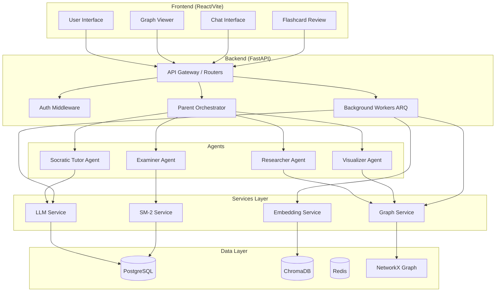
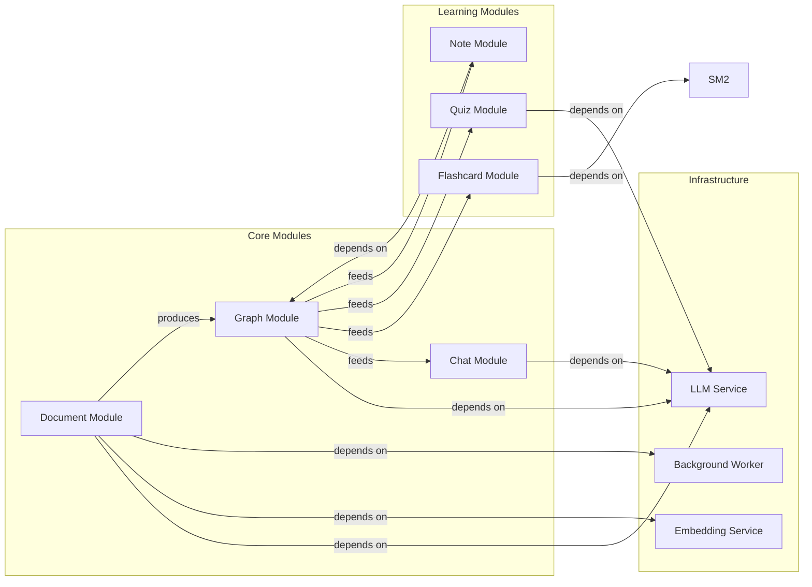

# Software Requirements Specification (SRS) — Tổng Quan

> **Document Owner:** AetherTutor Team
> **Created:** April 10, 2026
> **Version:** 1.0
> **Status:** Active (MVP Phase)
> **Source of Truth:** Đây là tài liệu SRS CHÍNH, đóng vai trò "Context Anchor" cho mọi yêu cầu AI code.

---

## 0. Hướng Dẫn Sử Dụng SRS Này (Cho Vibe Coding)

### Mục Đích
Bộ SRS này được thiết kế tối ưu cho **AI-assisted development**, tập trung vào 3 trụ cột:
1. **Business Rules** — Luật chơi bất biến
2. **User Flows** — Luồng dữ liệu end-to-end
3. **Module Contracts** — Interface definitions

### Cách Dùng Khi Prompt AI
```
Trước khi yêu cầu AI code cho Module X:
1. AI đọc file này (SRS_Overview.md) để nắm context tổng thể
2. AI đọc Business_Rules.md để nắm luật bất biến
3. AI đọc Module_Contracts.md để nắm input/output của module cần code
4. AI đọc User_Flows.md để nắm luồng người dùng liên quan
```

### Quan Hệ Với Tài Liệu Hiện Có
| Tài liệu SRS | Tài liệu hiện có trong docs/ | Quan hệ |
|---|---|---|
| `SRS_Overview.md` (file này) | `core/Architecture.md`, `core/Features.md` | Tổng hợp + bổ sung Business Rules |
| `Business_Rules.md` | `core/Data_Model.md` | Định nghĩa 15 luật chơi bất biến (logic chi tiết) |
| `User_Flows.md` | `design/User_Scenarios.md` | Chi tiết hóa thành flowchart/data flow |
| `Module_Contracts.md` | `core/API_Specifications.md` | Mở rộng sang internal service contracts |

---

## 1. Giới Thiệu

### 1.1 Mục Đích Hệ Thống
**AetherTutor** là AI-Powered Learning OS giúp người học đạt **"Hiểu Đầy Đủ"** thông qua:
- Xây dựng **Knowledge Graph** từ tài liệu cá nhân (PDF, Web, YouTube)
- Tương tác **Socratic** với 4 Agent chuyên biệt
- Ôn tập thông minh với thuật toán **SM-2 Spaced Repetition**
- Quản lý tri thức theo phương pháp **Zettelkasten**

### 1.2 Đối Tượng Người Dùng

#### Personas
| Persona | Mô tả | Use Case Chính |
|---|---|---|
| **Student** | Sinh viên, người tự học | Upload tài liệu → Chat Socratic → Ôn tập Flashcard |
| **Researcher** | Nghiên cứu sinh, chuyên gia | Xây dựng Knowledge Graph → Multi-hop Query → Visualize |
| **Professional** | Chuyên gia phân tích | Local Mode (Ollama) → Private Knowledge OS |

#### Actor States (MVP — Single User)

Trong MVP, chỉ có **1 Actor duy nhất** (Owner), nhưng Actor này tồn tại ở nhiều **trạng thái** khác nhau. Mỗi trạng thái quy định giới hạn quyền truy cập thực tế.

| State | Điều kiện | Quyền truy cập | Giới hạn |
|---|---|---|---|
| **New User** | Chưa có document nào | Upload document, General Chat (không graph-aware) | Không thể dùng Graph/Flashcard/Quiz/Notes |
| **Active User** | ≥ 1 document `completed` | Tất cả tính năng: Chat graph-aware, Flashcard, Quiz, Notes | Chịu rate limits (BR-012) |
| **Processing User** | Có document đang `processing` | Vẫn dùng tính năng cũ được | Không upload thêm nếu đã có 1 document pending/processing (tránh queue overload) |
| **Rate Limited** | Vượt quota trong ngày (BR-012) | Xem dữ liệu cũ, ôn tập flashcard | Không upload/generate flashcard/quiz mới |
| **Degraded Mode** | LLM service unavailable | Xem graph, notes, flashcard đã có | Không chat, không generate flashcard/quiz mới |

**State Transition:**
```
New User ──(upload + complete)──→ Active User
Active User ──(upload)──→ Processing User ──(complete)──→ Active User
Active User ──(rate limit hit)──→ Rate Limited ──(next day)──→ Active User
Active User ──(LLM down)──→ Degraded Mode ──(LLM up)──→ Active User
```

### 1.3 Phạm Vi MVP

| Thành phần | Trạng thái | Ghi chú |
|---|---|---|
| Document Upload (PDF) | ✅ Trong scope | Processing qua background worker |
| LightRAG Knowledge Graph | ✅ Trong scope | Entity extraction, dual-level retrieval |
| Socratic Chat | ✅ Trong scope | Feynman technique, graph-aware |
| Flashcard + SM-2 | ✅ Trong scope | Auto-generate từ graph entities |
| Quiz Generation | ✅ Trong scope | Multi-hop questions từ graph |
| Note Taking (Zettelkasten) | ✅ Trong scope | Atomic notes + backlinks |
| Knowledge Graph View | ✅ Trong scope | React Flow visualization |
| Authentication / JWT | ❌ Post-MVP | MVP: single-user local (Mock Auth) |
| Multi-user / Multi-tenancy | ❌ Post-MVP | MVP: single-user (Default User ID) |
| OAuth / Social Login | ❌ Post-MVP | Post-MVP Phase |
| Payment / Subscription | ❌ Post-MVP | Post-MVP Phase |
| Video/Audio Processing | ❌ Post-MVP | Post-MVP Phase |
| Mobile App | ❌ Post-MVP | Responsive web only (MVP) |

> [!NOTE]
> **MVP Mock Auth:** Giai đoạn MVP sử dụng một `DEFAULT_USER_ID` cố định (`00000000-0000-0000-0000-000000000000`) để thỏa mãn các luật về cô lập dữ liệu (BR-001). Cơ chế này được thực thi qua Authorization Middleware giả lập, đảm bảo mọi truy vấn database/vector/graph PHẢI luôn đi kèm ID này.


---

## 2. Tổng Quan Kiến Trúc

### 2.1 High-Level Architecture



### 2.2 Tech Stack Summary

| Layer | Technology | Version |
|---|---|---|
| Backend | Python + FastAPI | Python 3.11, FastAPI 0.115+ |
| Frontend | React + TypeScript + Vite | React 18+ |
| Database | PostgreSQL + asyncpg | PostgreSQL 16 |
| Vector DB | ChromaDB (HTTP mode) | ChromaDB 0.5.0 |
| Cache/Queue | Redis + ARQ | Redis 7 |
| Graph Storage | PostgreSQL + NetworkX | **PostgreSQL** là source-of-truth. **NetworkX** là in-memory view (được rebuild từ SQL khi cần). |
| LLM | OpenAI API / Ollama | Configurable |
| ORM | SQLAlchemy 2.0 (async) | 2.0+ |
| Migration | Alembic | Latest |
| Testing | pytest + pytest-asyncio | Latest |

---

## 3. Business Rules — Tổng Quan Cốt Lõi

> [!IMPORTANT]
> Đây là danh sách rút gọn. Chi tiết đầy đủ tại **`Business_Rules.md`**.

### BR-001: User Data Isolation (BẤT BIẾN)
**MỌI dữ liệu phải được cô lập (isolate) theo `user_id`. Dữ liệu User A KHÔNG BAO GIỜ hiển thị cho User B.**

### BR-002: Document Processing Pipeline (BẤT BIẾN)
**8 trạng thái BẮT BUỘC (khớp Data_Model State Machine):**

| Bước | State | Input | Output |
|---|---|---|---|
| 1 | `pending` | File PDF/URL upload | Document record created |
| 2 | `processing` | Worker picks up task | Status update |
| 3 | `chunking` | Raw text extracted | Chunks (500 chars, 50 overlap) |
| 4 | `entity_extraction` | Chunks | JSON entities + relations |
| 5 | `graph_construction` | Entities + Relations | NetworkX graph built |
| 6 | `embedding_generation` | Chunks | Vector embeddings |
| 7 | `vector_storage` | Embeddings generated | Saved to ChromaDB |
| 8 | `completed` | All storage success | Document ready |

**Failure Path:** Bất kỳ bước nào fail → `failed` state với error_message.

**Chi tiết đầy đủ tại:** [Business_Rules.md#br-002](Business_Rules.md#br-002-document-processing-pipeline)

### BR-003: Graph Construction Requires Entities (BẤT BIẾN)
**Knowledge Graph KHÔNG được xây dựng nếu không có entities nào được trích xuất (từ spaCy hoặc LLM).**

### BR-004: Flashcard Generation Rule (BẤT BIẾN)
**Flashcard chỉ được sinh từ graph entities/relations đã được người dùng xác nhận hoặc đã hoàn thành processing.**

### BR-005: SM-2 Scheduling Rule (BẤT BIẾN)
**Flashcard chỉ xuất hiện để ôn tập khi `sm2_next_review <= NOW()`. Không cho phép override thủ công trừ khi user explicitly yêu cầu.**

### BR-006: Socratic Response Rule (BẤT BIẾN)
**Socratic Tutor KHÔNG được đưa ra câu trả lời trực tiếp. PHẢI đặt câu hỏi gợi mở trước, chỉ giải thích khi user đã cố gắng trả lời ít nhất 1 lần.**

### BR-007: Quiz Generation Rule (BẤT BIẾN)
**Quiz PHẢI bao phủ ít nhất 80% các entities có `degree > 3` trong graph. Câu hỏi PHẢI có explanation cho đáp án đúng.**

### BR-008: Local Mode Rule (BẤT BIẾN)
**Khi user kích hoạt Local Mode, KHÔNG dữ liệu nào được gửi đến Cloud LLM. Mọi request PHẢI route sang Ollama endpoint.**

### BR-009: Note Backlink Rule (BẤT BIẾN)
**Khi tạo note mới, hệ thống PHẢI quét nội dung để tìm khái niệm trùng với entities trong graph và gợi ý backlinks.**

### BR-010: Error Recovery Rule (BẤT BIẾN)
**Mọi background task thất bại PHẢI được retry tối đa 3 lần với exponential backoff. Sau 3 lần vẫn fail → lưu error message và notify user.**

### BR-011: Document Upload Validation (CỐ ĐỊNH)
**Document upload PHẢI validate trước khi xử lý (file size, type, text layer).**

### BR-012: Rate Limiting & Quota (CỐ ĐỊNH)
**API calls PHẢI được giới hạn để tránh lạm dụng. MVP: per-user limits. Post-MVP: per subscription tier.**

### BR-013: Knowledge Graph Versioning (KHUYẾN NGHỊ — Post-MVP)
**Mỗi lần document mới được thêm vào graph, PHẢI lưu version snapshot để rollback. Post-MVP.**

### BR-014: Chat Session Context (KHUYẾN NGHỊ)
**Chat session PHẢI giữ context từ document hiện tại. Nếu user hỏi ngoài document, mở rộng retrieval.**

### BR-015: Flashcard Quality Threshold (KHUYẾN NGHỊ)
**Flashcard auto-generated PHẢI đạt chất lượng tối thiểu: confidence >= 0.7, description >= 20 chars.**

### BR-016: System Resilience (BẤT BIẾN)
**Hệ thống PHẢI phản ứng graceful khi hạ tầng gặp sự cố. Không crash, không treo user vô hạn.**

### BR-017: Request Idempotency (CỐ ĐỊNH)
**Mọi mutation request (POST/PUT/DELETE) PHẢI có cơ chế chống trùng lặp.**

---

## 4. Module Dependencies Map



### Dependency Rules

| Rule | Mô tả |
|---|---|
| **DEP-001** | Document Module PHẢI hoàn thành processing trước khi Graph Module sẵn sàng |
| **DEP-002** | Graph Module PHẢI có entities trước khi Flashcard/Quiz/Note modules hoạt động |
| **DEP-003** | Chat Module CÓ THỂ hoạt động độc lập nếu không có document (general chat) |
| **DEP-004** | LLM Service là dependency của GẦN NHƯ mọi module — cần health check trước khi xử lý |
| **DEP-005** | Background Worker là async — API trả về 202 Accepted ngay, client polling status |
| **DEP-006** | Auth Middleware (MC-012) chạy TRƯỚC mọi endpoint — inject user_id vào request context |
| **DEP-007** | Parent Orchestrator (MC-011) route request tới Agent — health check LLM trước khi route |

---

## 5. User Roles & Permissions (MVP)

> [!NOTE]
> MVP là single-user local nên chưa có phân quyền phức tạp. Bảng này mô tả **giới hạn quyền thực tế** dựa trên Actor State.

### 5.1 MVP — Owner (Default User)

| Tính năng | New User | Active User | Processing User | Rate Limited | Degraded Mode |
|---|---|---|---|---|---|
| Upload document | ✅ | ✅ | ❌ (1 lúc) | ❌ | ✅ |
| General Chat | ✅ | ✅ | ✅ | ✅ | ❌ (LLM down) |
| Graph-aware Chat | ❌ | ✅ | ✅ (doc cũ) | ✅ | ❌ (LLM down) |
| View Graph | ❌ | ✅ | ✅ (doc cũ) | ✅ | ✅ |
| Generate Flashcards | ❌ | ✅ | ✅ (doc cũ) | ❌ | ❌ (LLM down) |
| Review Flashcards | ❌ | ✅ | ✅ | ✅ | ✅ |
| Generate Quiz | ❌ | ✅ | ✅ (doc cũ) | ❌ | ❌ (LLM down) |
| Create/Edit Notes | ❌ | ✅ | ✅ | ✅ | ✅ |
| Delete Document | ❌ | ✅ | ✅ | ❌ | ✅ |
| Merge Entities | ❌ | ✅ | ✅ | ❌ | ✅ |
| Switch LLM Mode | ✅ | ✅ | ✅ | ✅ | ✅ |

### 5.2 Post-MVP Reference

| Role | Permissions | Scope |
|---|---|---|
| **User** | Upload, Chat, Graph, Flashcards, Quiz, Notes | Own data only |
| **Admin** | User management, System monitoring, Model configuration | System-wide |
| **Enterprise** | Team management, Shared knowledge graphs, Usage analytics | Team scope |

---

## 6. Non-Functional Requirements

### 6.1 Performance

| Yêu cầu | Ngưỡng | Cách đo |
|---|---|---|
| API Response Time | < 500ms (P95) cho read operations | Slow queries logging |
| Chat Response Time | < 3s cho first token (streaming) | Time to First Byte |
| Document Processing | < 5 phút cho PDF 50 trang | Worker timeout |
| Graph Query | < 2s cho graph với 10K entities | Query benchmark |
| Flashcard Review | < 200ms load time | Frontend performance |

### 6.2 Scalability

| Thành phần | Giới hạn MVP | Post-MVP Target |
|---|---|---|
| Documents per user | 100 | 10,000+ |
| Entities per graph | 5,000 | 100,000+ |
| Chat messages per session | 500 | Unlimited (archive old) |
| Concurrent users | 1 (single-user) | 1,000+ |

### 6.3 Reliability

| Yêu cầu | Target |
|---|---|
| Uptime (local dev) | Best effort |
| Data durability | 100% (PostgreSQL WAL + Volume backup) |
| Task retry success rate | > 95% (3 retries) |
| Graceful degradation | LLM down → queue requests, notify user |

### 6.4 Security (MVP)

| Yêu cầu | Implementation |
|---|---|
| API Key storage | Environment variables, NOT in code |
| Password hashing | bcrypt (Post-MVP) |
| Data encryption at rest | PostgreSQL TDE / Disk encryption |
| Row-level isolation | `WHERE user_id = :current_user_id` mọi query |
| CORS | Restrict to frontend domain (production) |
| Rate limiting | SlowAPI per IP (MVP), per user (Post-MVP) |

---

## 7. Glossary (Thuật Ngữ)

| Thuật ngữ | Định nghĩa |
|---|---|
| **Knowledge Graph** | Đồ thị tri thức với nodes (entities) và edges (relations) trích xuất từ tài liệu |
| **Entity** | Một khái niệm, thuật ngữ, người, quy trình được trích xuất từ document |
| **Relation** | Mối quan hệ có hướng giữa 2 entities (vd: "causes", "part_of") |
| **Dual-level Retrieval** | LightRAG retrieval: Level 1 (entity similarity) + Level 2 (concept traversal) |
| **Socratic Tutor** | Agent sử dụng phương pháp đặt câu hỏi gợi mở thay vì đưa câu trả lời trực tiếp |
| **Feynman Technique** | Yêu cầu user giải thích lại khái niệm bằng ngôn ngữ đơn giản để kiểm tra hiểu biết |
| **SM-2** | SuperMemo-2 algorithm tính toán thời điểm ôn tập tối ưu |
| **Zettelkasten** | Phương pháp ghi chú với atomic notes và backlinks |
| **Combo** | Bộ công cụ Agent phối hợp theo kịch bản học tập (vd: Researcher → Visualizer) |
| **Local Mode** | Chế độ sử dụng Ollama local, không gửi dữ liệu lên cloud |
| **Background Worker** | ARQ worker xử lý tác vụ nặng (entity extraction, graph building) bất đồng bộ |
| **Context Anchor** | Tài liệu SRS dùng làm "neo ngữ cảnh" cho AI khi code |

---

## 8. Tài Liệu Liên Quan

| Tài liệu | Đường dẫn | Mục đích |
|---|---|---|
| SRS Overview | `docs/srs/SRS_Overview.md` (file này) | Tổng quan + Business Rules summary |
| Business Rules | `docs/srs/Business_Rules.md` | **Chi tiết đầy đủ** mọi luật nghiệp vụ |
| User Flows | `docs/srs/User_Flows.md` | End-to-end flows với mermaid diagrams |
| Module Contracts | `docs/srs/Module_Contracts.md` | Interface definitions cho từng module |
| Architecture | `docs/core/Architecture.md` | Kiến trúc kỹ thuật chi tiết |
| Data Model | `docs/core/Data_Model.md` | Schema database chi tiết |
| API Spec | `docs/core/API_Specifications.md` | API endpoints |
| Features | `docs/core/Features.md` | Danh sách tính năng |

---

> [!IMPORTANT]
> **Tài liệu này là LIVING DOCUMENT.** Cập nhật khi có yêu cầu mới hoặc thay đổi kiến trúc.
> Mọi thay đổi PHẢI được review trước khi merge.

---
© 2026 AetherTutor Team. Created: April 10, 2026
