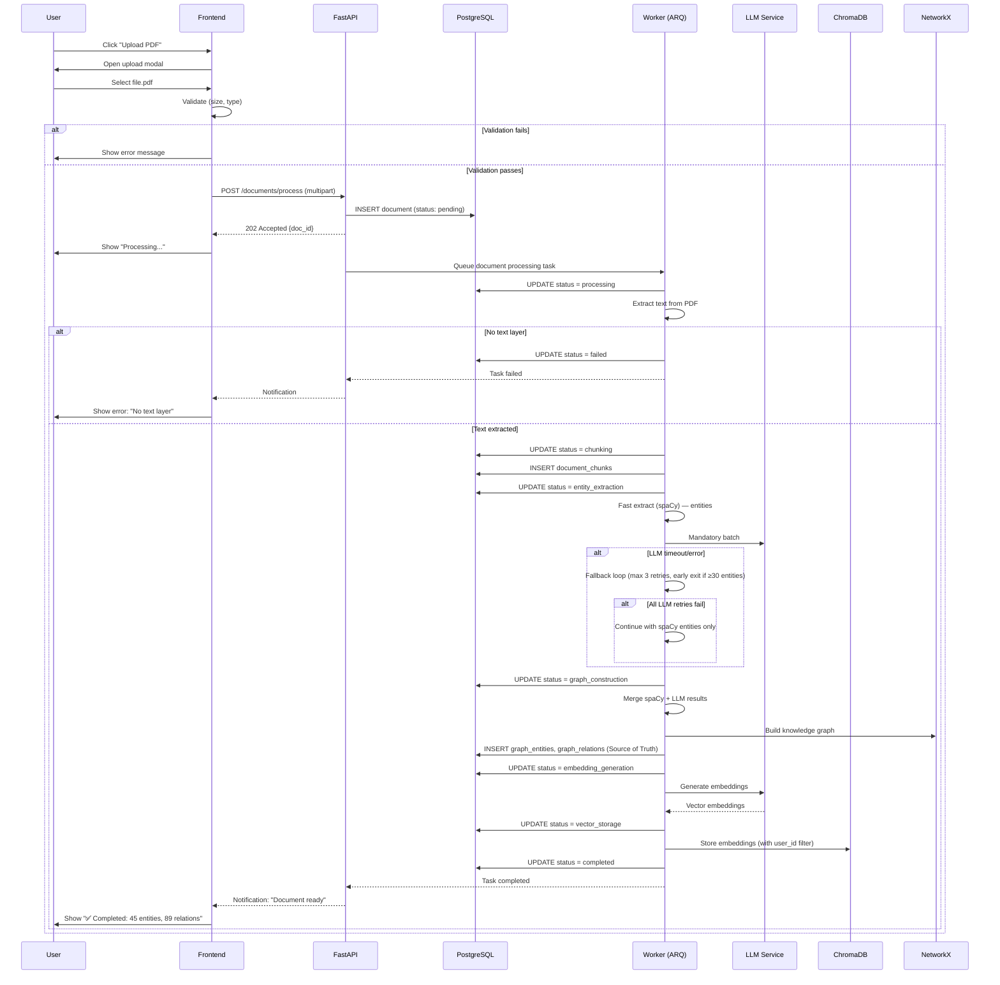
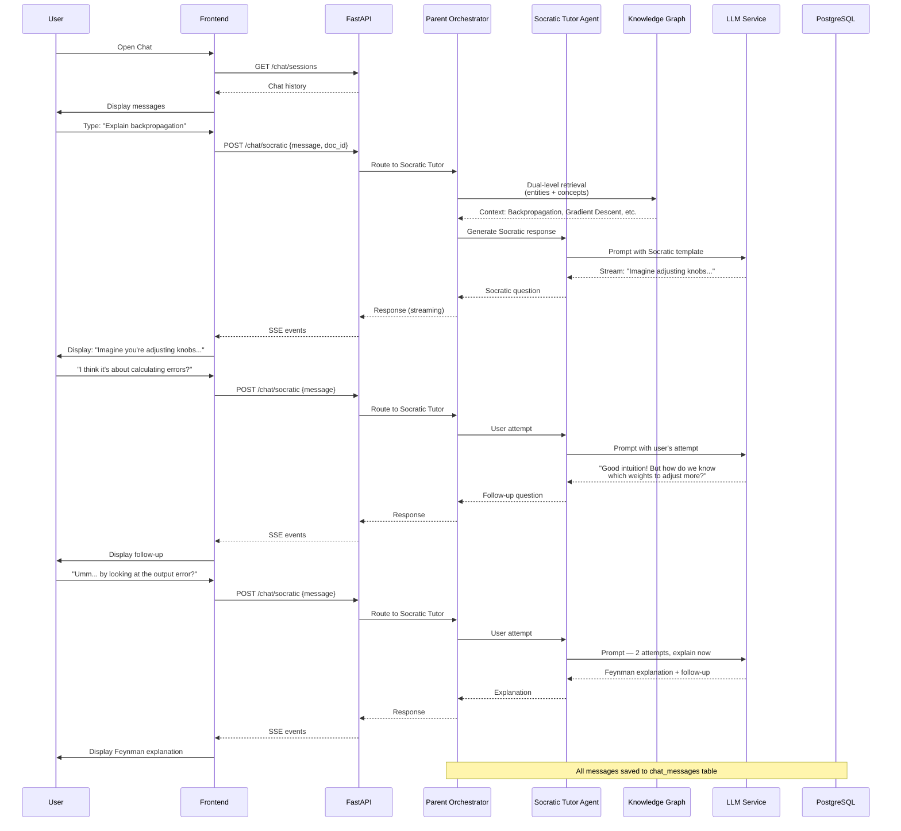
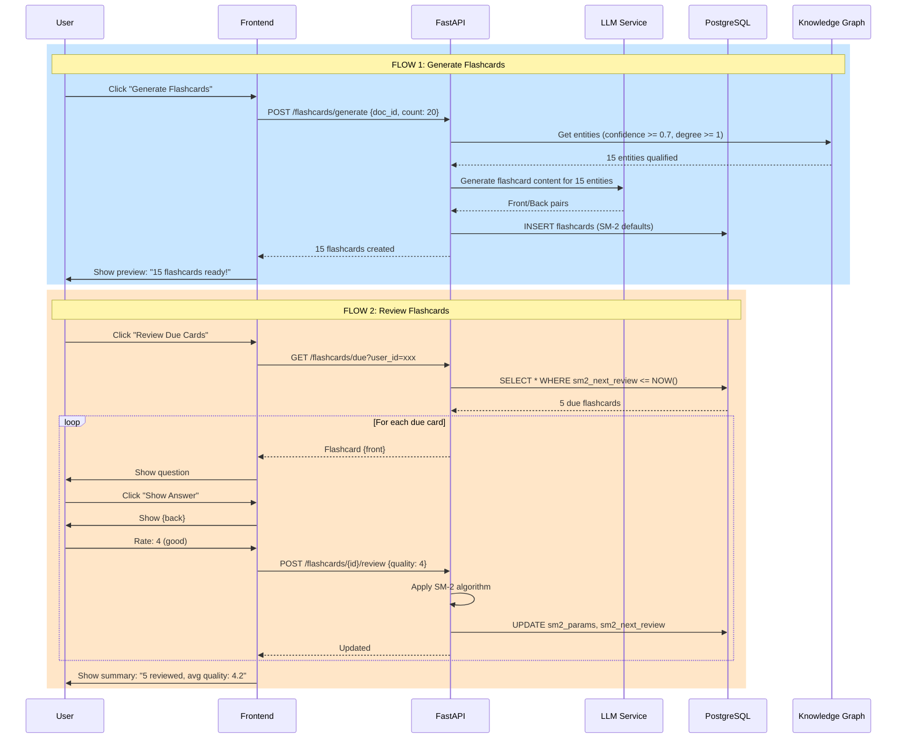
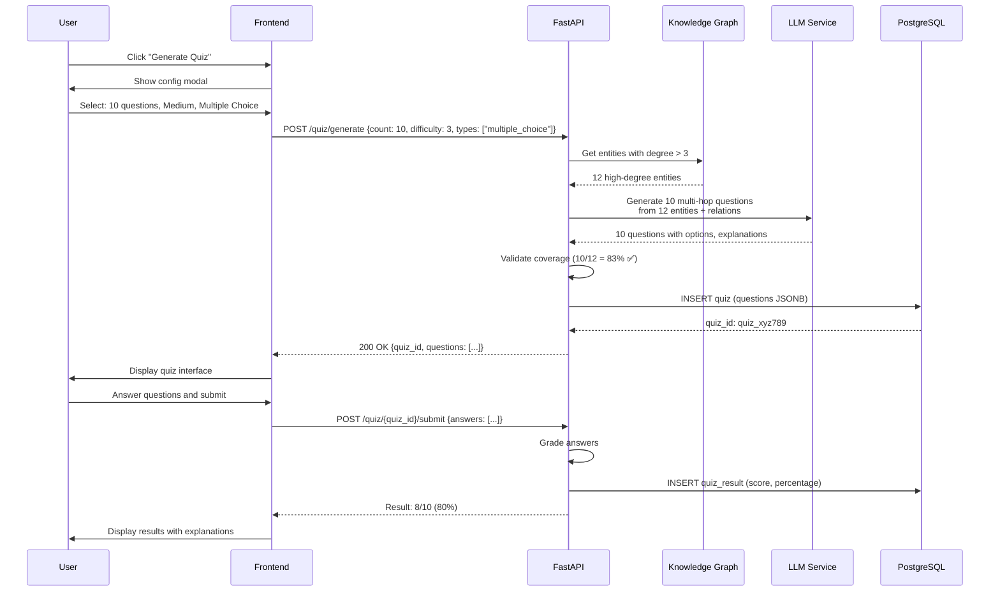
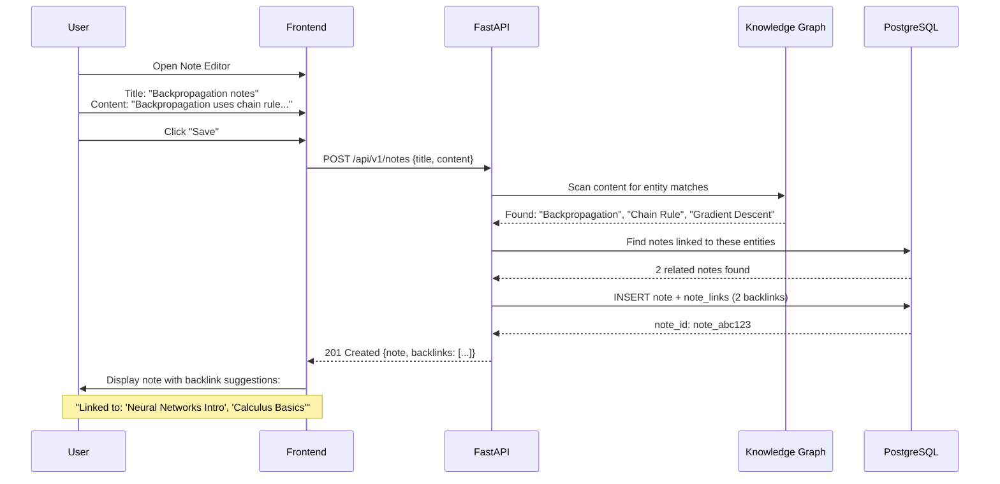
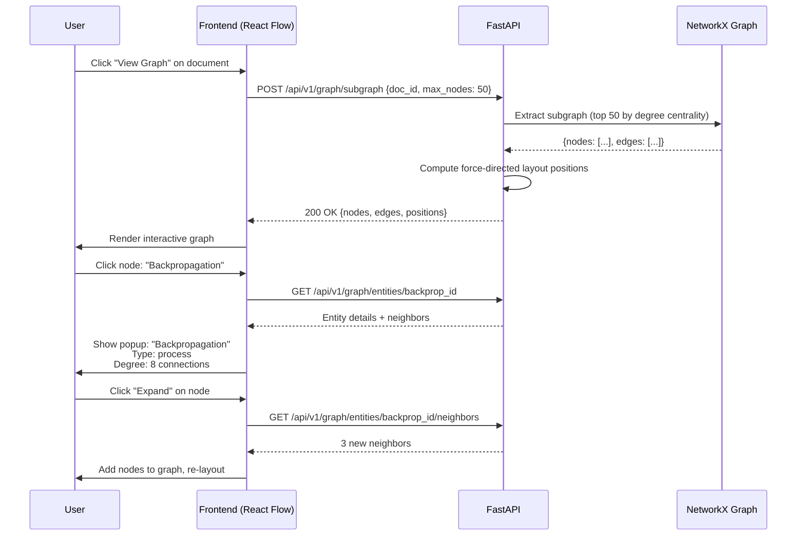
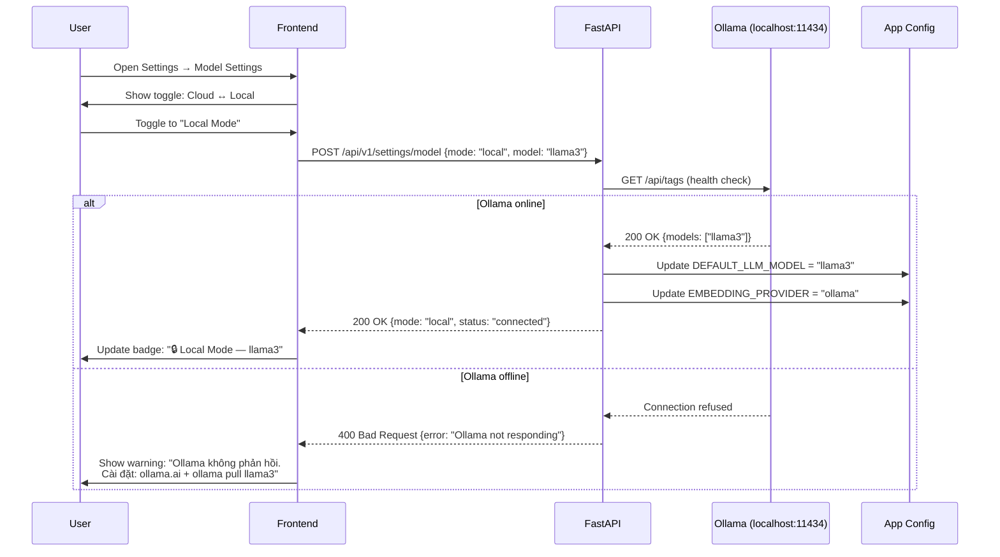
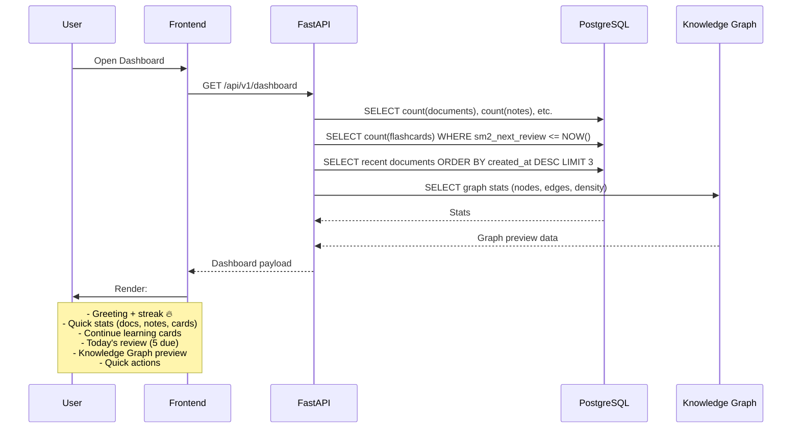

# User Flows — Luồng Người Dùng End-to-End

> **Document Owner:** AetherTutor Team
> **Created:** April 10, 2026
> **Version:** 1.0
> **Status:** Active (MVP Phase)
> **Parent:** [SRS_Overview.md](SRS_Overview.md)

---

## Hướng Dẫn Sử Dụng

Mỗi User Flow được đánh ID: **`UF-XXX`** (User Flow #XXX).

**Cấu trúc mỗi flow:**
1. **Trigger** — Điều gì bắt đầu flow
2. **Actor** — Ai thực hiện
3. **Preconditions** — Điều kiện tiên quyết
4. **Main Flow** — Luồng chính (happy path)
5. **Alternative Flows** — Luồng phụ / edge cases
6. **Postconditions** — Kết quả cuối cùng
7. **Business Rules áp dụng** — Rules liên quan
8. **Mermaid Diagram** — Visual flow

---

## UF-001: Upload & Process Document

**Trigger:** User tải lên file PDF hoặc paste URL
**Actor:** User (Owner)
**Preconditions:**
- User đã truy cập Dashboard hoặc Document Library
- File PDF hợp lệ, size <= 50MB

### Main Flow (Happy Path)

| Step | Action | System Response | Data Flow |
|---|---|---|---|
| 1 | User click "Upload PDF" | Mở upload modal | — |
| 2 | User chọn file PDF | Validate: size, type | File → Frontend |
| 3 | Validation passed | Hiển thị progress bar | `POST /api/v1/documents/process` |
| 4 | Frontend upload file | Backend tạo document record (status: `pending`) | File → PostgreSQL |
| 5 | Backend trả về `202 Accepted` + `doc_id` | Frontend hiển thị "Processing..." | `doc_id` → Frontend |
| 6 | Background worker nhận task | Update status: `processing` | Redis Queue → Worker |
| 7 | Worker trích xuất text | Lưu raw text vào `document_chunks` | PDF → Text → PostgreSQL |
| 8 | Worker gọi spaCy + LLM extract entities | Lưu entities + relations | Chunks → spaCy → LLM (fallback) → PostgreSQL |
| 9 | Worker xây dựng NetworkX graph | Lưu graph vào SQL (Source of Truth) | Entities → SQL (nodes/edges) |
| 10 | Worker tạo embeddings | Lưu vào ChromaDB | Chunks → Embedding → ChromaDB |
| 11 | Worker lưu vào Vector Storage | Kiểm tra tính toàn vẹn storage | ChromaDB → Verified |
| 12 | Worker update status: `completed` | Document sẵn sàng | PostgreSQL: `status = completed` |
| 13 | Frontend polling thấy status thay đổi | Hiển thị "✅ Completed" + stats | `GET /api/v1/documents/{id}/status` |

### Alternative Flows

| Flow | Điều kiện | Handling |
|---|---|---|
| **A1: File > 50MB** | Step 2 fail | Trả về `400 Bad Request`: "File vượt giới hạn 50MB" |
| **A2: Không có text layer** | Step 7 fail (scan PDF) | Status: `failed`, error: "Không đọc được text" |
| **A3: LLM timeout** | Step 8 timeout | Fallback loop retry (max 3 retries per batch). Nếu tất cả fail → vẫn có spaCy entities, graph xây được (không có relations) |
| **A4: Worker crash** | Any step | Worker restart, retry từ bước gần nhất |
| **A5: Không có entities** | Step 8 — spaCy + LLM đều fail | Status: `failed`, error: "No entities extracted" |

### Postconditions
- **Success:** Document có knowledge graph + embeddings, sẵn sàng cho Chat/Quiz/Flashcard
- **Failure:** Document status = `failed`, user thấy error message

### Business Rules áp dụng
- [BR-002](Business_Rules.md#br-002-document-processing-pipeline) 🔴 — 8 bước bắt buộc
- [BR-003](Business_Rules.md#br-003-graph-construction-requires-entities) 🔴 — Cần ít nhất 1 entity
- [BR-010](Business_Rules.md#br-010-error-recovery-rule) 🔴 — Retry fallback loop (3 retries)
- [BR-011](Business_Rules.md#br-011-document-upload-validation) 🟡 — Validation

### Mermaid Diagram

---

## UF-002: Socratic Chat (Graph-Aware)

**Trigger:** User gửi tin nhắn trong chat interface
**Actor:** User (Owner)
**Preconditions:**
- Ít nhất 1 document đã `completed`
- LLM service available

### Main Flow (Happy Path)

| Step | Action | System Response | Data Flow |
|---|---|---|---|
| 1 | User mở giao diện Chat | Load chat history | `GET /api/v1/chat/sessions` |
| 2 | User chọn document context | System load graph stats cho document đó | `GET /api/v1/graph/stats` |
| 3 | User nhập câu hỏi | — | — |
| 4 | User nhấn Enter | Frontend gửi message | `POST /api/v1/chat/socratic` |
| 5 | Backend nhận message | Orchestrator chọn Socratic Tutor Agent | — |
| 6 | Socratic Tutor query graph | Dual-level retrieval: entities + concepts | Graph → ChromaDB + NetworkX |
| 7 | LLM generate Socratic response | Streaming response về frontend | LLM → API → FE (SSE) |
| 8 | Frontend hiển thị câu hỏi gợi mở | User đọc và suy nghĩ | — |
| 9 | User trả lời | Gửi message tiếp | Repeat từ Step 4 |
| 10 | Sau >= 2 lần user thử | Socratic Tutor giải thích Feynman-style | LLM → API → FE |

### Alternative Flows

| Flow | Điều kiện | Handling |
|---|---|---|
| **A1: Không có document** | Step 2 | Chat hoạt động ở chế độ general (không graph-aware) |
| **A2: LLM down** | Step 7 | Trả về error: "AI không phản hồi. Thử lại hoặc kiểm tra Settings" |
| **A3: User hỏi ngoài context** | Step 6 | Agent thông báo và gợi ý document liên quan |
| **A4: Streaming bị ngắt** | Step 7 | Frontend retry, hiển thị partial response |

### Postconditions
- Message được lưu vào `chat_messages` table
- Session updated với `token_count`
- User nhận được câu hỏi gợi mở hoặc giải thích

### Business Rules áp dụng
- [BR-006](Business_Rules.md#br-006-socratic-response-rule) 🔴 — Hỏi trước, trả lời sau
- [BR-014](Business_Rules.md#br-014-chat-session-context) 🟢 — Graph-aware context
- [BR-001](Business_Rules.md#br-001-user-data-isolation) 🔴 — User isolation

### Mermaid Diagram

---

## UF-003: Generate & Review Flashcards

**Trigger:** User yêu cầu tạo flashcard hoặc mở review session
**Actor:** User (Owner)
**Preconditions:**
- Ít nhất 1 document `completed`
- Graph entities đã được extract

### Main Flow: Flashcard Generation

| Step | Action | System Response | Data Flow |
|---|---|---|---|
| 1 | User click "Generate Flashcards" | — | — |
| 2 | Frontend gửi request | `POST /api/v1/flashcards/generate` | {doc_id, count} |
| 3 | Backend lấy entities từ graph | Filter: confidence >= 0.7, degree >= 1 | Graph → PostgreSQL |
| 4 | LLM sinh flashcard content | Front/Back cho mỗi entity | Entities → LLM → Flashcards |
| 5 | Lưu flashcards với SM-2 defaults | `sm2_ease_factor=2.5, interval=0` | PostgreSQL: `flashcards` |
| 6 | Trả về danh sách flashcard đã tạo | Frontend hiển thị preview | Flashcards → FE |

### Main Flow: Flashcard Review

| Step | Action | System Response | Data Flow |
|---|---|---|---|
| 1 | User click "Review Due Cards" | Query flashcards where `sm2_next_review <= NOW()` | PostgreSQL |
| 2 | Frontend hiển thị flashcard đầu tiên | Front (question) visible, Back hidden | — |
| 3 | User click "Show Answer" | Back (answer) hiển thị | — |
| 4 | User tự đánh giá (0-5) | Gửi quality rating | `POST /api/v1/flashcards/{id}/review` |
| 5 | Backend cập nhật SM-2 params | Áp dụng SM-2 algorithm (BR-005) | Update flashcard record |
| 6 | Hiển thị flashcard tiếp theo | Repeat từ Step 2 | — |
| 7 | Hết flashcard due | Hiển thị summary: reviewed, avg quality | — |

### Alternative Flows

| Flow | Điều kiện | Handling |
|---|---|---|
| **A1: Không có entities** | Step 3 | Trả về: "Không có entities đủ điều kiện. Cần document processing hoàn tất." |
| **A2: Không có flashcard due** | Step 1 (Review) | Trả về: "Không có flashcard nào cần ôn tập lúc này. ✅" |
| **A3: User đánh giá sai quality** | Step 4 | Validate: quality phải 0-5 |

### Postconditions
- **Generation:** Flashcards mới được tạo, lưu vào DB
- **Review:** SM-2 params updated, `sm2_next_review` tính lại

### Business Rules áp dụng
- [BR-004](Business_Rules.md#br-004-flashcard-generation-rule) 🔴 — Chỉ sinh từ completed docs
- [BR-005](Business_Rules.md#br-005-sm-2-scheduling-rule) 🔴 — SM-2 algorithm
- [BR-015](Business_Rules.md#br-015-flashcard-quality-threshold) 🟢 — Quality threshold

### Mermaid Diagram

---

## UF-004: Generate Quiz

**Trigger:** User yêu cầu tạo bài kiểm tra từ document
**Actor:** User (Owner)
**Preconditions:**
- Document `completed`, có graph entities
- Entities có degree > 3 (để có đủ context)

### Main Flow (Happy Path)

| Step | Action | System Response | Data Flow |
|---|---|---|---|
| 1 | User click "Generate Quiz" | Mở config modal | — |
| 2 | User chọn: số câu hỏi, độ khó, loại câu hỏi | — | {count, difficulty, types} |
| 3 | Frontend gửi request | `POST /api/v1/quiz/generate` | Config → API |
| 4 | Backend lấy entities quan trọng | Filter: degree > 3, sort by centrality | Graph → API |
| 5 | LLM sinh câu hỏi | Multi-hop questions từ entities + relations | Entities → LLM → Questions |
| 6 | Validate: coverage >= 80% entities quan trọng | Nếu thiếu → sinh thêm | — |
| 7 | Lưu quiz vào DB | `POST /api/v1/quizzes` | Questions → PostgreSQL |
| 8 | Trả về quiz | Frontend hiển thị quiz UI | Quiz → FE |

### Alternative Flows

| Flow | Điều kiện | Handling |
|---|---|---|
| **A1: Không đủ entities** | Step 4 | Thông báo: "Cần thêm entities quan trọng. Hãy upload thêm tài liệu." |
| **A2: Coverage < 80%** | Step 6 | Cảnh báo user: "Quiz chỉ bao phủ X% entities quan trọng" |
| **A3: LLM sinh câu hỏi sai format** | Step 5 | Retry parsing, nếu fail → regenerate |

### Postconditions
- Quiz được lưu vào `quizzes` table
- User có thể làm quiz và lưu kết quả vào `quiz_results`

### Business Rules áp dụng
- [BR-007](Business_Rules.md#br-007-quiz-generation-rule) 🔴 — 80% coverage + explanation

### Mermaid Diagram

---

## UF-005: Create Note với Backlinks

**Trigger:** User tạo ghi chú mới
**Actor:** User (Owner)
**Preconditions:**
- Người dùng đã có ít nhất 1 document hoặc note trước đó

### Main Flow (Happy Path)

| Step | Action | System Response | Data Flow |
|---|---|---|---|
| 1 | User mở Note Editor | — | — |
| 2 | User nhập title + content | — | — |
| 3 | User nhấn "Save" | Frontend gửi request | `POST /api/v1/notes` |
| 4 | Backend quét content tìm keywords | So khớp với entities trong graph | Content → Graph search |
| 5 | Tìm thấy entities trùng | Gợi ý backlinks tới notes đã có | Entities → Notes lookup |
| 6 | Lưu note với backlinks | `INSERT note + note_links` | PostgreSQL |
| 7 | Trả về note đã lưu | Frontend hiển thị với backlink suggestions | Note + backlinks → FE |

### Alternative Flows

| Flow | Điều kiện | Handling |
|---|---|---|
| **A1: Không tìm thấy entities** | Step 5 | Lưu note bình thường, không backlink |
| **A2: Backlink trùng** | Step 6 | Bỏ qua duplicate (UNIQUE constraint) |

### Postconditions
- Note được lưu với metadata chứa linked entities
- Backlink suggestions hiển thị cho user

### Business Rules áp dụng
- [BR-009](Business_Rules.md#br-009-note-backlink-rule) 🔴 — Backlink suggestion

### Mermaid Diagram

---

## UF-006: Knowledge Graph Visualization

**Trigger:** User xem graph của document
**Actor:** User (Owner)
**Preconditions:**
- Document `completed`, có graph entities + relations

### Main Flow (Happy Path)

| Step | Action | System Response | Data Flow |
|---|---|---|---|
| 1 | User click "View Graph" trên document | — | — |
| 2 | Frontend gửi request | `GET /api/v1/graph/subgraph` | {doc_id, max_nodes: 50} |
| 3 | Backend extract subgraph | NetworkX: extract nodes + edges | NetworkX → API |
| 4 | Generate layout positions | Force-directed layout algorithm | — |
| 5 | Trả về nodes + edges + positions | Frontend render với React Flow | Graph data → FE |
| 6 | User tương tác: zoom, click node | Hiển thị entity details | — |
| 7 | User click "Expand" trên node | Fetch neighbors của node đó | `GET /api/v1/graph/entities/{id}` |

### Alternative Flows

| Flow | Điều kiện | Handling |
|---|---|---|
| **A1: Graph quá lớn** | Step 3 | Limit max_nodes, thông báo user: "Graph có X entities, hiển thị 50 nodes quan trọng nhất" |
| **A2: Không có graph** | Step 2 | Trả về empty state: "Document chưa processing xong" |

### Postconditions
- Graph visualization hiển thị trên frontend
- User có thể explore entities và relations

### Business Rules áp dụng
- [BR-001](Business_Rules.md#br-001-user-data-isolation) 🔴 — User isolation

### Mermaid Diagram

---

## UF-007: Switch Local/Cloud Mode

**Trigger:** User thay đổi LLM mode trong Settings
**Actor:** User (Owner)
**Preconditions:**
- Ollama đang chạy (cho Local Mode)

### Main Flow (Happy Path)

| Step | Action | System Response | Data Flow |
|---|---|---|---|
| 1 | User mở Settings → Model Settings | — | — |
| 2 | User toggle Local/Cloud Mode | — | — |
| 3 | Nếu Local Mode: Kiểm tra Ollama health | `GET http://localhost:11434/api/tags` | — |
| 4a | Ollama online | Cập nhật config, hiển thị "🔒 Local Mode" | `DEFAULT_LLM_MODEL = llama3` |
| 4b | Ollama offline | Cảnh báo: "Ollama không phản hồi. Kiểm tra lại." | Error message → FE |
| 5 | Lưu setting | Cập nhật `.env` hoặc DB config | — |
| 6 | Badge trên UI thay đổi | "🌐 Cloud" → "🔒 Local" | — |

### Alternative Flows

| Flow | Điều kiện | Handling |
|---|---|---|
| **A1: Ollama không chạy** | Step 3 | Không cho phép switch, hiển thị hướng dẫn cài Ollama |
| **A2: Model không có trong Ollama** | Step 3 | Gợi ý pull model: `ollama pull llama3` |

### Postconditions
- LLM mode được cập nhật
- Mọi request tiếp theo route đúng endpoint

### Business Rules áp dụng
- [BR-008](Business_Rules.md#br-008-local-mode-rule) 🔴 — No cloud data in Local Mode

### Mermaid Diagram

---

## UF-008: Dashboard — Morning Routine

**Trigger:** User mở Dashboard
**Actor:** User (Owner)
**Preconditions:**
- User đã có hoạt động học tập trước đó

### Main Flow (Happy Path)

| Step | Action | System Response | Data Flow |
|---|---|---|---|
| 1 | User mở Dashboard | — | — |
| 2 | Frontend load dashboard data | `GET /api/v1/dashboard` | — |
| 3 | Backend tổng hợp: stats, due cards, recent docs | Parallel queries | PostgreSQL |
| 4 | Trả về dashboard payload | Stats, recent docs, due count, graph preview | — |
| 5 | Frontend render | Hiển thị greeting, stats, quick actions | — |
| 6 | User click "Review 5 Due Cards" | Chuyển tới Flashcard Review | — |

### Alternative Flows

| Flow | Điều kiện | Handling |
|---|---|---|
| **A1: User mới (chưa có data)** | Step 3 | Hiển thị empty state với hướng dẫn onboarding |
| **A2: Không có due cards** | Step 3 | Ẩn section "Today's Review" hoặc hiển thị "✅ Không có card nào cần ôn" |

### Postconditions
- User thấy overview hoạt động học tập
- Quick actions sẵn sàng

### Mermaid Diagram

---

## User Flow Summary Matrix

| Flow ID | Tên Flow | Module chính | Business Rules | Độ phức tạp |
|---|---|---|---|---|
| **UF-001** | Upload & Process Document | Document, Worker, Graph | BR-002, BR-003, BR-010, BR-011 | 🔴 Cao |
| **UF-002** | Socratic Chat | Chat, Graph, LLM | BR-006, BR-014, BR-001 | 🔴 Cao |
| **UF-003** | Generate & Review Flashcards | Flashcard, SM-2, Graph | BR-004, BR-005, BR-015 | 🟡 Trung bình |
| **UF-004** | Generate Quiz | Quiz, Graph, LLM | BR-007 | 🟡 Trung bình |
| **UF-005** | Create Note với Backlinks | Notes, Graph | BR-009 | 🟡 Trung bình |
| **UF-006** | Knowledge Graph Visualization | Graph, NetworkX | BR-001 | 🟢 Thấp |
| **UF-007** | Switch Local/Cloud Mode | Settings, LLM | BR-008 | 🟢 Thấp |
| **UF-008** | Dashboard — Morning Routine | Dashboard | BR-001 | 🟢 Thấp |

---

> [!IMPORTANT]
> **Mọi user flow mới PHẢI tuân theo cấu trúc này.**
> Cập nhật tài liệu khi thêm flow mới hoặc thay đổi flow cũ.

---
© 2026 AetherTutor Team. Created: April 10, 2026
