# User Flows — Luồng Người Dùng End-to-End

> **Document Owner:** AetherTutor Team
> **Created:** April 10, 2026
> **Version:** 1.0
> **Status:** Active (MVP Phase)
> **Parent:** [SRS_Overview.md](SRS_Overview.md)

---

## Hướng Dẫn Sử Dụng

Mỗi User Flow được đánh ID: **`UF-XXX`** (User Flow #XXX).

**Cấu trúc mỗi flow:**
1. **Trigger** — Điều gì bắt đầu flow
2. **Actor** — Ai thực hiện
3. **Preconditions** — Điều kiện tiên quyết
4. **Main Flow** — Luồng chính (happy path)
5. **Alternative Flows** — Luồng phụ / edge cases
6. **Postconditions** — Kết quả cuối cùng
7. **Business Rules áp dụng** — Rules liên quan
8. **Mermaid Diagram** — Visual flow

---

## UF-001: Upload & Process Document

**Trigger:** User tải lên file PDF hoặc paste URL
**Actor:** User (Owner)
**Preconditions:**
- User đã truy cập Dashboard hoặc Document Library
- File PDF hợp lệ, size <= 50MB

### Main Flow (Happy Path)

| Step | Action | System Response | Data Flow |
|---|---|---|---|
| 1 | User click "Upload PDF" | Mở upload modal | — |
| 2 | User chọn file PDF | Validate: size, type | File → Frontend |
| **2a** | **Kiểm tra concurrent processing (BR-011)** | **SELECT COUNT(*) FROM documents WHERE user_id = :user_id AND status IN ('PENDING', 'PROCESSING')** | **PostgreSQL** |
| **2b** | **⚠️ NẾU có document đang xử lý** | **Trả về 409 CONCURRENT_PROCESSING: "Document khác đang được xử lý. Vui lòng đợi hoàn tất trước khi upload thêm."** | **Error → Frontend** |
| **2c** | **Kiểm tra idempotency — file hash (BR-017)** | **SHA-256 hash → SELECT id FROM documents WHERE content_hash = :hash AND user_id = :user_id** | **PostgreSQL** |
| **2d** | **⚠️ NẾU file đã tồn tại** | **Trả về 409 DUPLICATE_DOCUMENT: "File này đã được upload trước đó (doc_id: xxx)"** | **Error → Frontend** |
| 3 | Validation passed | Hiển thị progress bar | `POST /api/v1/documents/process` |
| 4 | Frontend upload file | Backend tạo document record (status: `pending`) | File → PostgreSQL |
| 5 | Backend trả về `202 Accepted` + `doc_id` | Frontend hiển thị "Processing..." | `doc_id` → Frontend |
| 6 | Background worker nhận task | Update status: `processing` | Redis Queue → Worker |
| 7 | Worker trích xuất text | Lưu raw text vào `document_chunks` | PDF → Text → PostgreSQL |
| 8 | Worker gọi spaCy + LLM extract entities | Lưu entities + relations | Chunks → spaCy → LLM (fallback) → PostgreSQL |
| 9 | Worker xây dựng NetworkX graph | Lưu graph vào SQL (Source of Truth) | Entities → SQL (nodes/edges) |
| 10 | Worker tạo embeddings | Lưu vào ChromaDB | Chunks → Embedding → ChromaDB |
| 11 | Worker lưu vào Vector Storage | Kiểm tra tính toàn vẹn storage | ChromaDB → Verified |
| 12 | Worker update status: `completed` | Document sẵn sàng | PostgreSQL: `status = completed` |
| 13 | Frontend polling thấy status thay đổi | Hiển thị "✅ Completed" + stats | `GET /api/v1/documents/{id}/status` |

### Alternative Flows

| Flow | Điều kiện | Handling |
|---|---|---|
| **A1: File > 50MB** | Step 2 fail | Trả về `400 Bad Request`: "File vượt giới hạn 50MB" |
| **A2: Không có text layer** | Step 7 fail (scan PDF) | Status: `failed`, error: "Không đọc được text" |
| **A3: LLM timeout** | Step 8 timeout | Fallback loop retry (max 3 retries per batch). Nếu tất cả fail → vẫn có spaCy entities, graph xây được (không có relations) |
| **A4: Worker crash** | Any step | Worker restart, retry từ bước gần nhất |
| **A5: Không có entities** | Step 8 — spaCy + LLM đều fail | Status: `failed`, error: "No entities extracted" |

### Postconditions
- **Success:** Document có knowledge graph + embeddings, sẵn sàng cho Chat/Quiz/Flashcard
- **Failure:** Document status = `failed`, user thấy error message

### Business Rules áp dụng
- [BR-002](Business_Rules.md#br-002-document-processing-pipeline) 🔴 — 8 bước bắt buộc
- [BR-003](Business_Rules.md#br-003-graph-construction-requires-entities) 🔴 — Cần ít nhất 1 entity
- [BR-010](Business_Rules.md#br-010-error-recovery-rule) 🔴 — Retry fallback loop (3 retries)
- [BR-011](Business_Rules.md#br-011-document-upload-validation) 🟡 — Validation

### Mermaid Diagram

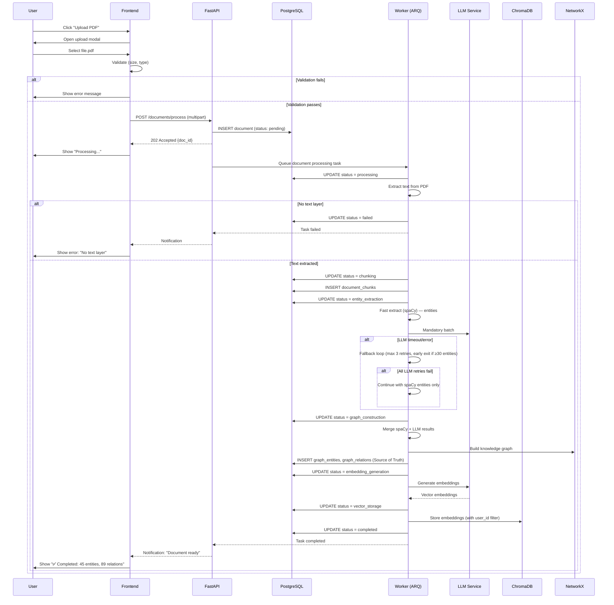

---

## UF-002: Socratic Chat (Graph-Aware)

**Trigger:** User gửi tin nhắn trong chat interface
**Actor:** User (Owner)
**Preconditions:**
- Ít nhất 1 document đã `completed`
- LLM service available

### Main Flow (Happy Path)

| Step | Action | System Response | Data Flow |
|---|---|---|---|
| 1 | User mở giao diện Chat | Load chat history | `GET /api/v1/chat/sessions` |
| 2 | User chọn document context | System load graph stats cho document đó | `GET /api/v1/graph/stats` |
| 3 | User nhập câu hỏi | — | — |
| 4 | User nhấn Enter | Frontend gửi message | `POST /api/v1/chat/socratic` |
| 5 | Backend nhận message | Orchestrator chọn Socratic Tutor Agent | — |
| 6 | Socratic Tutor query graph | Dual-level retrieval: entities + concepts | Graph → ChromaDB + NetworkX |
| 7 | LLM generate Socratic response | Streaming response về frontend | LLM → API → FE (SSE) |
| 8 | Frontend hiển thị câu hỏi gợi mở | User đọc và suy nghĩ | — |
| 9 | User trả lời | Gửi message tiếp | Repeat từ Step 4 |
| 10 | Sau >= 2 lần user thử | Socratic Tutor giải thích Feynman-style | LLM → API → FE |

### Alternative Flows

| Flow | Điều kiện | Handling |
|---|---|---|
| **A1: Không có document** | Step 2 | Chat hoạt động ở chế độ general (không graph-aware) |
| **A2: LLM down** | Step 7 | Trả về error: "AI không phản hồi. Thử lại hoặc kiểm tra Settings" |
| **A3: User hỏi ngoài context** | Step 6 | Agent thông báo và gợi ý document liên quan |
| **A4: Streaming bị ngắt** | Step 7 | Frontend retry, hiển thị partial response |

### Postconditions
- Message được lưu vào `chat_messages` table
- Session updated với `token_count`
- User nhận được câu hỏi gợi mở hoặc giải thích

### Business Rules áp dụng
- [BR-006](Business_Rules.md#br-006-socratic-response-rule) 🔴 — Hỏi trước, trả lời sau
- [BR-014](Business_Rules.md#br-014-chat-session-context) 🟢 — Graph-aware context
- [BR-001](Business_Rules.md#br-001-user-data-isolation) 🔴 — User isolation

### Mermaid Diagram

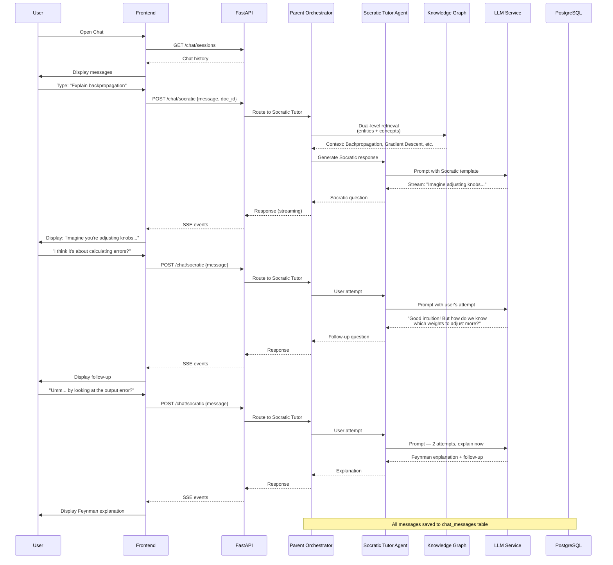

---

## UF-003: Generate & Review Flashcards

**Trigger:** User yêu cầu tạo flashcard hoặc mở review session
**Actor:** User (Owner)
**Preconditions:**
- Ít nhất 1 document `completed`
- Graph entities đã được extract

### Main Flow: Flashcard Generation

| Step | Action | System Response | Data Flow |
|---|---|---|---|
| 1 | User click "Generate Flashcards" | — | — |
| 2 | Frontend gửi request | `POST /api/v1/flashcards/generate` | {doc_id, count} |
| 3 | Backend lấy entities từ graph | Filter: confidence >= 0.7, degree >= 1 | Graph → PostgreSQL |
| 4 | LLM sinh flashcard content | Front/Back cho mỗi entity | Entities → LLM → Flashcards |
| 5 | Lưu flashcards với SM-2 defaults | `sm2_ease_factor=2.5, interval=0` | PostgreSQL: `flashcards` |
| 6 | Trả về danh sách flashcard đã tạo | Frontend hiển thị preview | Flashcards → FE |

### Main Flow: Flashcard Review

| Step | Action | System Response | Data Flow |
|---|---|---|---|
| 1 | User click "Review Due Cards" | Query flashcards where `sm2_next_review <= NOW()` | PostgreSQL |
| 2 | Frontend hiển thị flashcard đầu tiên | Front (question) visible, Back hidden | — |
| 3 | User click "Show Answer" | Back (answer) hiển thị | — |
| 4 | User tự đánh giá (0-5) | Gửi quality rating | `POST /api/v1/flashcards/{id}/review` |
| 5 | Backend tính SM-2 params mới | Áp dụng công thức BR-005 | Flashcard → SM-2 Algorithm |
| 6 | Cập nhật flashcard | Lưu ease_factor, interval, repetitions, next_review, **sm2_last_review** | PostgreSQL |
| **6a** | **Ghi nhận study session** | **`INSERT INTO study_sessions (user_id, flashcard_id, quality, response_time_ms)`** | **PostgreSQL** |
| 7 | Hiển thị flashcard tiếp theo | Repeat từ Step 2 | — |
| 7 | Hết flashcard due | Hiển thị summary: reviewed, avg quality | — |

### Alternative Flows

| Flow | Điều kiện | Handling |
|---|---|---|
| **A1: Không có entities** | Step 3 | Trả về: "Không có entities đủ điều kiện. Cần document processing hoàn tất." |
| **A2: Không có flashcard due** | Step 1 (Review) | Trả về: "Không có flashcard nào cần ôn tập lúc này. ✅" |
| **A3: User đánh giá sai quality** | Step 4 | Validate: quality phải 0-5 |

### Postconditions
- **Generation:** Flashcards mới được tạo, lưu vào DB
- **Review:** SM-2 params updated, `sm2_next_review` tính lại

### Business Rules áp dụng
- [BR-004](Business_Rules.md#br-004-flashcard-generation-rule) 🔴 — Chỉ sinh từ completed docs
- [BR-005](Business_Rules.md#br-005-sm-2-scheduling-rule) 🔴 — SM-2 algorithm
- [BR-015](Business_Rules.md#br-015-flashcard-quality-threshold) 🟢 — Quality threshold

### Mermaid Diagram

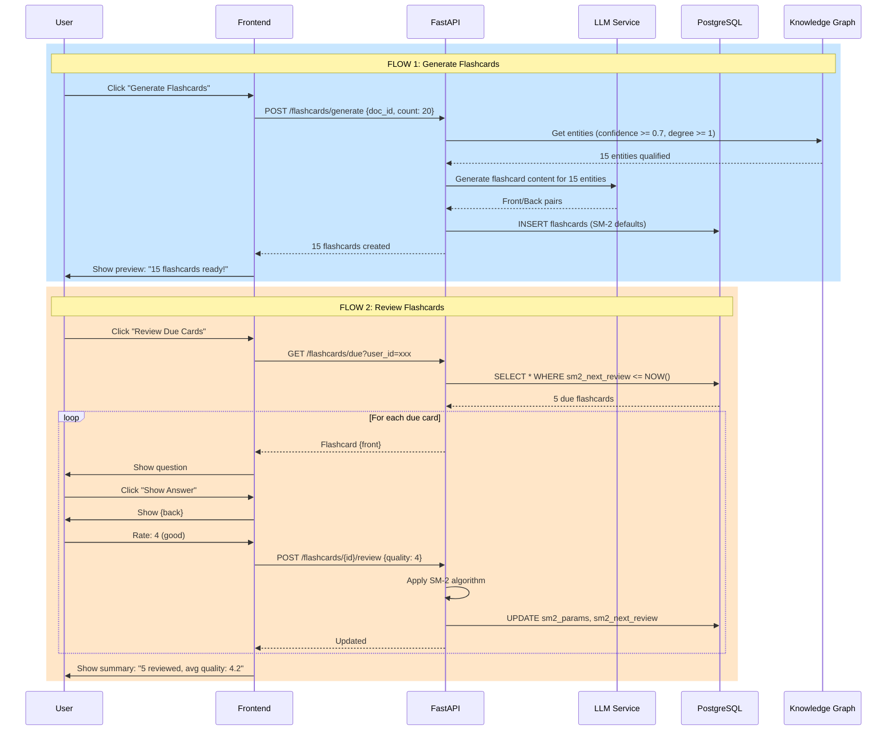

---

## UF-004: Generate Quiz

**Trigger:** User yêu cầu tạo bài kiểm tra từ document
**Actor:** User (Owner)
**Preconditions:**
- Document `completed`, có graph entities
- Entities có degree > 3 (để có đủ context)

### Main Flow (Happy Path)

| Step | Action | System Response | Data Flow |
|---|---|---|---|
| 1 | User click "Generate Quiz" | Mở config modal | — |
| 2 | User chọn: số câu hỏi, độ khó, loại câu hỏi | — | {count, difficulty, types} |
| 3 | Frontend gửi request | `POST /api/v1/quiz/generate` | Config → API |
| 4 | Backend lấy entities quan trọng | Filter: degree > 3, sort by centrality | Graph → API |
| 5 | LLM sinh câu hỏi | Multi-hop questions từ entities + relations | Entities → LLM → Questions |
| 6 | Validate: coverage >= 80% entities quan trọng | Nếu thiếu → sinh thêm | — |
| 7 | Lưu quiz vào DB | `POST /api/v1/quizzes` | Questions → PostgreSQL |
| 8 | Trả về quiz | Frontend hiển thị quiz UI | Quiz → FE |

### Alternative Flows

| Flow | Điều kiện | Handling |
|---|---|---|
| **A1: Không đủ entities** | Step 4 | Thông báo: "Cần thêm entities quan trọng. Hãy upload thêm tài liệu." |
| **A2: Coverage < 80%** | Step 6 | Cảnh báo user: "Quiz chỉ bao phủ X% entities quan trọng" |
| **A3: LLM sinh câu hỏi sai format** | Step 5 | Retry parsing, nếu fail → regenerate |

### Postconditions
- Quiz được lưu vào `quizzes` table
- User có thể làm quiz và lưu kết quả vào `quiz_results`

### Business Rules áp dụng
- [BR-007](Business_Rules.md#br-007-quiz-generation-rule) 🔴 — 80% coverage + explanation

### Mermaid Diagram

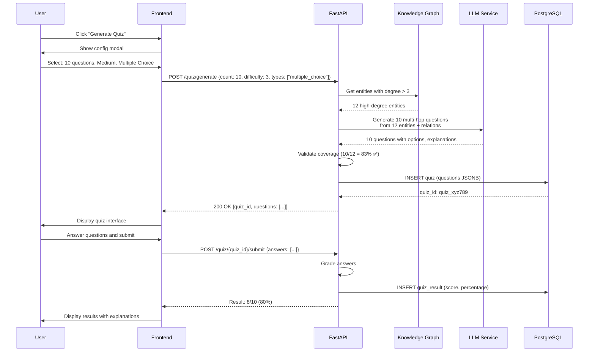

---

## UF-005: Create Note với Backlinks

**Trigger:** User tạo ghi chú mới
**Actor:** User (Owner)
**Preconditions:**
- User ở trạng thái Active User (đã có ít nhất 1 document `completed`)

### Main Flow (Happy Path)

| Step | Action | System Response | Data Flow |
|---|---|---|---|
| 1 | User mở Note Editor | — | — |
| 2 | User nhập title + content | — | — |
| 3 | User nhấn "Save" | Frontend gửi request | `POST /api/v1/notes` |
| 4 | Backend quét content tìm keywords | So khớp với entities trong graph | Content → Graph search |
| 5 | Tìm thấy entities trùng | Gợi ý backlinks tới notes đã có | Entities → Notes lookup |
| 6 | Lưu note với backlinks | `INSERT note + note_links` | PostgreSQL |
| **6a** | **Sinh embedding cho note content** | **Embed note content → lưu ChromaDB** | **Note content → Embedding → ChromaDB** |
| 7 | Trả về note đã lưu | Frontend hiển thị với backlink suggestions | Note + backlinks → FE |

### Alternative Flows

| Flow | Điều kiện | Handling |
|---|---|---|
| **A1: Không tìm thấy entities** | Step 5 | Lưu note bình thường, không backlink |
| **A2: Backlink trùng** | Step 6 | Bỏ qua duplicate (UNIQUE constraint) |

### Postconditions
- Note được lưu với metadata chứa linked entities
- Backlink suggestions hiển thị cho user

### Business Rules áp dụng
- [BR-009](Business_Rules.md#br-009-note-backlink-rule) 🔴 — Backlink suggestion

### Mermaid Diagram

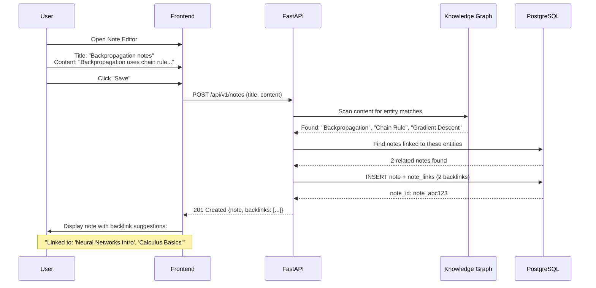

---

## UF-006: Knowledge Graph Visualization

**Trigger:** User xem graph của document
**Actor:** User (Owner)
**Preconditions:**
- Document `completed`, có graph entities + relations

### Main Flow (Happy Path)

| Step | Action | System Response | Data Flow |
|---|---|---|---|
| 1 | User click "View Graph" trên document | — | — |
| 2 | Frontend gửi request | `GET /api/v1/graph/subgraph` | {doc_id, max_nodes: 50} |
| 3 | Backend extract subgraph | NetworkX: extract nodes + edges | NetworkX → API |
| 4 | Generate layout positions | Force-directed layout algorithm | — |
| 5 | Trả về nodes + edges + positions | Frontend render với React Flow | Graph data → FE |
| 6 | User tương tác: zoom, click node | Hiển thị entity details | — |
| 7 | User click "Expand" trên node | Fetch neighbors của node đó | `GET /api/v1/graph/entities/{id}` |

### Alternative Flows

| Flow | Điều kiện | Handling |
|---|---|---|
| **A1: Graph quá lớn** | Step 3 | Limit max_nodes, thông báo user: "Graph có X entities, hiển thị 50 nodes quan trọng nhất" |
| **A2: Không có graph** | Step 2 | Trả về empty state: "Document chưa processing xong" |

### Postconditions
- Graph visualization hiển thị trên frontend
- User có thể explore entities và relations

### Business Rules áp dụng
- [BR-001](Business_Rules.md#br-001-user-data-isolation) 🔴 — User isolation

### Mermaid Diagram

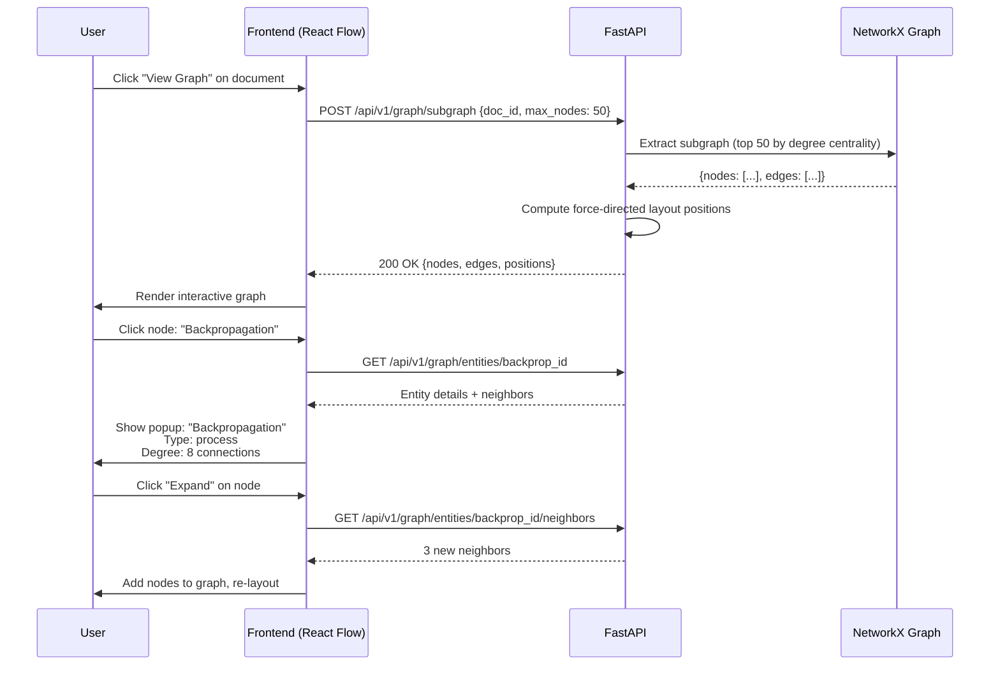

---

## UF-007: Switch Local/Cloud Mode

**Trigger:** User thay đổi LLM mode trong Settings
**Actor:** User (Owner)
**Preconditions:**
- Ollama đang chạy (cho Local Mode)

### Main Flow (Happy Path)

| Step | Action | System Response | Data Flow |
|---|---|---|---|
| 1 | User mở Settings → Model Settings | — | — |
| 2 | User toggle Local/Cloud Mode | — | — |
| 3 | Nếu Local Mode: Kiểm tra Ollama health | `GET http://localhost:11434/api/tags` | — |
| 3a | **Kiểm tra embedding dimension** | **So sánh dim model mới vs model cũ** | **Config DB** |
| **3b** | **⚠️ NẾU dimension khác nhau** | **CẢNH BÁO user: "Chế độ mới dùng embedding khác kích thước. Tài liệu cũ và mới sẽ ở không gian vector riêng. Bạn có muốn tiếp tục?"** | **Confirmation modal** |
| 4a | Ollama online + user xác nhận | Cập nhật config, tạo collection mới nếu cần, hiển thị "🔒 Local Mode" | `DEFAULT_LLM_MODEL = llama3` |
| 4b | Ollama offline | Cảnh báo: "Ollama không phản hồi. Kiểm tra lại." | Error message → FE |
| 5 | Lưu setting | Cập nhật `.env` hoặc DB config | — |
| 6 | Badge trên UI thay đổi | "🌐 Cloud" → "🔒 Local" | — |

### Alternative Flows

| Flow | Điều kiện | Handling |
|---|---|---|
| **A1: Ollama không chạy** | Step 3 | Không cho phép switch, hiển thị hướng dẫn cài Ollama |
| **A2: Model không có trong Ollama** | Step 3 | Gợi ý pull model: `ollama pull llama3` |

### Postconditions
- LLM mode được cập nhật
- Mọi request tiếp theo route đúng endpoint

### Business Rules áp dụng
- [BR-008](Business_Rules.md#br-008-local-mode-rule) 🔴 — No cloud data in Local Mode

### Mermaid Diagram

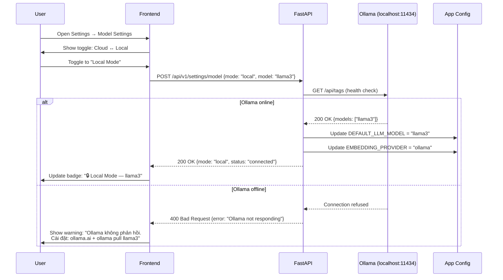

---

## UF-008: Dashboard — Morning Routine

**Trigger:** User mở Dashboard
**Actor:** User (Owner)
**Preconditions:**
- User đã có hoạt động học tập trước đó

### Main Flow (Happy Path)

| Step | Action | System Response | Data Flow |
|---|---|---|---|
| 1 | User mở Dashboard | — | — |
| 2 | Frontend load dashboard data | `GET /api/v1/dashboard` | — |
| 3 | Backend tổng hợp: stats, due cards, recent docs | Parallel queries | PostgreSQL |
| 4 | Trả về dashboard payload | Stats, recent docs, due count, graph preview | — |
| 5 | Frontend render | Hiển thị greeting, stats, quick actions | — |
| 6 | User click "Review 5 Due Cards" | Chuyển tới Flashcard Review | — |

### Alternative Flows

| Flow | Điều kiện | Handling |
|---|---|---|
| **A1: User mới (chưa có data)** | Step 3 | Hiển thị empty state với hướng dẫn onboarding |
| **A2: Không có due cards** | Step 3 | Ẩn section "Today's Review" hoặc hiển thị "✅ Không có card nào cần ôn" |

### Postconditions
- User thấy overview hoạt động học tập
- Quick actions sẵn sàng

### Mermaid Diagram

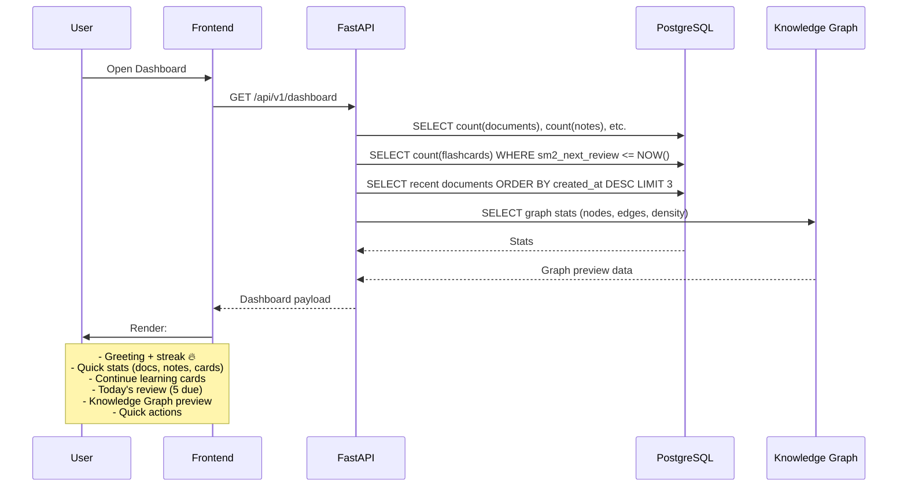

---

## User Flow Summary Matrix

| Flow ID | Tên Flow | Module chính | Business Rules | Độ phức tạp |
|---|---|---|---|---|
| **UF-001** | Upload & Process Document | Document, Worker, Graph | BR-002, BR-003, BR-010, BR-011 | 🔴 Cao |
| **UF-002** | Socratic Chat | Chat, Graph, LLM | BR-006, BR-014, BR-001 | 🔴 Cao |
| **UF-003** | Generate & Review Flashcards | Flashcard, SM-2, Graph | BR-004, BR-005, BR-015 | 🟡 Trung bình |
| **UF-004** | Generate Quiz | Quiz, Graph, LLM | BR-007 | 🟡 Trung bình |
| **UF-005** | Create Note với Backlinks | Notes, Graph | BR-009 | 🟡 Trung bình |
| **UF-006** | Knowledge Graph Visualization | Graph, NetworkX | BR-001 | 🟢 Thấp |
| **UF-007** | Switch Local/Cloud Mode | Settings, LLM | BR-008 | 🟢 Thấp |
| **UF-008** | Dashboard — Morning Routine | Dashboard | BR-001 | 🟢 Thấp |
| **UF-009** | Obsidian Graph Integration | Graph, Worker | BR-002, BR-003, BR-004 | 🟡 Trung bình |
| **UF-010** | Delete Document (Cascade Cleanup) | Document, Graph, Flashcard, Quiz, Note | BR-001, BR-016, BR-017 | 🔴 Cao |
| **UF-011** | Edit/Update Note (Recalculate Backlinks) | Note, Graph | BR-009, BR-001 | 🟡 Trung bình |
| **UF-012** | Merge Entities | Graph, LLM | BR-001, BR-017 | 🟡 Trung bình |
| **UF-013** | Error Recovery (User Perspective) | Document, Worker | BR-002, BR-010, BR-016 | 🟡 Trung bình |

---

## UF-010: Delete Document (Cascade Cleanup)

**Trigger:** User nhấn nút "Delete" trên document
**Actor:** Active User hoặc Processing User (cho document cũ)
**Preconditions:**
- Document tồn tại và thuộc về user
- User không ở trạng thái Rate Limited

### Main Flow (Happy Path)

| Step | Action | System Response | Data Flow |
|---|---|---|---|
| 1 | User click "Delete" trên document | Mở confirmation modal | — |
| 2 | User xác nhận "Delete" | Frontend gửi request | `DELETE /api/v1/documents/{doc_id}` |
| 3 | Backend nhận request | Validate: document tồn tại, thuộc user | — |
| **4** | **Bắt đầu transaction PostgreSQL** | **BEGIN TRANSACTION** | **PostgreSQL** |
| **5** | **Xóa embeddings (ChromaDB — KHÔNG có CASCADE)** | **ChromaDB: `delete(where={"document_id": doc_id})`** | **ChromaDB** |
| **6** | **Xóa entity-document links (junction table)** | **`DELETE FROM entity_documents WHERE document_id = doc_id`** | **PostgreSQL** |
| **7** | **Xóa document record (CASCADE tự động cleanup)** | **`DELETE FROM documents WHERE id = doc_id`**<br/>→ CASCADE xóa: `document_chunks`, `graph_entities` (of this doc), `graph_relations` (of this doc), `flashcards`, `quizzes`, `notes` | **PostgreSQL CASCADE** |
| **8** | **Commit transaction** | **COMMIT** | **PostgreSQL** |
| **9** | **Cleanup orphan entities** | **Xóa entities không còn `document_links` nào**<br/>`DELETE FROM graph_entities WHERE id NOT IN (SELECT entity_id FROM entity_documents)` | **PostgreSQL** |
| 10 | Rebuild NetworkX graph | Load lại graph từ SQL (nguồn sự thật) | NetworkX |
| 11 | Trả về kết quả | Frontend đóng modal, refresh danh sách | Response: `{deleted_entities, deleted_relations, deleted_embeddings, cascade_counts}` |

**⚠️ CASCADE Clarification:**
```
PostgreSQL Foreign Keys với ON DELETE CASCADE:
    - documents → document_chunks (CASCADE)
    - documents → graph_entities (SET NULL cho document_id, KHÔNG xóa entity)
    - documents → flashcards (SET NULL)
    - documents → quizzes (SET NULL)
    - documents → notes (SET NULL)
    - graph_entities → graph_relations (CASCADE)
    - entity_documents → (junction row, CASCADE)

THỦ CÔNG (KHÔNG có CASCADE):
    - ChromaDB embeddings → PHẢI xóa thủ công trước khi commit
    - NetworkX in-memory graph → PHẢI reload sau khi xóa SQL

⚠️ Nếu ChromaDB delete fail:
    - Rollback transaction PostgreSQL
    - Trả về 500: "Cannot delete document: embedding cleanup failed"
    - User retry sau
```

### Alternative Flows

| Flow | Điều kiện | Handling |
|---|---|---|
| **A1: PostgreSQL down** | Step 4-12 fail | Trả về `503`: "Database không khả dụng. Thử lại sau." Không xóa gì cả (atomic) |
| **A2: ChromaDB down** | Step 7 fail | Log error, tiếp tục xóa SQL. Notify user: "Embeddings chưa xóa được, sẽ cleanup sau." |
| **A3: Document đang processing** | Step 3 | Cancel background task trước → tiếp tục cleanup → xóa record |
| **A4: Document đã xóa** | Step 3 | Idempotent: trả về `200: "Already deleted"` (BR-017) |

### Postconditions
- **Success:** Document và TẤT CẢ dữ liệu liên quan (flashcards, quizzes, embeddings, entities, relations, chunks) bị xóa khỏi mọi storage layer
- **Partial failure:** Nếu ChromaDB fail, SQL vẫn xóa → orphan embeddings. Background job cleanup sẽ xử lý sau.
- **Data consistency:** Không thể rollback sau khi xóa (hard delete)

### Business Rules áp dụng
- [BR-001](Business_Rules.md#br-001-user-data-isolation) 🔴 — Chỉ xóa document của user
- [BR-016](Business_Rules.md#br-016-system-resilience) 🔴 — Xử lý graceful khi DB down
- [BR-017](Business_Rules.md#br-017-request-idempotency) 🟡 — Idempotent delete

### Mermaid Diagram

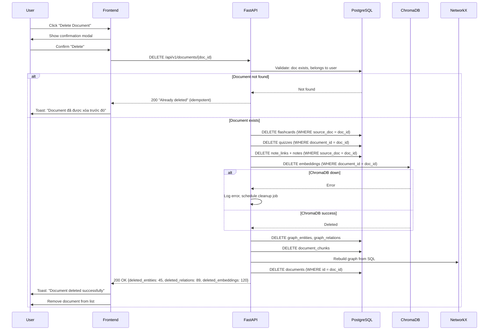

---

## UF-011: Edit/Update Note (Recalculate Backlinks)

**Trigger:** User chỉnh sửa nội dung note đã lưu
**Actor:** Active User
**Preconditions:**
- Note tồn tại và thuộc về user
- Ít nhất 1 document đã `completed` (để có entities so khớp)

### Main Flow (Happy Path)

| Step | Action | System Response | Data Flow |
|---|---|---|---|
| 1 | User mở note đã lưu | Load note content + backlinks hiện tại | `GET /api/v1/notes/{note_id}` |
| 2 | User chỉnh sửa content | — | — |
| 3 | User nhấn "Save" | Frontend gửi request | `PUT /api/v1/notes/{note_id}` |
| 4 | Backend update note | Update title, content, updated_at | PostgreSQL |
| 5 | Quét lại content tìm entities mới | So khớp với entities trong graph | Content → Graph search |
| 6 | So sánh backlinks cũ vs mới | Tìm backlinks mới, backlinks đã mất | — |
| 7 | Thêm backlinks mới | `INSERT INTO note_links` (ignore duplicate) | PostgreSQL |
| 8 | Xóa backlinks không còn khớp | `DELETE FROM note_links WHERE note_id = X AND entity NOT IN (new_entities)` | PostgreSQL |
| 9 | Trả về note đã update | Frontend hiển thị với backlinks mới | Note + updated backlinks → FE |

### Alternative Flows

| Flow | Điều kiện | Handling |
|---|---|---|
| **A1: Content không còn entities nào** | Step 5 | Xóa TẤT CẢ backlinks cũ của note này |
| **A2: PostgreSQL down** | Step 4 fail | Trả về `503`, không update gì cả |
| **A3: Note không tồn tại** | Step 3 | Trả về `404: "Note not found"` |

### Postconditions
- Note được update với nội dung mới
- Backlinks được đồng bộ: thêm mới, xóa cũ
- `updated_at` timestamp được cập nhật

### Business Rules áp dụng
- [BR-009](Business_Rules.md#br-009-note-backlink-rule) 🔴 — Recalculate backlinks
- [BR-001](Business_Rules.md#br-001-user-data-isolation) 🔴 — Chỉ update note của user

### Mermaid Diagram

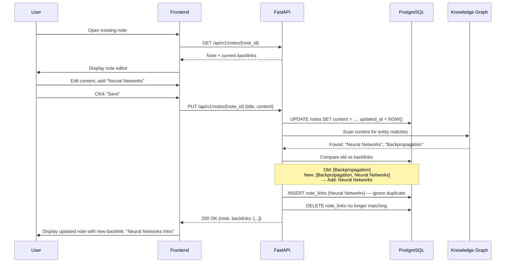

---

## UF-012: Merge Entities

**Trigger:** User chọn gộp 2 entities trùng lặp hoặc liên quan chặt chẽ
**Actor:** Active User
**Preconditions:**
- Cả 2 entities tồn tại trong graph
- Entities thuộc về user

### Main Flow (Happy Path)

| Step | Action | System Response | Data Flow |
|---|---|---|---|
| 1 | User chọn 2 entities trên graph view | Mở merge dialog | — |
| 2 | User chọn entity "giữ lại" (primary) và entity "gộp vào" (secondary) | — | {primary_id, secondary_id} |
| 3 | User nhấn "Merge" | Frontend gửi request | `POST /api/v1/graph/entities/merge` |
| 4 | Backend validate | Kiểm tra cả 2 entities tồn tại, không cùng ID | — |
| 5 | Merge relations | Chuyển TẤT CẢ relations của secondary sang primary | Graph → PostgreSQL |
| 6 | Resolve description conflict | Áp dụng strategy (xem bảng dưới) | — |
| **6a** | **Update entity_documents** | **Chuyển document associations của secondary sang primary** | **`INSERT INTO entity_documents (entity_id=primary_id, document_id) SELECT secondary_id, document_id FROM entity_documents WHERE entity_id = secondary_id ON CONFLICT DO NOTHING`** |
| **6b** | **Update note_entity_links** | **Chuyển note links từ secondary sang primary** | **`UPDATE note_entity_links SET entity_id = primary_id WHERE entity_id = secondary_id`** |
| 7 | Xóa secondary entity | `DELETE FROM graph_entities WHERE id = secondary_id` | PostgreSQL |
| 8 | Update primary entity | Merge description (nếu cần), cập nhật updated_at | PostgreSQL |
| 9 | Rebuild NetworkX graph | Load lại graph từ SQL | NetworkX |
| 10 | Trả về kết quả | Primary entity info + số relations đã merge | Response → FE |

### Description Conflict Resolution

| Trường hợp | Strategy |
|---|---|
| **Primary có description, Secondary không** | Giữ description của Primary |
| **Cả hai đều có description khác nhau** | Gọi LLM: *"Merge these two descriptions into one comprehensive summary"* |
| **Cả hai description giống nhau > 90%** | Giữ description của Primary, không cần AI |
| **LLM down khi merge** | Fallback: Concatenate cả 2 description, thêm prefix `"[Merged] "` |

### Alternative Flows

| Flow | Điều kiện | Handling |
|---|---|---|
| **A1: Secondary đã bị merge trước đó** | Step 4 | Idempotent: trả về primary info (200 OK) — BR-017 |
| **A2: PostgreSQL down** | Step 5 fail | Trả về `503`, không merge gì cả |
| **A3: Relations trùng lặp** | Step 5 | Nếu cùng source + target + type → bỏ qua (UNIQUE constraint) |

### Postconditions
- Secondary entity bị xóa
- Primary entity giữ lại, có thêm relations từ secondary
- Graph được rebuild từ SQL
- Không thể rollback (hard delete secondary)

### Business Rules áp dụng
- [BR-001](Business_Rules.md#br-001-user-data-isolation) 🔴 — Chỉ merge entities của user
- [BR-017](Business_Rules.md#br-017-request-idempotency) 🟡 — Idempotent merge

### Mermaid Diagram

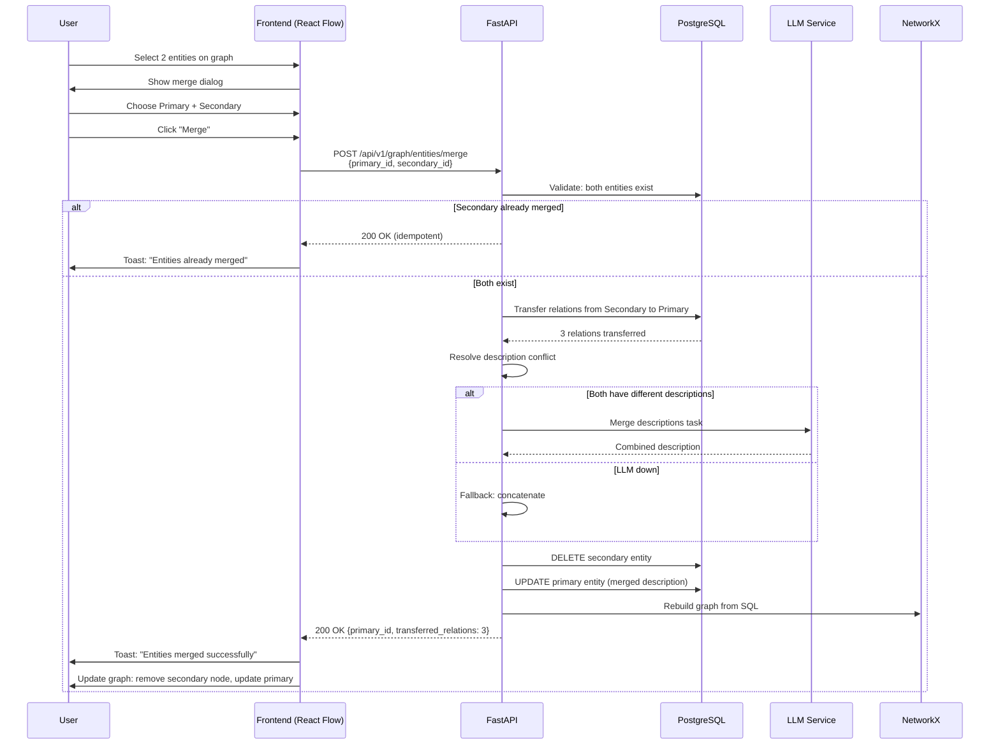

---

## UF-013: Error Recovery (User Perspective)

**Trigger:** User thấy document ở trạng thái `failed`
**Actor:** Active User hoặc Processing User
**Preconditions:**
- Document tồn tại với status = `failed`

### Main Flow (Happy Path)

| Step | Action | System Response | Data Flow |
|---|---|---|---|
| 1 | User thấy document với badge "❌ Failed" | — | — |
| 2 | User click vào document | Hiển thị error details | `GET /api/v1/documents/{doc_id}` |
| 3 | User đọc error message | `error_message` hiển thị rõ ràng + gợi ý | — |
| 4 | User click "Retry Processing" | Frontend gửi request | `POST /api/v1/documents/{doc_id}/retry` |
| **5** | **Backend rollback partial data** | **XÓA toàn bộ partial data của document** | **Xem chi tiết rollback bên dưới** |
| 6 | Backend reset status | Update status = `pending`, clear error_message | PostgreSQL |
| 7 | Queue lại task | Gửi vào ARQ queue | Redis → Worker |
| 8 | Worker xử lý | Repeat pipeline từ step 1 (UF-001) **trên data sạch** | — |
| 9 | User thấy status thay đổi | Polling hoặc notification | `GET /api/v1/documents/{doc_id}/status` |

**Rollback Steps (Step 5 — BẮT BUỘC):**
```
5a. DELETE FROM document_chunks WHERE document_id = :doc_id
5b. DELETE FROM graph_entities WHERE document_id = :doc_id
5c. DELETE FROM graph_relations WHERE document_id = :doc_id
5d. ChromaDB: delete(where={"document_id": doc_id, "content_type": "chunk"})
5e. ChromaDB: delete(where={"document_id": doc_id, "content_type": "entity"})
5f. NetworkX: remove nodes associated with doc_id từ in-memory graph
5g. Log rollback action → graph_edit_log
```

### Alternative Flows

| Flow | Điều kiện | Handling |
|---|---|---|
| **A1: Lỗi không sửa được** (vd: PDF không có text layer) | Step 3 | Hiển thị: "Lỗi không thể sửa bằng retry. Vui lòng upload file khác." |
| **A2: User nhấn "Delete" thay vì "Retry"** | Step 3 | Chuyển sang UF-010 (Delete Document) |
| **A3: Retry cũng fail** | Step 8 | Hiển thị error mới + suggestion cụ thể hơn (vd: "LLM timeout — thử Local Mode") |
| **A4: Worker down** | Step 6 fail | Trả về `503`: "Task queue unavailable. Thử lại sau." |

### Error Message Guide

| Error Pattern | User Message | Suggested Action |
|---|---|---|
| `LLM timeout` | "AI không phản hồi trong thời gian cho phép." | "Thử lại hoặc chuyển sang Local Mode (Settings)" |
| `No text layer` | "Không đọc được text từ PDF. File có thể là ảnh scan." | "Upload file PDF có text layer hoặc dùng OCR tool trước" |
| `No entities extracted` | "Không tìm thấy thực thể nào trong tài liệu." | "Kiểm tra tài liệu có nội dung text. Thử file khác nếu cần." |
| `ChromaDB connection error` | "Không lưu được embeddings. Hệ thống vector DB đang sự cố." | "Thử lại sau. Nếu vẫn lỗi, liên hệ support." |
| `Worker crash` | "Tiến trình xử lý bị gián đoạn." | "Nhấn Retry để chạy lại từ đầu." |

### Postconditions
- **Success:** Document chuyển sang `completed` sau retry
- **Failure:** Document vẫn `failed` với error message mới
- **Delete:** Document bị xóa nếu user chọn không retry

### Business Rules áp dụng
- [BR-002](Business_Rules.md#br-002-document-processing-pipeline) 🔴 — Retry pipeline
- [BR-010](Business_Rules.md#br-010-error-recovery-rule) 🔴 — Retry 3 lần
- [BR-016](Business_Rules.md#br-016-system-resilience) 🔴 — Graceful error handling

### Mermaid Diagram

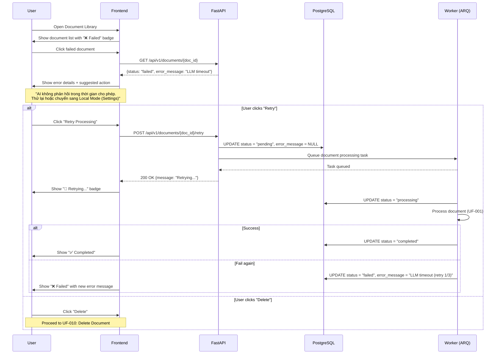

---

## UF-009: Obsidian Graph Integration

**Trigger:** User thực hiện import Obsidian vault vào hệ thống.
**Actor:** User (Owner)
**Preconditions:**
- User có thư mục Obsidian vault trên máy tính (local).
- Hệ thống đang ở trạng thái sẵn sàng.

### Main Flow (Happy Path)

| Step | Action | System Response | Data Flow |
|---|---|---|---|
| 1 | User mở Graph Explorer | Hiển thị toolbars | — |
| 2 | Click "Import Obsidian Vault" | Mở modal nhập path | — |
| 3 | Nhập path và xác nhận | Gửi yêu cầu import | `POST /api/v1/graph/import/obsidian` |
| 4 | Backend nhận request | Tạo job ID, queue task cho worker | — |
| 5 | Worker quét file .md | Trích xuất content, links, tags | Path → MarkdownParser |
| 6 | Worker resolve thực thể | Kiểm tra trùng lặp và gộp tự động | `resolve_and_merge` |
| 7 | Worker xây dựng quan hệ | Tạo liên kết từ wiki-links `[[...]]` | Relations → PostgreSQL |
| **7a** | **Worker sinh embeddings cho Obsidian files** | **Embed từng file content → lưu ChromaDB** | **Obsidian files → Embedding → ChromaDB (content_type: "obsidian")** |
| 8 | Polling hoàn tất | Thông báo thành công, reload graph | `GET /api/v1/graph/import/obsidian/status/{job_id}` |

### Alternative Flows

| Flow | Điều kiện | Handling |
|---|---|---|
| **A1: Thư mục không tồn tại**| Step 4 | Trả về lỗi 400: "Vault path does not exist" |
| **A2: Xung đột thực thể** | Step 6 | Nếu không chắc chắn, tạo thành thực thể mới và gợi ý gộp sau |

### Business Rules áp dụng
- [BR-001](Business_Rules.md#br-001-user-data-isolation) 🔴 — User data isolation cho imported entities
- [BR-002](Business_Rules.md#br-002-document-processing-pipeline) 🟡 — Processing pipeline (tương tự document)
- [BR-017](Business_Rules.md#br-017-request-idempotency) 🟡 — Idempotent import (cùng vault path không duplicate)

---

> [!IMPORTANT]
> **Mọi user flow mới PHẢI tuân theo cấu trúc này.**
> Cập nhật tài liệu khi thêm flow mới hoặc thay đổi flow cũ.

---
© 2026 AetherTutor Team. Created: April 10, 2026
